# ServiceNow USEM with Tenable and Wiz

> **Tools Research** · Unified Security Exposure Management reviewed against ServiceNow's official documentation (Brazil release, September 2026). Companion study: [ServiceNow VR, CC and CVR with Tenable and Wiz](/tools-research/SERVICENOW_VR_CC_CVR_TENABLE_WIZ.md). Download: [PDF](https://github.com/TeamStarWolf/TeamStarWolf/raw/main/tools-research/pdf/ServiceNow_USEM_Tenable_Wiz.pdf).

## Summary: USEM unifies the workflow, not the findings

ServiceNow Unified Security Exposure Management (USEM) is **Vulnerability Response v30.x**, delivered through the ServiceNow Store. It is a major architectural upgrade of the existing VR applications, not a new product. ServiceNow's documentation calls it "a major architectural upgrade to Vulnerability Response applications," and it reached Store general availability on **December 11, 2025**. It puts host, application, container, and configuration-compliance findings into one Security Exposure Management (SEM) Workspace and moves assignment, scoring, SLA, and exception rules into shared `sn_sec_*` tables. The findings themselves stay in separate per-domain tables, so **there is no unified exposure table**. The Brazil family went to Early Availability on **September 24, 2026**, and its GA is **scheduled for November 5, 2026**. The claim that Brazil force-upgrades VR below v30 onto USEM appears only in ServiceNow Community guidance. The official Brazil docs never say it, and they still tell Container VR customers who "don't intend to upgrade" to stay below v30. They do confirm the migration is one-way: rollback is impossible. Tenable and Wiz each enter USEM through a ServiceNow-built Store app.

- **Tenable** (`sn_vul_tenable`) is a separate subscription that ships on two tracks, 30.x for USEM and 6.x for classic VR. It imports only Critical and High findings by default. It maps VPR, CVSS v4, KEV, and EPSS, but not Tenable's ACR or AES. It matches assets to CIs using network identifiers plus the Tenable asset UUID.
- **Wiz** (`sn_vul_wiz`) runs on a 32.x track for USEM and a 4.x track for legacy VR. It pulls daily deltas from Wiz's GraphQL API and anchors identity on cloud resource IDs. Some Wiz context lands as first-class fields and some only as raw JSON. Wiz's own risk score is not mapped.

Deduplication across the two scanners exists but is narrow. The rule-based duplicate feature works only when both findings sit on the **same CI** and share a **CVE**. ServiceNow also documents a generative AI duplicate-detection skill, but no Tenable- or Wiz-specific page describes how it treats their findings, and application findings get no cross-scanner dedup at all. The verdict for a large Tenable-plus-Wiz estate: USEM is a strong governance and remediation layer, but its prioritization and dedup are only as good as the program's own design decisions. Those decisions are which scanner owns which assets, which signals drive the score, and whether CMDB identity is fixed before go-live.

**How to read the sourcing.** This page treats ServiceNow's official documentation repository as authoritative: [github.com/ServiceNow/ServiceNowDocs](https://github.com/ServiceNow/ServiceNowDocs/blob/brazil/README.md), `brazil` branch, change log dated 24 and 28 September 2026, with most pages marked `last_updated: 2026-09-10`. Where it conflicts with Community posts, KB snippets, or third-party sources, the repo wins. The repo's [llms.txt on the brazil branch is stale](https://github.com/ServiceNow/ServiceNowDocs/blob/brazil/llms.txt). It still says "australia" is the latest release and links only to australia-branch indexes, so navigate it through `markdown/<publication>/index.md` instead. ServiceNow's Store release notes on servicenow.com, the source of the version-by-version histories below, are official but are not in the repo, so they could not be re-checked against it. Claims are labeled **official docs**, **ServiceNow release notes (outside the repo)**, **Community** (often ServiceNow staff, but not product documentation), or **third-party**. A ledger near the end lists the material claims and the evidence behind each.

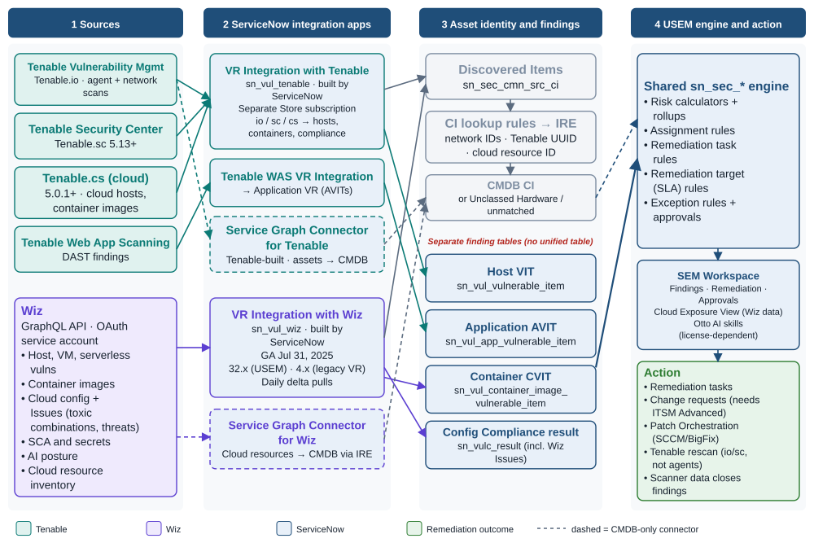

*Figure 1. How Tenable and Wiz data reaches USEM: sources, ServiceNow-built integration apps, asset identity, separate finding tables, and the shared `sn_sec_*` engine. Source: Official ServiceNowDocs (brazil): Tenable, Wiz, Service Graph Connector for Wiz and SEM components pages; Tenable ServiceNow integration guide (Aug 2026).*

## USEM is Vulnerability Response v30, and Brazil GA lands November 5

### What the product actually is

The official Brazil landing page frames USEM as an upgrade path. Existing VR customers "must use the Migration assistant" (KB2556844) the first time they move to it ([official docs](https://github.com/ServiceNow/ServiceNowDocs/blob/brazil/markdown/security-management/unified-security-exposure-management-landing-page.md)). The USEM application's scope is **`sn_vul_usem_common`**, and it must be installed before v30.x of any other VR application ([official docs](https://github.com/ServiceNow/ServiceNowDocs/blob/brazil/markdown/security-management/vulnerability-response/migrate-to-usem.md)). Installing it brings in six components:

- Unified Security Exposure Management
- SEM Workspace
- Administration for SEM
- Risk Scoring for SEM
- Remediation for Attack Surface Management
- Exception Management for USEM

USEM "also depends on" the existing VR, Application VR (AVR), Container VR (CVR), and Configuration Compliance (CC) components ([official docs](https://github.com/ServiceNow/ServiceNowDocs/blob/brazil/markdown/security-management/sem-components-installed.md)). The Zurich release notes list USEM as "a new application" that activates on the plugin `com.snc.security_support.core`, available "to all customers entitled to Vulnerability Response" ([ServiceNow Zurich release notes](https://www.servicenow.com/docs/r/zurich/release-notes/secops-sem-rn.html)). The workspace change is official, not just Community opinion: "Starting with v30.0 of Vulnerability Response, the Vulnerability Manager workspace is **replaced** with the Security Exposure Management workspace," which "unifies Infrastructure VR, AVR, CVR, and Configuration Compliance into a single workspace" ([official docs](https://github.com/ServiceNow/ServiceNowDocs/blob/brazil/markdown/security-management/vulnerability-manager-workspace/vulnerability-manager-workspace-landing-page.md)). Security Incident Response remains a separately licensed product. OT Vulnerability Response is still a separate entry in the Australia release index ([ServiceNowDocs, australia branch](https://github.com/ServiceNow/ServiceNowDocs/blob/australia/markdown/release-notes/australia-zurich-combined-release-notes.md)).

### Release history: three families of groundwork, then USEM

No keynote or press release launched USEM by name. The first public evidence is November 2025 Community and webinar material. Store GA followed on December 11, 2025, the core reached 30.2.5 by January 2026, and it reached 30.3.3 by Australia ([Community](https://www.servicenow.com/community/secops-articles/essential-information-vr-to-usem-upgrade-guidance/ta-p/3453606); [Australia release notes](https://www.servicenow.com/docs/r/australia/delta-zurich-australia/australia-zurich-unifiedsecurityexposuremanagementusem-release-notes.html)). Much of what USEM unifies was built in earlier families, and that history explains behavior you will inherit.

| Release | What it contributed to today's USEM |
|---|---|
| Washington DC (VR ~v21–22) | CISA KEV integration, compensating controls, auto-close rules (v22.0), exclusion rules that stop detections from becoming VIs, Vulnerability Crisis Management, the Cybersecurity Executive Dashboard, and a generic framework for ingesting any vendor ([release notes](https://www.servicenow.com/docs/r/yokohama/delta-washingtondc-yokohama/yokohama-washingtondc-vulnerabilityresponse-release-notes.html)) |
| Xanadu (VR ~v24) | **Tenable and MS TVM detections split into one VIT per detected instance**, solutions created from scanner data, Flow Designer replacing Workflow, and Exposure Response renamed Exposure Assessment ([same](https://www.servicenow.com/docs/r/yokohama/delta-washingtondc-yokohama/yokohama-washingtondc-vulnerabilityresponse-release-notes.html)) |
| Yokohama (VR ~v25) | Exception rules that defer VITs directly, lookup rules that ignore Discovered Items inactive for more than 90 days, a "Reopened Count" field, and the FIRST.org EPSS integration (Vancouver–Yokohama window) ([same](https://www.servicenow.com/docs/r/yokohama/delta-washingtondc-yokohama/yokohama-washingtondc-vulnerabilityresponse-release-notes.html); [integrations notes](https://www.servicenow.com/docs/r/yokohama/delta-vancouver-yokohama/yokohama-vancouver-vulnerabilityresponseintegrations-release-notes.html)) |
| Zurich + Q4 2025 Store (USEM GA Dec 11, 2025) | SEM Workspace (Findings, Remediation, Approvals), the Administration console, Cloud Exposure View, risk and rollup calculators, unified approval rules, Match First/Match All task rules, and Now Assist insight and approval-recommendation skills ([Zurich notes](https://www.servicenow.com/docs/r/zurich/release-notes/secops-sem-rn.html)) |
| Australia (2026) | SSVC enrichment, Early Warning, **Fix Intelligence using Armis Centrix ViPR**, a CVE Exposure Assessment REST API, the Security Exposure 360 agentic workflow, AI Security Exposure Management, the rename to "ServiceNow Otto for USEM," the Migration assistant and "Upgrade later," and **ITSM Advanced required for change creation** ([Australia notes](https://www.servicenow.com/docs/r/australia/delta-zurich-australia/australia-zurich-unifiedsecurityexposuremanagementusem-release-notes.html)) |
| Brazil (EA **Sept 24, 2026**; GA **scheduled Nov 5, 2026**) | Official "What's new" lists: SSVC roll-up to TPEs, task re-evaluation when the preferred solution changes, SCCM/BigFix multi-patch deployment, Prisma AIRS integrations, Wiz AI-posture routing, Employee Center AI-exposure tasks, pentest-finding attachment, and **irreversible** SBOM cleanup. Also: Wiz container Grouped Vulnerability and Deployment Context integrations, Reapply Look up Rules replacing the "reconcile unmatched" job, and Otto replacing Now Assist for VR with "entitlements unchanged" ([USEM notes](https://github.com/ServiceNow/ServiceNowDocs/blob/brazil/markdown/release-notes/secops-sem-rn.md); [CVR notes](https://github.com/ServiceNow/ServiceNowDocs/blob/brazil/markdown/release-notes/secops-cvr-rn.md); [Zurich→Brazil VR delta](https://github.com/ServiceNow/ServiceNowDocs/blob/brazil/markdown/delta-zurich-brazil/brazil-zurich-vulnerabilityresponse-release-notes.md); [upgrade summary](https://github.com/ServiceNow/ServiceNowDocs/blob/brazil/markdown/release-notes/rn-summary-upgrade-info.md)) |

The Brazil dates come from two places. The official available-versions page lists the Brazil EA release as **2026/09/24** and gives no GA row ([official docs](https://github.com/ServiceNow/ServiceNowDocs/blob/brazil/markdown/release-notes/available-versions.md)). The November 5 GA date appears only on the accessibility page, which says highlights "will be available for the Brazil General Availability (GA) release, which is currently scheduled for November 5th" ([official docs](https://github.com/ServiceNow/ServiceNowDocs/blob/brazil/markdown/release-notes/r_Accessibility508Compliance.md)). Treat it as a schedule, not a shipped fact. Several Brazil "What's new" items repeat what the Australia notes attributed to Australia: SSVC roll-up, preferred-solution re-evaluation, and SCCM/BigFix multi-patch. They are Store-delivered app features, so read them as current USEM 30.x capabilities rather than Brazil-platform exclusives. That reading is my inference. "Reopened Count" shows up both in the Washington DC–Yokohama notes and in the Zurich-to-Brazil delta, where it counts Closed→Open/Active transitions. Check which definition your instance carries before you use it as a KPI.

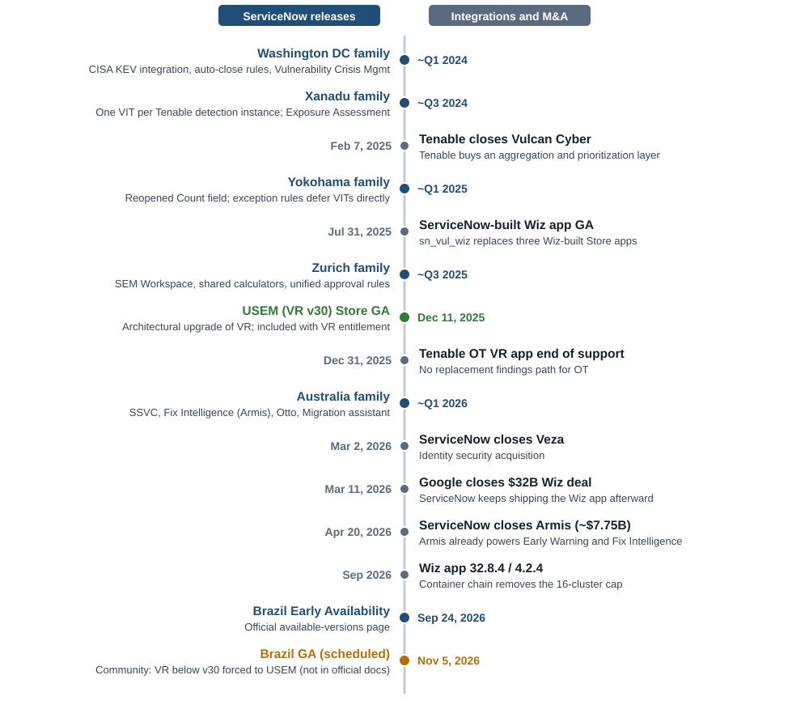

*Figure 2. Releases and corporate events that shape USEM with Tenable and Wiz. Source: ServiceNow release notes and official docs; Community; SEC filings and deal counsel. Family-release placements are approximate.*

### The forced upgrade is Community-sourced, but the one-way door is official

The most cited operational warning about USEM is that Brazil makes it mandatory. That comes from ServiceNow Community guidance: "USEM (VR v30x) becomes the minimum supported VR version when customers upgrade to the Brazil Platform Family Release," and anything lower "is automatically forced to USEM," which ServiceNow staff call "not an ideal path" ([Community](https://www.servicenow.com/community/secops-articles/essential-information-vr-to-usem-upgrade-guidance/ta-p/3453606)). The same Community material warns that **Australia Patch 3m and 4m "unintentionally trigger an automatic VR-to-USEM upgrade for versions below 30, with no ability to roll back"** ([Community FAQ](https://www.servicenow.com/community/secops-articles/usem-office-hours-faqs-migration-amp-adoption/ta-p/3524375)). Devoteam puts the minimum non-USEM VR version on Australia at 26.4.4 ([third-party](https://www.devoteam.com/expert-view/how-servicenow-australia-release-modernises-secops/)).

The official Brazil docs say none of this. A full search of the Brazil security-management and release-notes trees found no sentence saying VR below v30 is force-upgraded, auto-upgraded, or unsupported. The Brazil CVR upgrade notes still say: "If you're currently using Container Vulnerability Response, and you don't intend to upgrade to Unified Security Exposure Management (USEM), install a version below v30.x" ([official docs](https://github.com/ServiceNow/ServiceNowDocs/blob/brazil/markdown/release-notes/secops-cvr-rn.md); [upgrade summary](https://github.com/ServiceNow/ServiceNowDocs/blob/brazil/markdown/release-notes/rn-summary-upgrade-info.md)). The Tenable integration page lists three app lines available on Brazil ([official docs](https://github.com/ServiceNow/ServiceNowDocs/blob/brazil/markdown/security-management/vulnerability-response/tenableIntegration.md)). The Migration assistant also offers **"Upgrade later,"** which hides the assistant but leaves it reachable from the Filter Navigator ([official docs](https://github.com/ServiceNow/ServiceNowDocs/blob/brazil/markdown/security-management/vulnerability-response/migrate-to-usem.md)). The core VR plugin may still be treated differently in KB0856498 or KB2556844, both login-gated, so the forced-upgrade claim remains **unverified in official docs** rather than disproven.

The prudent position is to plan as if the Community warning is true. The reason is that the official docs state the cost of an unplanned migration plainly: "**Rollback is not possible once an instance is upgraded to USEM**." Before migrating, customers must:

- deactivate every third-party integration (`sn_sec_int_integration` records),
- deactivate the VR, AVR, CVR, and CC scheduled jobs,
- upgrade in strict order: VR first, then CC, then CVR, then each third-party integration one at a time,
- test in non-production first.

([official docs](https://github.com/ServiceNow/ServiceNowDocs/blob/brazil/markdown/security-management/sem-install-prerequisites.md))

The assistant lives at All > Vulnerability Response > Administration > Migration assistant. It walks through five stages: preparation, ordered upgrades, conflict resolution, an "Enable all" step that restores integrations and jobs, and verification, after which it redirects to the lookup-rule page ([official docs](https://github.com/ServiceNow/ServiceNowDocs/blob/brazil/markdown/security-management/vulnerability-response/migrate-to-usem.md)). ServiceNow calls it "the preferred choice" over Store App Manager. Only the assistant offers pre-upgrade insights, temporary disabling of integrations, and upgrades of the other VR Store apps to v30.0 ([official docs](https://github.com/ServiceNow/ServiceNowDocs/blob/brazil/markdown/security-management/vulnerability-response/usem-migration-planning.md)). The Community FAQ adds that the classic UI survives but new features ship only to the SEM Workspace ([Community FAQ](https://www.servicenow.com/community/secops-articles/usem-office-hours-faqs-migration-amp-adoption/ta-p/3524375)). That fits the official note that most Otto skills run in both "Legacy and USEM" workspaces.

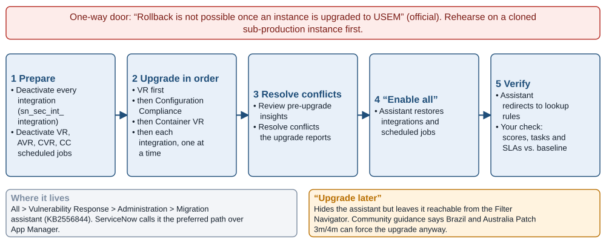

*Figure 3. The Migration assistant path from classic Vulnerability Response to USEM. Source: Official docs: migrate-to-usem, sem-install-prerequisites, usem-migration-planning; Community upgrade guidance.*

## Shared rule tables sit over separate finding tables

### The physical data model, by official table name

USEM's "unified data model" means **unified configuration and engine tables over unchanged per-domain finding tables**. The host, application, container, and compliance finding tables stay physically separate. What moves into shared `sn_sec_*` tables is the rule, scoring, exception, and task-rule configuration, and the per-app rule tables those replace are now deprecated ([official docs](https://github.com/ServiceNow/ServiceNowDocs/blob/brazil/markdown/security-management/sem-new-tables-installed.md); [official docs](https://github.com/ServiceNow/ServiceNowDocs/blob/brazil/markdown/security-management/sem-components-installed.md)). The official component pages settle several table names that are hard to confirm elsewhere. Most importantly, **`sn_vul_vulnerability` is real: it is the host Remediation Tasks table**, "Collection of vulnerable items organized for remediation." `sn_vul_entry` exists as the parent vulnerability-entry table ([official docs](https://github.com/ServiceNow/ServiceNowDocs/blob/brazil/markdown/security-management/vulnerability-response/installed-with-vr.md)).

| Object | Official table(s) | Notes |
|---|---|---|
| Scanner detection | `sn_vul_detection` | "Vulnerable item detections from third-party integrations"; opened and closed only by scanner data |
| Host vulnerable item (VIT) | `sn_vul_vulnerable_item` | "The occurrence of a vulnerability on a configuration item" |
| Vulnerability entry | `sn_vul_entry` (parent), `sn_vul_third_party_entry` (TPE, e.g., Tenable `TEN-` records), `sn_vul_nvd_entry` (CVE) | TPE↔CVE links in `sn_vul_m2m_entry_cve` |
| Host remediation task | **`sn_vul_vulnerability`** ("Remediation Tasks"); members in `sn_vul_m2m_vul_group_item`; changes in `sn_vul_m2m_vg_change_request` | Legacy task rules in `sn_vul_grouping_rule` |
| Cross-app task surface | `sn_vul_remediation_task` (v18.0) | "Stores all the remediation tasks for VR, AVR, CVR, and test result groups"; visible to users who cannot read `sn_vul_vulnerability` |
| Application finding (AVIT) | `sn_vul_app_vulnerable_item`; entries `sn_vul_app_vul_entry`; discovered apps `sn_vul_app_release` | AVR remediation task table not found in docs |
| Container finding (CVIT) | `sn_vul_container_image_vulnerable_item`; tasks `sn_vul_container_vulnerability`; images `sn_vul_container_image`; per-package findings `sn_vul_container_image_findings` | |
| Configuration Compliance | results `sn_vulc_result`; tests `sn_vulc_test`; tasks `sn_vulc_result_group`; policies `sn_vulc_policy`; history `sn_vulc_result_history` | Wiz misconfigurations and Issues land here |
| Discovered Item (scanner asset) | `sn_sec_cmn_src_ci` | Host tags in `sn_sec_cmn_host_tag` |
| Fix (Fix Intelligence) | `sn_vul_fix_intel` (plugin scope `sn_vul_fix`) | One record per unique fix |
| AI exposure | `sn_sec_ai_vul_entry`, `sn_sec_ai_posture_finding`, `sn_sec_ai_validation_finding`, `sn_sec_ai_scan_finding`, `sn_sec_ai_src_ci` | |
| Solutions | `sn_vul_solution`, `sn_vul_m2m_vulnerability_solution`, `sn_vul_m2m_solution_supersedence` | |
| Licensing usage | `sn_vul_licensing_usage_by_ci_classes`, `sn_vul_vr_configuration_item_count` | Suggests per-CI metering |

Sources: [VR components](https://github.com/ServiceNow/ServiceNowDocs/blob/brazil/markdown/security-management/vulnerability-response/installed-with-vr.md); [AVR components](https://github.com/ServiceNow/ServiceNowDocs/blob/brazil/markdown/security-management/application-vulnerability-response/installed-with-avm.md); [CC components](https://github.com/ServiceNow/ServiceNowDocs/blob/brazil/markdown/security-management/configuration-compliance/installed-with-config-compliance.md); [Fix Intelligence components](https://github.com/ServiceNow/ServiceNowDocs/blob/brazil/markdown/security-management/fix-intel-components-installed.md); [CVR risk rules](https://github.com/ServiceNow/ServiceNowDocs/blob/brazil/markdown/security-management/sem-configure-risk-rules.md); [AI Security Exposure](https://github.com/ServiceNow/ServiceNowDocs/blob/brazil/markdown/security-management/ai-security-exposure-install-config.md).

The new USEM tables fall into five groups. The deprecation map from old tables to these is the authoritative checklist for custom code. Every script, ACL, report, and Performance Analytics indicator that reads a deprecated table will break or go stale after migration. The same page lists 14 deprecated scheduled jobs, including "Rerun calculators," "Reapply all vulnerability assignment rules," and "Evaluate remediation targets" ([official docs](https://github.com/ServiceNow/ServiceNowDocs/blob/brazil/markdown/security-management/sem-components-installed.md)).

| USEM area | New shared tables | Replaces (deprecated) |
|---|---|---|
| Risk Scoring for SEM | `sn_sec_calculator_group`, `sn_sec_calculator_rule`, `sn_sec_calculator_risk_field`, `sn_sec_calculator_config`, `sn_sec_calculator_risk_score_weight` | `sn_vul_calculator_group`, `sn_vul_calc_risk`, `sn_vulc_calculator_*`, `sn_vul_risk_field`, `sn_sec_cmn_calculator*`; risk weights in `sn_sec_cmn_risk_score_weight` below v30.0 |
| Administration for SEM | `sn_sec_wf_assign_rule`, `sn_sec_wf_classification_group/_rule`, `sn_sec_wf_ttr_rule`, `sn_sec_wf_m2m_ttr_status`, `sn_sec_wf_rollup_config` | `sn_vul_assignment_rule`, `sn_vulc_assignment_rule`, `sn_vul_ttr_rule`, `sn_vulc_ttr_rule`, `sn_vul_rollup`, `sn_vulc_risk_score_rollup`, `sn_vul_classification_*` |
| Exception Management for USEM | `sn_sec_exception_rule`, `sn_sec_exception_change_approval`, `sn_sec_exception_config`, `sn_sec_exception_policy_reason_mapping`, `sn_sec_exception_questionnaire_config` | `sn_vul_auto_exception_rule`, `sn_vulc_auto_exception_rule`, `sn_vul_change_approval`, `sn_vulc_state_change_approval` |
| Remediation for Attack Surface Mgmt | `sn_sec_rem_task_rule` | Per-app task rules |
| SEM dashboards | `sn_sec_sem_dashboard`, `sn_sec_sem_m2m_widget_dashboard`, `sn_sec_sem_widget_grouping` | — |

Two further moves happen outside the `sn_sec_*` tables. Compensating controls move to `sn_vul_cmn_m2m_entry_compensating_control`, and the container auto-close configuration moves to `sn_vul_cmn_auto_close_rule`. No dedicated exception-record table exists beyond the rule and Change Approval tables. My reading is that individual deferrals live as Change Approval records plus finding state, but the narrative docs do not confirm it.

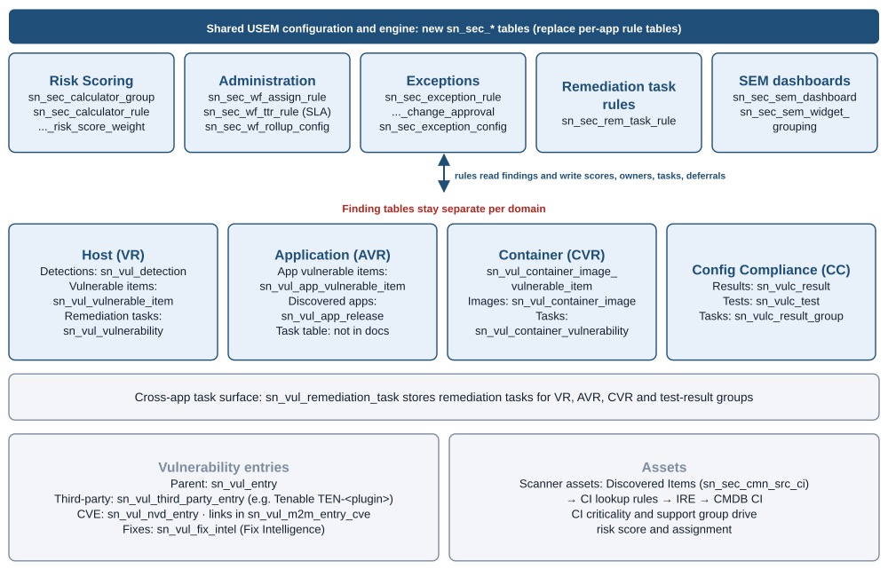

*Figure 4. USEM data model: shared `sn_sec_*` configuration tables sit over unchanged per-domain finding tables. Source: Official docs: sem-components-installed, sem-new-tables-installed, installed-with-vr / avm / config-compliance.*

### CI resolution is the hinge for everything downstream

Every integration writes scanner assets to **Discovered Items** (`sn_sec_cmn_src_ci`) and then applies CI lookup rules. Lookup rules now carry an "Applies to" field: Discovered Item for VR, or Discovered Application for AVR ([official docs](https://github.com/ServiceNow/ServiceNowDocs/blob/brazil/markdown/security-management/sem-configure-lookup-rules.md)). Assets that don't match go through the Identification and Reconciliation Engine (IRE). Since VR v20.0, unmatched cloud assets can go to Unclassed Hardware via `sn_sec_cmn.unmatched_cloud_resource_enabled` ([official docs](https://github.com/ServiceNow/ServiceNowDocs/blob/brazil/markdown/security-management/sem-ci-creation-using-IRE.md)).

The class history comes from Community webinar material. Unmatched assets went to the legacy Unmatched CI class before v12.2, to Unclassed Hardware or Incomplete IP from v12.2, and to a Cloud Resource class from v18. If `sn_sec_cmn.ci_creation_through_IRE` is false, Unmatched CI records "will never be reclassified" ([Community](https://www.servicenow.com/community/secops-vr-forum-read-only/what-differentiates-unmatched-cis-from-unclassed-cis/td-p/2519506)).

Brazil makes two changes here. It deprecates the "reconcile unmatched discovered items" job in favor of **"Reapply Look up Rules,"** and it adds `sn_sec_cmn.ci_lifecycle_status_source` to keep decommissioned Discovered Items out of lookup ([official docs](https://github.com/ServiceNow/ServiceNowDocs/blob/brazil/markdown/delta-zurich-brazil/brazil-zurich-vulnerabilityresponse-release-notes.md)). A Community architect sums up the dependency: USEM "relies heavily on CMDB quality to calculate business risk and priority" ([Community](https://www.servicenow.com/community/developer-forum/usem-unlocked-critical-changes-and-your-action-plan-for-future/td-p/3439262)).

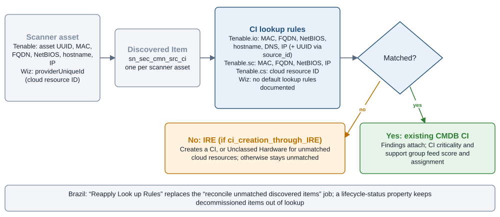

*Figure 5. How a scanner asset becomes a CMDB configuration item. Source: Official docs: sem-configure-lookup-rules, sem-ci-creation-using-IRE, tenableIntegration; Brazil VR delta notes.*

## Default scoring weighs EPSS, leaves KEV to you, and hides its weights

### What the base system actually scores

The official calculator page settles a question that Community material leaves open. VR ships a **Default Risk Calculator** whose **Default Risk Rule** "calculates Risk Score based on multiple values":

- **vulnerability severity**
- **exploit information**
- **criticality**
- **external exposure of the CI**
- **EPSS scores**

A second calculator, **Vulnerability Severity**, ships **disabled by default**, and only one calculator per target field can be active at a time ([official docs](https://github.com/ServiceNow/ServiceNowDocs/blob/brazil/markdown/security-management/vulnerability-response/vuln-calculators-rules.md)). Calculator rules are first-match-wins, and field-value weights run from 0 to 100. Scores recalculate when a VI is created, when its CI or vulnerability changes, or on demand. Since v25.0.3, work-notes logging of score changes (`sn_sec_cmn.risk_score_changes_add_worknotes`) is off by default. Risk ratings map from score as follows: **1 = 90–100, 2 = 70–89, 3 = 40–69, 4 = 1–39, 5 = 0**.

**ServiceNow does not publish the Default Risk Rule's numeric weights.** The docs point to login-gated KB1169927. The only published weights are an illustrative example: severity 50 and exploit-exists 50, combined as `(W(severity)·FV(severity) + W(exploit)·FV(exploit)) / 100` ([official docs](https://github.com/ServiceNow/ServiceNowDocs/blob/brazil/markdown/security-management/vulnerability-response/vuln-calc-risk-rule-example.md)). Other base calculators differ by domain. AVR's Default Risk Rule scores severity, OWASP Top 10, and SANS Top 25 ([official docs](https://github.com/ServiceNow/ServiceNowDocs/blob/brazil/markdown/security-management/application-vulnerability-response/avm-calculators-rules.md)). CVR uses the same 1–5 bands ([official docs](https://github.com/ServiceNow/ServiceNowDocs/blob/brazil/markdown/security-management/container-vulnerability-response/cvr-calculator-rules.md)).

**CISA KEV is not a weighted default factor.** Instead, "the risk score is automatically recalculated when the associated CVEs or TPEs on the VIs are linked to a CVE Known Exploit Vulnerability (KEV)" ([official docs](https://github.com/ServiceNow/ServiceNowDocs/blob/brazil/markdown/security-management/vulnerability-response/vuln-calculators-rules.md)). A KEV listing therefore triggers re-scoring but adds nothing to the score unless you add a criterion. The KEV "Known To Be Used in Ransomware Campaigns" flag is ingested at the CVE level and rolled up to the TPE ([official docs](https://github.com/ServiceNow/ServiceNowDocs/blob/brazil/markdown/security-management/vulnerability-response/vulnerability-fields.md)). One practical consequence: Tenable's `on_cisa_kev` and Wiz's `hasCisaKevExploit` both map to the same `cisa_exists` field, as shown in the integration sections below. A KEV criterion keyed on that field therefore treats both scanners consistently, which is the easiest cross-scanner normalization USEM offers.

**SSVC is opt-in.** SSVC enrichment "is available only in USEM," and you can use SSVC fields in your calculator ([official docs](https://github.com/ServiceNow/ServiceNowDocs/blob/brazil/markdown/security-management/vulnerability-response/nvd-ssvc-enrichment.md)). **Early Warning**, powered by Armis, adds an Admiralty score (A1–F6) as a rule criterion, with signals arriving "before broader industry recognition or CISA KEV inclusion" ([official docs](https://github.com/ServiceNow/ServiceNowDocs/blob/brazil/markdown/security-management/armis-early-warning-integration.md)).

Rule criteria in Risk Scoring for SEM can draw on several sources:

- the VI itself
- its CI, including extended classes
- its vulnerability record, including TPE fields
- reference tables of any of the three
- custom conditions

Many-to-many fields support min or max aggregation. The documented examples include the scanner's "Source Severity" ("Qualys and Tenable provide their own scores") and business criticality from `sn_vul_m2m_ci_services` with min aggregation. A third example, an internet-facing custom condition, carries a warning that it "might degrade performance" ([official docs](https://github.com/ServiceNow/ServiceNowDocs/blob/brazil/markdown/security-management/sem-vuln-calc-define-risk-rule-fields.md)). Two inputs remain undocumented: which EPSS the Default Risk Rule reads, and how "Criticality" is sourced by default. EPSS could come from the NVD-level FIRST.org feed or from a scanner's own field, and criticality could come from the CI's own field or from a related service.

### Vendor rules and rollups

The **Tenable Risk Rule** is official and ships with the Tenable app inside the Default Risk Calculator. It weights **VPR 70%, Asset 15%, and Business Criticality 15%**, and it is **"inactive by default"** with a warning that it "may impact your data ingestion performance" ([official docs](https://github.com/ServiceNow/ServiceNowDocs/blob/brazil/markdown/security-management/vulnerability-response/tenableIntegration.md); [official docs](https://github.com/ServiceNow/ServiceNowDocs/blob/brazil/markdown/security-management/vulnerability-response/vuln-calculators-rules.md)). No Wiz equivalent exists.

Rollup calculators aggregate finding scores upward on a 15-minute schedule. The base rollups cover:

- Discovered Application, Discovered Item, and Discovered Image
- Vulnerability Entry and Configuration Test
- Remediation Task, Container Remediation Task, Application Remediation Task, and Test Results Remediation Task
- Remediation Effort
- Organization Risk Score
- Patch Update

([official docs](https://github.com/ServiceNow/ServiceNowDocs/blob/brazil/markdown/security-management/sem-prioritizing-vulnerabilities-other-findings.md))

The widely quoted **80/5/15** weighting (maximum risk score 80, average 5, count of vulnerable items 15) appears in the official docs **only as a worked example**: "consider the following weights." The formula is `(Max/100)·80 + (Avg/100)·5 + factor·15`, where the count factor steps from 0.2 below 10 items to 1.0 above 10,000 ([official docs](https://github.com/ServiceNow/ServiceNowDocs/blob/brazil/markdown/security-management/sem-vuln-rollup-calculator.md)). It is consistent with long-standing practice, but verify the shipped values in `sn_sec_wf_rollup_config` before you rely on them. Rollup rules can use "Basic" weights or a script that returns 0–100. "All active records" **includes deferred findings** ([official docs](https://github.com/ServiceNow/ServiceNowDocs/blob/brazil/markdown/security-management/sem-configure-risk-rules.md)). EPSS rolls up from NVD to TPEs as `1 − Π(1 − p)`. In the docs' example, 100 vulnerabilities at 5% each yield 99.4%, which shows how quickly multi-CVE scanner entries saturate ([official docs](https://github.com/ServiceNow/ServiceNowDocs/blob/brazil/markdown/security-management/sem-vuln-rollup-calculator.md)). The Organization rollup takes the maximum across VIT, AVIT, CVIT, and test results, and it feeds the Unified VR Dashboard and the Cybersecurity Executive Dashboard.

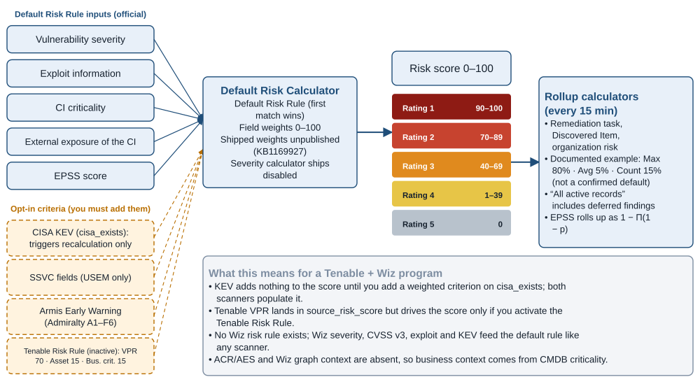

*Figure 6. How USEM scores a vulnerable item, what is on by default, and what you must add. Source: Official docs: vuln-calculators-rules, sem-vuln-rollup-calculator, tenableIntegration, nvd-ssvc-enrichment, armis-early-warning-integration.*

## Remediation rules centralize, and three defaults deserve scrutiny

### Assignment, grouping and SLAs

USEM moves the remediation rule sets into the SEM Workspace Administration console, where one rule can apply across VIT, AVIT, CVIT, and test results.

**Assignment rules** can use a user group, a group field on `cmdb_ci`, or a script. They run in ascending order: first match applies, then the default rule, otherwise the finding stays unassigned. "Manually assigned findings aren't reevaluated." The **"Run assignment rules" scheduled job is inactive by default** ([official docs](https://github.com/ServiceNow/ServiceNowDocs/blob/brazil/markdown/security-management/sem-assigning-findings-to-remediation-teams.md)).

**Remediation task rules** start from a default rule grouped by vulnerability and allow up to six group-by fields. They evaluate after CI matching, risk calculation, and assignment. **Match All is the default**, which means a finding can join several tasks at once. Match First puts each finding in exactly one task. The mode is set by `sn_sec_rem.remediation_task_rule_mode`. Re-evaluating tasks when the assignment group or preferred solution changes requires `sn_sec_rem.rerun_task_rules`, which is "not activated by default." That qualifies the release-note headline about automatic re-evaluation. "Reapply" deletes and recreates tasks. Task states roll down to findings, and common terminal states roll up to the task ([official docs](https://github.com/ServiceNow/ServiceNowDocs/blob/brazil/markdown/security-management/sem-grouping-multiple-findings-remediation-tasks-processing.md)). Under Match All, task counts and task-level rollup risk can double-count findings. That matters for SLA and backlog reporting.

**Remediation target (SLA) rules** set the target, the reminder target, the recipients, and the recalculation method. They are evaluated at import and on reopen. When several rules match, "the most restrictive rule is used." "Target from" defaults to **Last opened date**, and deactivating a rule clears dates to "No Target." **No out-of-box day values per risk rating were found**, so SLA days are customer-defined. From **USEM 30.1.4 / VR 26.4.4**, a risk-rating change triggers one of four recalculation methods: "Default calculation" (keep the existing date), recalculate from the risk-change date, always use the earliest target, or use the earliest only when the rating increases ([official docs](https://github.com/ServiceNow/ServiceNowDocs/blob/brazil/markdown/security-management/sem-defining-your-own-sla.md)). The earlier Zurich and Australia notes described targets simply recalculating from the latest risk-rating change ([Australia notes](https://www.servicenow.com/docs/r/australia/delta-zurich-australia/australia-zurich-unifiedsecurityexposuremanagementusem-release-notes.html)). Confirm which method your instance uses, because it decides whether a Tenable VPR jump or a Wiz exposure change moves a due date. On the task itself, v30.2.5 captures a remediation plan and commitment date when an owner moves the task to "Awaiting Implementation," and a "Missed Remediation Commitment Date" field tracks slippage ([Community](https://www.servicenow.com/community/secops-articles/usem-release-highlights-and-upgrade-information/ta-p/3438714)).

### Exceptions, change, patch, and the Fix layer

**Exception rules** auto-defer matching new and reopened findings until a "Deferred until" date, with the highest-priority rule winning. Approval is "a two-level process," and a rule with no first-level approver can't be approved. Submitting a rule now also creates a Change Approval record. "Execute on existing data" runs once on the Valid-from date ([official docs](https://github.com/ServiceNow/ServiceNowDocs/blob/brazil/markdown/security-management/sem-exception-rules-overview.md)). Australia added bulk approve and reject, Smart Assessment, and KPI tiles for expiring exceptions, extensions, and repeated rejections ([Australia notes](https://www.servicenow.com/docs/r/australia/delta-zurich-australia/australia-zurich-unifiedsecurityexposuremanagementusem-release-notes.html)).

**Change creation requires ITSM Advanced.** "Create Change" and "Add to existing change" appear only with the ITSM Advanced plugin. Customers on an "ITSM AI Native SKU without ITSM Advanced" lose them ([official docs](https://github.com/ServiceNow/ServiceNowDocs/blob/brazil/markdown/security-management/sem-ws-CRs.md)). Patch Orchestration and its integrations ship through the Store ([official docs](https://github.com/ServiceNow/ServiceNowDocs/blob/brazil/markdown/security-management/vulnerability-response/patch-orch-legacy-overview.md)). **Vulnerability Crisis Management** became "a separate subscription in the store" from v1.0.1 ([official docs](https://github.com/ServiceNow/ServiceNowDocs/blob/brazil/markdown/security-management/vulnerability-response/vulnerability-crisis-management.md)). **Vulnerability Solution Management** "requires a separate subscription." Its preferred-solution logic ranks vendor solutions above scanner solutions ([official docs](https://github.com/ServiceNow/ServiceNowDocs/blob/brazil/markdown/security-management/vulnerability-response/vuln-solution-mgmt.md)).

**Fix Intelligence** is backed by Armis Centrix ViPR. It normalizes and de-duplicates fixes across detections, assets, and scanners. Host VIs from Qualys, Rapid7, **Tenable.io**, **Wiz**, and Microsoft Defender Vulnerability Management are supported ([official docs](https://github.com/ServiceNow/ServiceNowDocs/blob/brazil/markdown/security-management/fix-intel-data-flow.md)). A task rule that groups by fix "effectively de-duplicates many findings into one actionable remediation task" ([official docs](https://github.com/ServiceNow/ServiceNowDocs/blob/brazil/markdown/security-management/group-findings-by-fix.md)).

### Workspace and Otto AI

The SEM Workspace modules are:

- Findings
- Remediation
- Approvals
- List
- Watch topics
- Cloud Exposure View
- AI Exposures
- Health Dashboard
- Visualization library
- Administration

([official docs index](https://github.com/ServiceNow/ServiceNowDocs/blob/brazil/markdown/security-management/index.md))

Exposure Assessment requires ITSM Software Asset Management (`com.snc.asset_management`) ([official docs](https://github.com/ServiceNow/ServiceNowDocs/blob/brazil/markdown/security-management/vulnerability-response-workspaces/vr-ws-exposure-assessment.md)).

Otto for USEM ships **seven generative AI skills** ([official docs](https://github.com/ServiceNow/ServiceNowDocs/blob/brazil/markdown/security-management/using-now-assist-skills-vulnerability-response.md)):

1. Security Exposure 360
2. AI guardrails helper
3. Generate vulnerability insights
4. Exception and false-positive approval recommendations
5. Create an API connector
6. **Identify duplicate vulnerable items**
7. Suggest vulnerability solutions (requires Vulnerability Solution Management)

It also ships **five agentic workflows**: Security Exposure 360, Guardrails detector, Assess vulnerability exposure, Retrieve vulnerability data, and Analyze remediation status. Agent records are read-only by default and must be duplicated in AI Agent Studio before you modify them ([official docs](https://github.com/ServiceNow/ServiceNowDocs/blob/brazil/markdown/security-management/using-now-assist-ai-agents-vr.md)). Access to every skill and workflow is "depending on your license." The "Vulnerability Resolution AI Specialist" in ServiceNow's August 2026 press release appears **nowhere** in the Brazil security docs ([official docs](https://github.com/ServiceNow/ServiceNowDocs/blob/brazil/markdown/release-notes/autonomous-workforce-rn.md); [press release](https://newsroom.servicenow.com/press-releases/details/2026/ServiceNow-delivers-Autonomous-Security-the-industrys-most-complete-security-offering/default.aspx)). Treat it as roadmap.

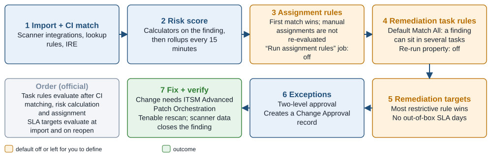

*Figure 7. Remediation pipeline, with the steps whose defaults are off or customer-defined highlighted. Source: Official docs: sem-assigning-findings, sem-grouping-multiple-findings, sem-defining-your-own-sla, sem-exception-rules-overview, sem-ws-CRs.*

## Licensing hides in separate subscriptions, not a USEM SKU

USEM has no SKU of its own. It is available to every customer entitled to VR ([Zurich notes](https://www.servicenow.com/docs/r/zurich/release-notes/secops-sem-rn.html)). The real cost sits in adjacent entitlements, which the official docs state more clearly than any tier sheet does.

These components are documented as **separate subscriptions**:

- Application VR
- Container VR
- Configuration Compliance
- Vulnerability Crisis Management
- Vulnerability Solution Management
- the Tenable integration
- most third-party AVR scanner integrations

These features carry explicit **prerequisites**:

- Fix Intelligence requires an **Armis Centrix ViPR** entitlement.
- Change creation requires **ITSM Advanced**.
- Exposure Assessment requires **ITSM SAM**.

([AVR](https://github.com/ServiceNow/ServiceNowDocs/blob/brazil/markdown/security-management/application-vulnerability-response/avr-landing.md); [CVR](https://github.com/ServiceNow/ServiceNowDocs/blob/brazil/markdown/security-management/container-vulnerability-response/exploring-cvr.md); [CC](https://github.com/ServiceNow/ServiceNowDocs/blob/brazil/markdown/security-management/configuration-compliance/cc-configuring.md); [Fix Intelligence](https://github.com/ServiceNow/ServiceNowDocs/blob/brazil/markdown/security-management/install-fix-intel.md); [Tenable](https://github.com/ServiceNow/ServiceNowDocs/blob/brazil/markdown/security-management/vulnerability-response/tenableIntegration.md))

The Wiz app's install page names VR, Container VR, and Configuration Compliance as prerequisites and notes "these applications are available as separate subscriptions" ([official docs](https://github.com/ServiceNow/ServiceNowDocs/blob/brazil/markdown/security-management/vulnerability-response/vr-wiz-host-vuln-install.md)). **A full Wiz deployment therefore implies CVR and CC entitlements.** The tables `sn_vul_licensing_usage_by_ci_classes` and `sn_vul_vr_configuration_item_count` point to per-CI metering ([official docs](https://github.com/ServiceNow/ServiceNowDocs/blob/brazil/markdown/security-management/vulnerability-response/installed-with-vr.md)). Brazil notes say Otto replaces Now Assist for VR and "your product entitlements remain unchanged" ([official docs](https://github.com/ServiceNow/ServiceNowDocs/blob/brazil/markdown/release-notes/rn-summary-upgrade-info.md)).

The official security docs publish **no Foundation/Advanced/Prime feature matrix**. A licensing consultancy reports that those tiers replaced Standard through Enterprise Plus on April 9, 2026, with assists "metered from a tenant pool with an unpublished top up rate" ([third-party](https://redresscompliance.com/servicenow-foundation-advanced-prime-compared)). A Community packaging guide places Vulnerability Crisis Management, Patch Orchestration, and the Executive Dashboard in Advanced, and Vulnerability Solution Management in Prime ([Community](https://www.servicenow.com/community/secops-articles/servicenow-secops-2026-packaging-guide-for-cisos/ta-p/3568678)). The product docs do not corroborate that placement. Their "separate subscription" wording either predates the tiers or describes subscriptions the tiers bundle. Settle it in the order form, not the docs. A 2021 ServiceNow deck said the Tenable app came with a VR Standard license ([Community deck](https://www.servicenow.com/community/s/cgfwn76974/attachments/cgfwn76974/security-operations-kb/481/1/SN-built%20VR%20Integration%20with%20Tenable%20-%20Ravi%20K.pdf)). The current docs supersede that: the app is a separate Store subscription.

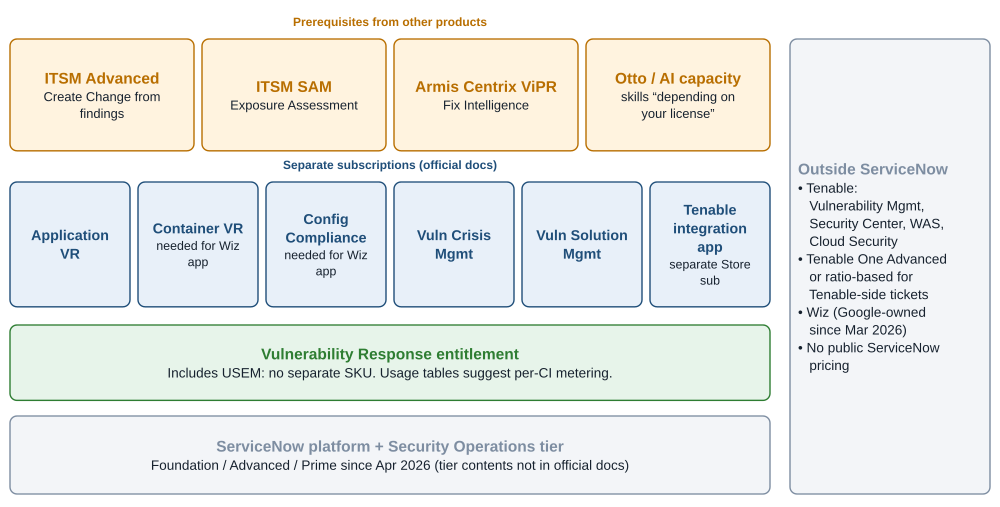

*Figure 8. Entitlement map: what USEM includes and what is licensed separately. Source: Official docs (AVR, CVR, CC, Fix Intelligence, Tenable and Wiz install pages); third-party and Community sources for tiers.*

## Tenable arrives through a separately subscribed ServiceNow app

### Which Tenable paths are live

| Path | Publisher | Direction and destination | Status, Oct 2026 |
|---|---|---|---|
| Vulnerability Response Integration with Tenable (`sn_vul_tenable`; Tenable.io, Tenable.sc 5.13+, Tenable.cs 5.0.1+) | ServiceNow | Tenable → Discovered Items, TPEs, VITs, CVITs, and (separate Store entry) Configuration Compliance results | **Primary findings path**, separate subscription ([official docs](https://github.com/ServiceNow/ServiceNowDocs/blob/brazil/markdown/security-management/vulnerability-response/tenableIntegration.md); [USEM catalog](https://github.com/ServiceNow/ServiceNowDocs/blob/brazil/markdown/security-management/integrating-usem.md)) |
| Tenable Web Application Scanning VR Integration | ServiceNow | Tenable WAS → Discovered Applications (`sn_vul_app_release`), AVITs, scan summaries | Documented in Brazil ([official docs](https://github.com/ServiceNow/ServiceNowDocs/blob/brazil/markdown/security-management/application-vulnerability-response/tenable-was-integration.md)) |
| Service Graph Connector for Tenable 6.x | Tenable | Tenable assets → CMDB via IRE; pushes CIs back to TVM/TSC | Current, per Tenable ([Tenable guide, Aug 2026](https://docs.tenable.com/integrations/ServiceNow/Content/PDF/Tenable_and_ServiceNow_Integration_Guide.pdf)) |
| Tenable for ITSM | Tenable | Findings → custom `x_tsirm` tables → Incidents | Current; for teams without VR ([same](https://docs.tenable.com/integrations/ServiceNow/Content/PDF/Tenable_and_ServiceNow_Integration_Guide.pdf)) |
| Tenable Exposure Management ServiceNow Connector | Tenable | **ServiceNow CMDB → Tenable**, assets only, daily | Current; not FedRAMP Moderate ([Tenable docs](https://docs.tenable.com/exposure-management/Content/connectors/servicenow-connector.htm)) |
| Tenable EM "Create ServiceNow Ticket" / Hexa AI | Tenable | Findings → incidents; sync within ~10 minutes | Ratio-based Tenable One or Tenable One Advanced only ([Tenable docs](https://docs.tenable.com/exposure-management/Content/inventory/create-snow-ticket.htm)) |
| Tenable-built VR app (TVM/TSC) | Tenable | — | **End of support April 14, 2023** ([Tenable docs](https://docs.tenable.com/snow/Content/Welcome.htm)) |
| Tenable.ot / OT Security for VR | Tenable | OT findings → VITs | **End of support Dec 31, 2025**, no replacement ([Tenable EOL notice](https://docs.tenable.com/pdfs/EOL/tenableot-VR-ServiceNow-EOL.pdf)) |

ServiceNow launched its own Tenable app on November 19, 2020, alongside Tenable's ([Tenable blog](https://www.tenable.com/blog/tenable-and-servicenow-extending-vulnerability-response-options-through-strategic-partner)). Migration from the Tenable-built app is governed by KB0960667. The official app is "developed by ServiceNow engineering" and "available with a separate subscription from the ServiceNow Store." It requires VR 12.1 or later, IntegrationHub, and the Setup Assistant "Tenable (Tenable Platform)" tile. Its roles are `sn_vul_tenable.configure_integration` and `sn_vul_tenable.read_integration` ([official docs](https://github.com/ServiceNow/ServiceNowDocs/blob/brazil/markdown/security-management/vulnerability-response/tenable-setup-checklist.md)).

**The app ships on two tracks, and the docs' version table is stale.** A Community FAQ said ServiceNow shipped USEM-compatible v30.x builds of its integrations, Tenable included ([Community FAQ](https://www.servicenow.com/community/secops-articles/usem-office-hours-faqs-migration-amp-adoption/ta-p/3524375)). The official Tenable page lists "Available versions for Brazil: v3.13.1, v4.1, v5.0.1" and defers compatibility to KB0856498. Other official pages contradict even that table: they describe mappings "implemented as part of Tenable 5.2.1" and a compliance-results split "starting with v 6.1.3" ([official docs](https://github.com/ServiceNow/ServiceNowDocs/blob/brazil/markdown/security-management/vulnerability-response/tenable-data-transformref.md); [official docs](https://github.com/ServiceNow/ServiceNowDocs/blob/brazil/markdown/security-management/vulnerability-response/tenable-io-integrations-list.md)). ServiceNow's Store release notes settle it: the app has shipped paired releases since January 2026, a USEM track (30.2.0, 30.2.1, 30.3.3, 30.4.1, 30.4.4, and **30.5.3** in September 2026) and a classic track (6.0.0, 6.0.1, 6.1.3, and **6.2.3** in September 2026). Each 30.x entry is tagged "(USEM)" ([ServiceNow release notes](https://www.servicenow.com/docs/r/store-release-notes/store-secops-rn-vr-integration-with-tenable.html)). The Community FAQ was right and the docs repo's version table lags the Store. Install the 30.x track on USEM and the 6.x track on classic VR, and confirm the certified build in KB0856498.

Three coverage facts changed with the official docs:

- **Web App Scanning is covered.** The Tenable WAS integration uses Tenable's export APIs to pull applications and DAST findings in chunks. It authenticates with an access key and secret validated against `GET /session`, and it offers a per-integration lookup strategy (CI lookup or Product Model) ([official docs](https://github.com/ServiceNow/ServiceNowDocs/blob/brazil/markdown/security-management/application-vulnerability-response/configure-tenable-was-integration-using-setup-assistant.md)). The earlier 2023–2024 Community reports of no WAS support ([Community](https://www.servicenow.com/community/secops-forum/tenable-io-web-application-scanning-asset-and-vulnerabilities/m-p/2475079)) are outdated.
- **Tenable.cs support for "cloud hosts and container images" appears in the official Zurich-to-Brazil delta notes.** An earlier docs snippet dated it to VR v20.0, so check your version. It creates VIs for cloud hosts and CVITs for images, through a "Tenable.cs GraphQl REST message" authenticated by a "Tenable CS Platform" token ([official docs](https://github.com/ServiceNow/ServiceNowDocs/blob/brazil/markdown/delta-zurich-brazil/brazil-zurich-vulnerabilityresponse-release-notes.md); [official docs](https://github.com/ServiceNow/ServiceNowDocs/blob/brazil/markdown/security-management/vulnerability-response/tenable-rest-msgs.md)). The GraphQL API suggests it targets the current Ermetic-based Tenable Cloud Security platform rather than the legacy Tenable.cs, which reached end of life on September 30, 2024 ([Tenable EOL](https://docs.tenable.com/pdfs/EOL/legacy-cloud-security.pdf)). The docs do not say so explicitly.
- **There is no ServiceNow path for Tenable OT or Tenable Identity Exposure findings.** Tenable shows up only as an asset source, including for OT CI classes, in Security Posture Control's connector reference ([official docs](https://github.com/ServiceNow/ServiceNowDocs/blob/brazil/markdown/security-management/scp-hw-connectors-ci-classes.md)).

### The job chain, defaults and throughput

Each Tenable product runs as a set of separately scheduled integrations under the VR Integration Framework.

**Tenable.io** runs the following integrations ([official docs](https://github.com/ServiceNow/ServiceNowDocs/blob/brazil/markdown/security-management/vulnerability-response/tenable-io-integrations-list.md)):

| Integration | What it does |
|---|---|
| Assets | Pulls the asset export in chunks, tracked in `sn_vul_tenable_chunk_status` and cleaned after 30 days |
| Plugin | Incremental, by last plugin update |
| **Fixed Vulnerabilities** | Scheduled; **chains to Open Vulnerabilities** |
| Scan Credential | Weekly; needed for rescans |
| Template | Used for rescans |
| Scan Metadata | Pulls scan records |
| Fixed Compliance → Open Compliance | Chained, from v6.1.3 |
| Compliance Backfill | Up to 200 missing asset IDs |

**Tenable.sc** splits assets into Open and Fixed integrations "to avoid creating duplicate discovered items." Its Fixed Vulnerabilities integration chains to Open and excludes **plugin families 0 and 39 by default**. A seven-day Backfill integration is **inactive by default** ([official docs](https://github.com/ServiceNow/ServiceNowDocs/blob/brazil/markdown/security-management/vulnerability-response/tenable-sc-integrations-list.md)). **Tenable.cs** runs the reverse order, pulling Open before Fixed for both containers and cloud hosts ([official docs](https://github.com/ServiceNow/ServiceNowDocs/blob/brazil/markdown/security-management/vulnerability-response/tenable-cs-integrations-list.md)). A ServiceNow employee explained the Fixed-before-Open order this way: "The Tenable API works in a fixed sequence" ([Community](https://www.servicenow.com/community/secops-forum/tenable-integration-scheduled-job/m-p/1312355)).

The import defaults matter at enterprise scale ([official docs](https://github.com/ServiceNow/ServiceNowDocs/blob/brazil/markdown/security-management/vulnerability-response/tenable-data-rerieve.md)):

- **Severity:** Tenable.io imports **only Critical and High by default**. `severity_medium`, `severity_low`, and `severity_info` are all false, and Tenable.cs uses the same default.
- **Chunk and page sizes:** the vulnerability export chunk (`num_assets`) defaults to 50 assets, the asset `chunk_size` to 1,000, and the plugin page size to 1,000 (maximum 10,000).
- **Custom JSON filters:** you can add filters such as `cidr_range`, `plugin_family`, and severity to the Tenable.io REST methods. EPSS, CVSS v4, and VPR v2 filters arrive with app 5.2.1 ([official docs](https://github.com/ServiceNow/ServiceNowDocs/blob/brazil/markdown/security-management/vulnerability-response/tenable-add-filters.md)).
- **First run:** each integration has an "initial start date." Leaving it empty imports every plugin, vulnerability, and asset ([official docs](https://github.com/ServiceNow/ServiceNowDocs/blob/brazil/markdown/security-management/vulnerability-response/vr-tenable-config-in-SA.md)).
- **MID Server and timeouts:** a MID Server is required only when Tenable.sc and the instance are in different environments, and "integrations time out after five minutes" either way ([official docs](https://github.com/ServiceNow/ServiceNowDocs/blob/brazil/markdown/security-management/vulnerability-response/tenableIntegration.md)).
- **Credentials:** a Tenable.io basic user with permission 16 is enough from app v3.8. Tenable.sc needs Security Analyst or Manager, with API keys from sc 5.13.
- **Import queue:** each import-queue entry has a one-hour processing limit, and heartbeat properties control it since VR 18.2.4 ([official docs](https://github.com/ServiceNow/ServiceNowDocs/blob/brazil/markdown/security-management/vulnerability-response/vr-tenable-rescan-tenable-io.md)).

Throughput is limited on the ServiceNow side. A ServiceNow support KB says Tenable.io asset and fixed-vulnerability runs can sit "several hours" in the import queue, and it recommends raising active Vulnerability Import Templates from 5 to 15–20 ([KB2313924, search snippet](https://support.servicenow.com/kb?id=kb_article_view&sysparm_article=KB2313924)). ServiceNow's preparation guide says to disable unused calculators and notification business rules before the first load ([ServiceNow docs](https://www.servicenow.com/docs/r/zwMwt0JEh8FTHmrqXNjCAw/cIbKvQfzuVzUy2IfxMT_5g)). No HTTP 429 or rate-limit handling is documented.

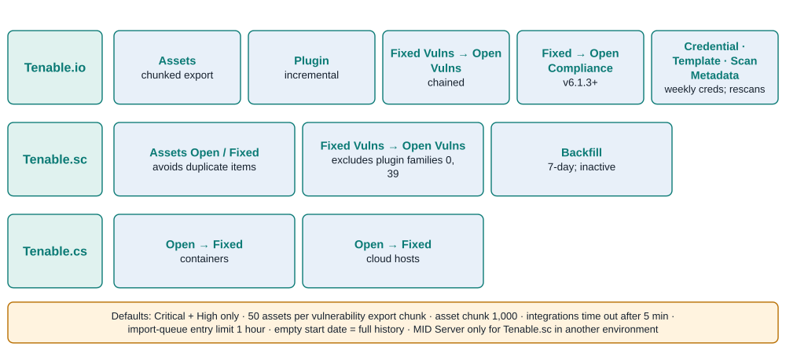

*Figure 9. Tenable integration job chains and import defaults per Tenable product. Source: Official docs: tenable-io / sc / cs-integrations-list, tenable-data-rerieve, tenableIntegration.*

### Field mappings: VPR, CVSS v4, KEV and EPSS arrive; ACR and AES do not

| Tenable source | ServiceNow target | Notes |
|---|---|---|
| Plugin `id` | `sn_vul_third_party_entry` id `TEN-<id>` | CVEs linked via `sn_vul_m2m_entry_cve` → `sn_vul_nvd_entry` |
| `risk_factor` | `source_severity` | |
| `vpr.score` (VPR v2 preferred over v1) | `source_risk_score`, plus derived `source_risk_rating` (9–10 Critical, 7–9 High, 4–7 Medium, 0–4 Low) | Business rule, marked "Tenable 5.2.1"; if both VPRs are empty, the score is unchanged |
| `vpr.drivers.*` | `age_of_vuln`, `exploit_code_maturity`, `product_coverage`, `threat_sources`, `threat_intensity`, `threat_recency`, `v3_impact_subscore` | |
| `exploit_available` | `exploit` | Feeds the Default Risk Rule's exploit factor |
| `cvss3_base_score`; `cvss4_base_score`/`cvss4_threat_score` | `v3_base_score`; `v4_base_score`/`v4_threat_score` | |
| `on_cisa_kev` | `cisa_exists` | Same field Wiz KEV maps to |
| `epss_score`, VPRv2 threat summary, `in_the_news`, targeted industries and regions, workaround fields | "Tenable TPE Additional Attributes" table | Not first-class VI fields |
| `severity_id` | VI `priority` (default 5) | |
| `first_found` / `last_found` | VI `first_found` / `last_found` | |
| `state` (io) / `hasBeenMitigated` (sc) / `resolved` (cs) | VI `state` | sc Fixed integration sets all VIs Closed |
| Asset `id` (UUID) | Discovered Item `source_id` | "Used for CI lookup" |
| **ACR, AES** | **Not mapped** | A grep for `acr`, `aes`, `exposure_score`, and `asset_criticality` found nothing |
| Accept/recast (`severity_modification_type`) | **Not mapped** | No route into VR exceptions |

Source: [official transform reference](https://github.com/ServiceNow/ServiceNowDocs/blob/brazil/markdown/security-management/vulnerability-response/tenable-data-transformref.md).

The prioritization consequence is direct. **Tenable's asset-context scores (ACR, AES) never reach USEM**, so business context has to come from CMDB criticality. EPSS from Tenable lands in a side table, and the docs do not say whether the Default Risk Rule's EPSS factor reads it or the NVD-level FIRST.org feed. Tenable's ACR and AES live only in Tenable's own ITSM tables (`u_acrscore`, `u_assetexposurescore`) ([Tenable guide](https://docs.tenable.com/integrations/ServiceNow/Content/PDF/Tenable_and_ServiceNow_Integration_Guide.pdf)).

State handling has three documented rules. First, VIs are created only for Open and Reopened detections. Fixed detections update existing VIs, and they create new Fixed-state VIs only when "Create vulnerable items for Fixed Vulnerability detections" (`insert_fixed`) is set, at a performance cost ([official docs](https://github.com/ServiceNow/ServiceNowDocs/blob/brazil/markdown/security-management/vulnerability-response/tenable-io-integrations-list.md)). That official behavior does not explain a May 2025 Community report of VIs created **Open** for plugins Tenable reported as fixed. That report remains unanswered ([Community](https://www.servicenow.com/community/secops-forum/vr-tenable-io-fixed-vulnerabilities-integration-question/m-p/3265320)). Second, Auto-Close Stale Detections works across all Tenable integrations and is environment-wide ([official docs](https://github.com/ServiceNow/ServiceNowDocs/blob/brazil/markdown/security-management/vulnerability-response/vr-setup-autoclose-detections.md)). Third, detection granularity is tunable. "Include proof in VI key," combined with regex entries in `sn_vul_proof_key_vulnerability`, splits detections per file path and closes paths that disappear by hash comparison. An "Include port" option exists for io and sc ([official docs](https://github.com/ServiceNow/ServiceNowDocs/blob/brazil/markdown/security-management/vulnerability-response/tenable-split-detections.md)). For compliance results, the test identifier is now selectable (`compliance_control_id`, `check_id`, or `compliance_functional_id`). Previously `check_id` caused overwrites ([official docs](https://github.com/ServiceNow/ServiceNowDocs/blob/brazil/markdown/delta-australia-brazil/brazil-australia-configurationcompliance-release-notes.md)).

### Asset matching uses network identifiers plus the Tenable UUID

The shipped CI lookup rules are ([official docs](https://github.com/ServiceNow/ServiceNowDocs/blob/brazil/markdown/security-management/vulnerability-response/tenableIntegration.md)):

- **Tenable.io:** MAC_ADDRESS, FQDN, NetBIOS, HostName, DNS, IP
- **Tenable.sc:** MAC_ADDRESS, FQDN, NetBIOS, IP
- **Tenable.cs:** "Cloud Resource Id"

Multiple IPs, MACs, and FQDNs per asset create multiple network adapters through IRE. The USEM lookup-rules page gives a list **without IP** for io and sc ([official docs](https://github.com/ServiceNow/ServiceNowDocs/blob/brazil/markdown/security-management/sem-associate-finding-configuration-item-using-lookup-rules.md)), so check what your instance actually has. The Tenable UUID is used. The Tenable.io asset `id` lands in `source_id`, "used for CI lookup," and the serial number lands in `source_payload` "used for CI matching." Tags go to `sn_sec_cmn_host_tag` ([official docs](https://github.com/ServiceNow/ServiceNowDocs/blob/brazil/markdown/security-management/vulnerability-response/tenable-data-transformref.md)).

Some identifiers still go unused. The payload carries `agent_uuid`, `bios_uuid`, `network_id`, and a `device_type` such as `aws-ec2-instance`, but **no shipped rule matches on agent UUID, BIOS UUID, or cloud instance ID**. Tenable.sc assets have no API UUID at all. The app synthesizes one from `uniqueness`. That fits the Community thread title "Tenable.sc – missing property on Asset Import causing multiple hosts to map to same Discovered Item" ([Community](https://www.servicenow.com/community/secops-forum/understanding-the-tenable-vulnerability-integration/m-p/3545667)).

Three levers help:

- **Network partition identifier:** an opt-in setting separates assets that share an IP, using io `network_id` or sc `repository_id` ([official docs](https://github.com/ServiceNow/ServiceNowDocs/blob/brazil/markdown/security-management/vulnerability-response/tenable-updateCI-NPI.md)).
- **Exclusion properties:** `ignoreIPAddress` and `ignoreMacAddress` keep listed values out of lookup and CI creation.
- **Tag import:** asset tags import by default (`sn_vul.import_asset_tags`) and work in assignment and task-rule conditions, but they are "intended for use only in the condition builder," not as a group key ([official docs](https://github.com/ServiceNow/ServiceNowDocs/blob/brazil/markdown/security-management/vulnerability-response/tenableIntegration.md)).

If you also run Tenable's own SGC, it writes CIs through IRE with `discovery_source = "SG-Tenable"` ([Tenable guide](https://docs.tenable.com/integrations/ServiceNow/Content/PDF/Tenable_and_ServiceNow_Integration_Guide.pdf)). That creates a second identity path unless both paths agree on identification rules.

### Rescans exist for io and sc; write-back does not

The Brazil docs document rescan for **both Tenable.io and Tenable.sc** ([official docs](https://github.com/ServiceNow/ServiceNowDocs/blob/brazil/markdown/security-management/vulnerability-response/vr-tenable-rescan-tenable-io.md); [official docs](https://github.com/ServiceNow/ServiceNowDocs/blob/brazil/markdown/security-management/vulnerability-response/vr-tenable-rescan.md)). Rescans launch from VIs, remediation tasks, TPEs, Discovered Items (io only), and the workspaces. They require the Template and Scan Credential integrations plus `sn_vul.write_all` or `sn_vul.write_assigned`. Child scans split per IP and network, up to 1,000 IPs each. Results appear only "after the next scheduled import of the Fixed Vulnerabilities Integration." Neither product "support[s] launching rescan on agent based machines," so agent-only fleets verify fixes on the agent's own cadence. No write-back of ServiceNow state, exceptions, or tags to Tenable is documented. Tenable's SGC can push CIs to TVM, but it "only passes network details and servicenow sys_id" and assigns no tags ([Tenable docs](https://docs.tenable.com/integrations/ServiceNow/Content/AssetsIntroduction.htm)).

## Wiz arrives through a delta-pulling ServiceNow app and a CMDB connector

### Ownership, tracks and versions

ServiceNow made the "Vulnerability Response Integration with Wiz" (`sn_vul_wiz`) generally available on **July 31, 2025** as an app "built, managed and supported by ServiceNow." It replaced three Wiz-built apps from the `x_wiz_vul` lineage, and customers can migrate from those under KB2344715 at their own pace ([Community announcement](https://www.servicenow.com/community/secops-articles/announcement-wiz-integration-with-servicenow-secops/ta-p/3325055)). Customers who posted chose to start fresh. One thread reports deprecated Wiz-built tables and a "Wiz details" tab left behind after migration, with no fix posted ([Community](https://www.servicenow.com/community/secops-forum/new-wiz-integration-from-servicenpw/m-p/3374992)).

The two version tracks are official. Configuration pages refer to "versions 30.3 (USEM workspace-compatible) and 1.3 (legacy workspace)" and "version 32.1 (USEM) and version 4.1 (non-USEM)" ([official docs](https://github.com/ServiceNow/ServiceNowDocs/blob/brazil/markdown/security-management/vulnerability-response/vr-config-wiz-host-vuln.md); [official docs](https://github.com/ServiceNow/ServiceNowDocs/blob/brazil/markdown/security-management/vulnerability-response/wiz-assets-resources-tab.md)). ServiceNow's Store release notes trace the history from 1.0.10 (August 2025) through 30.2.3/1.2.1 (January 2026) and 32.0.3 (April) to **32.8.4/4.2.4 (September 2026)** ([ServiceNow release notes, outside the repo](https://www.servicenow.com/docs/r/store-release-notes/store-secops-rn-vr-int-wiz.html)). Those notes are not in the docs repo, so that history is not re-verified here.

Two references are stale. The official USEM integrations catalog still lists the **Wiz-built** "Wiz Integration for Security Operations" and the Wiz Container VR app instead of the ServiceNow-built one ([official docs](https://github.com/ServiceNow/ServiceNowDocs/blob/brazil/markdown/security-management/integrating-usem.md)). Wiz's own marketing page still calls the VR integration "Built by Wiz" ([Wiz](https://www.wiz.io/integrations/servicenow-vulnerability-response)).

### Install, jobs and what lands where

The app installs from All Available Applications. Its prerequisites are VR (with the NVD, CISA, and CWE jobs), Container VR, and Configuration Compliance ([official docs](https://github.com/ServiceNow/ServiceNowDocs/blob/brazil/markdown/security-management/vulnerability-response/vr-wiz-host-vuln-install.md)). Configuration takes an Auth URL, API URL, client ID, and secret, tested with "Save and test." The required roles are `sn_vul.vulnerability_admin`, `sn_vulc.admin`, and `sn_vul_wiz.configure_integration`. All integrations except Host Test Results run daily, and you backdate by editing "Import since" and choosing Execute now ([official docs](https://github.com/ServiceNow/ServiceNowDocs/blob/brazil/markdown/security-management/vulnerability-response/vr-config-wiz-host-vuln.md); [official docs](https://github.com/ServiceNow/ServiceNowDocs/blob/brazil/markdown/security-management/vulnerability-response/wiz-activate-backfill.md)).

| Integration | Wiz scopes | Lands in USEM as | Default state |
|---|---|---|---|
| Asset | `read:resources` | Discovered Items for cloud resources (`asset_record_count` 500) | **Off by default and optional since 32.1/4.1**; Host needs `VIRTUAL_MACHINE` or `SERVERLESS` types if used |
| Host Vulnerability | `read:host_configuration`, `read:vulnerabilities` | Host detections and VITs | Daily; "First" page size suggested 1,000 |
| Host Test Results | `read:issues`, `read:threat_issues` | CC test results (host configurations) | On demand |
| Configuration Compliance (Test Results) | `read:issues`, `read:threat_issues` | CC test results (cloud platforms incl. AWS, GKE, EKS, AKS, Terraform, OpenAI) | Daily; AI-posture routing to AI Security Exposure **off by default** |
| Issues | `read:issues`, `read:threat_issues` | CC test results labeled source "Wiz Issues"; types CLOUD_CONFIGURATION, **THREAT_DETECTION**, TOXIC_COMBINATION | Daily |
| Container Grouped Vulnerability → Deployment Context → Container Vulnerability | `read:cloud_configuration` | CVITs, plus `sn_vul_container_image_relationship_mapping` | All three active by default; chain removes the old 16-cluster cap; gate with `sn_vul_wiz.deployment_context_gate_writes` |
| Application List, SCA Findings, Secret Findings | `read:secret_instances` | `sn_vul_app_release` and AVITs (`scan_type` = sca or secret) | Daily; record counts up to 1,000 |

Sources: [official docs](https://github.com/ServiceNow/ServiceNowDocs/blob/brazil/markdown/security-management/vulnerability-response/vr-config-wiz-host-vuln.md); [Issues tab](https://github.com/ServiceNow/ServiceNowDocs/blob/brazil/markdown/security-management/vulnerability-response/wiz-issues-tab-filters.md); [Test Results tab](https://github.com/ServiceNow/ServiceNowDocs/blob/brazil/markdown/security-management/vulnerability-response/wiz-test-result-tab-filters.md); [container chain](https://github.com/ServiceNow/ServiceNowDocs/blob/brazil/markdown/security-management/vulnerability-response/wiz-container-runtime-exposure-cvr.md); [AI routing](https://github.com/ServiceNow/ServiceNowDocs/blob/brazil/markdown/security-management/configuration-compliance/wiz-ai-sem-integration.md).

Three details matter operationally. First, the **Issues integration's THREAT_DETECTION type confirms that Wiz Defend threat issues land as Configuration Compliance test results, not as Security Incident Response incidents.** Second, the Asset page contradicts itself. It calls the integration optional, yet its "What to do next" section still says other integrations "depend on imported data from the Wiz Asset Integration." Test with it off before relying on that. Third, the host tab exposes import filters for Has CISA KEV Exploit, Has Public Exploit, Has Fix, admin and high privileges, wide or limited internet exposure, and "Validated In Runtime." The last of these "typically persists for a 48-hour period" after the package was last seen in memory ([official docs](https://github.com/ServiceNow/ServiceNowDocs/blob/brazil/markdown/security-management/vulnerability-response/wiz-host-tab-filters.md)). These are **import filters, not risk-score inputs**. No MID Server step appears anywhere in the Wiz docs, and none of them give rate-limit guidance.

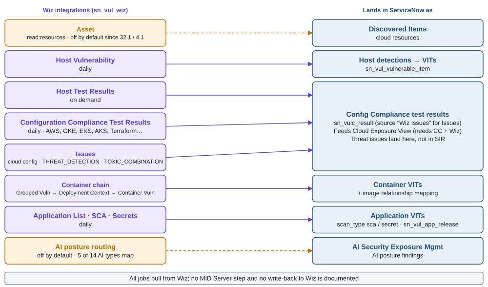

*Figure 10. Where each Wiz integration lands in ServiceNow. Source: Official docs: vr-config-wiz-host-vuln, wiz-issues-tab-filters, wiz-test-result-tab-filters, wiz-container-runtime-exposure-cvr, wiz-ai-sem-integration, vr-cloud-exposure-view-db.*

### Field mappings: Wiz context lands partly as fields, partly as JSON

| Wiz field | ServiceNow target | Usable in calculators? |
|---|---|---|
| `lastDetectedAt` / `firstDetectedAt` | `sn_vul_detection.last_found` / `first_found` | Yes (date fields) |
| `status` | `source_status`, `is_ignored`, `status` | Yes |
| `vendorSeverity` | `source_severity` | Yes |
| `name` (vulnerability ID, usually a CVE) | `sn_vul_entry.id` | — |
| `score` | TPE `v3_base_score` | Yes |
| `hasExploit` | `exploit` | Yes, feeds the Default Risk Rule |
| `hasCisaKevExploit` | `cisa_exists` | Yes |
| `fixedVersion` | detection `fixed_version` | — |
| `vulnerableAsset.providerUniqueId` | Discovered Item `resource_id` | Identity |
| `isAccessibleFromInternet` | Discovered Item `cmdb_ci_internet_facing` | Only if it propagates to the matched CI (undocumented) |
| `isOpenToAllInternet`, `hasAdminPrivileges`, `hasHighPrivileges`, `hasSensitiveData`, `hasAccessToSensitiveData`, `relatedIssueAnalytics` | Discovered Item `source_data` (raw JSON) | Only via custom scripted criteria |
| `layerMetadata.isBaseLayer`, `validate_at_runtime`, `fixed_version` (containers) | `is_base_image`, `validate_at_runtime`, `fix_status` | Container findings only |
| Wiz risk / priority score | **Not mapped** | — |

Source: [official field mapping](https://github.com/ServiceNow/ServiceNowDocs/blob/brazil/markdown/security-management/vulnerability-response/wiz-vul-resp-integration-view-findings.md).

Wiz severity, exploit, KEV, and CVSS v3 feed the Default Risk Rule directly. Internet exposure feeds the rule's "external exposure of the CI" factor only if the Discovered Item flag propagates to the CMDB CI, and the docs do not confirm that it does. Wide exposure, privileges, sensitive data, and toxic-combination context need custom calculators that read JSON. That is exactly the graph context that makes Wiz valuable, and USEM flattens it.

### Keys, exceptions and the rejected-finding toggles

The **detection key** changed in versions 30.3 (USEM) and 1.3 (legacy). New detections are keyed on the Wiz UUID. Existing customers keep vulnerability + asset_id + proof, and "you must run a full import" to re-key. The key is editable under Configure Detection Granularity ([official docs](https://github.com/ServiceNow/ServiceNowDocs/blob/brazil/markdown/security-management/vulnerability-response/vr-config-wiz-host-vuln.md)). The default **CVIT key** is image repository + vulnerability + image, optionally extended by registry, namespace, cluster, or service. Keys "aren't editable unless there is no container vulnerability data in the instance, or unless you're a new customer" ([official docs](https://github.com/ServiceNow/ServiceNowDocs/blob/brazil/markdown/security-management/vulnerability-response/wiz-container-tab-filters.md)). Container path tracking moved from `sn_vul_container_image_package` to `sn_vul_container_image_findings` ([official docs](https://github.com/ServiceNow/ServiceNowDocs/blob/brazil/markdown/delta-australia-brazil/brazil-australia-containervulnerabilityresponse-release-notes.md)).

The **"Manage Exceptions in ServiceNow"** option is narrower than the release notes imply. It is documented **only on the App Vulnerabilities (AVR) configuration tab**. Unselected, Wiz-ignored (REJECTED) application findings arrive as "Deferred reason: Risk Accepted." Selected, they arrive as Open, and ServiceNow Exception Management governs them ([official docs](https://github.com/ServiceNow/ServiceNowDocs/blob/brazil/markdown/security-management/vulnerability-response/avr-wiz-config.md)). The test-result integrations instead offer "Fetch rejected findings" and "Close rejected findings." Without "Close," rejected results "remain in a failed state but are neither closed nor rolled up" ([official docs](https://github.com/ServiceNow/ServiceNowDocs/blob/brazil/markdown/security-management/vulnerability-response/wiz-test-result-tab-filters.md)). Host VITs simply map REJECTED to `is_ignored`, with no documented toggle. Verify in your instance how host exceptions behave.

### Cloud Exposure View runs on Wiz data

Whether Cloud Exposure View uses Wiz data is settled by the official page. Misconfigurations and issues, including "assets that are involved in toxic combinations," are "imported by the… Wiz Vulnerability Response Integration." The view does not display them unless both Configuration Compliance and the Wiz integration are installed. Its risk filter hides Low and None by default ([official docs](https://github.com/ServiceNow/ServiceNowDocs/blob/brazil/markdown/security-management/vr-cloud-exposure-view-db.md)).

AI posture routing from the Test Results integration is opt-in. It recognizes 14 Wiz AI resource types, but only five map to AI Security asset types: agent, dataset, model, tool, and MCP server. The others are skipped with a warning. ServiceNow notes that Wiz "does not currently include supporting evidence" ([official docs](https://github.com/ServiceNow/ServiceNowDocs/blob/brazil/markdown/security-management/configuration-compliance/wiz-ai-sem-integration.md)).

### The Service Graph Connector for Wiz anchors cloud identity

The **Service Graph Connector for Wiz** ingests CMDB data per Wiz project over REST. It uses a service account with `read:resources` and `read:projects` and a hard-coded token URL, `https://auth.app.wiz.io/oauth/token` ([official docs](https://github.com/ServiceNow/ServiceNowDocs/blob/brazil/markdown/servicenow-platform/service-graph-connectors/sgc-cmdb-wiz-setup.md)). The hard-coded URL may not fit Wiz tenants on other auth endpoints, such as Gov; that is unverified. Data passes through transforms and then IRE. Resources deleted in Wiz are marked "retired or absent." Images without a subscription ID are not imported. Tags go to `cmdb_key_value` and projects to `sn_wiz_integ_extension_attributes` ([official docs](https://github.com/ServiceNow/ServiceNowDocs/blob/brazil/markdown/servicenow-platform/service-graph-connectors/sgc-cmdb-integration-wiz.md)).

Identity rests on `object_id`, which comes mostly from Wiz `externalId`. For VMs it is `ProviderUniqueId` on AWS and Azure and `externalId` on GCP ([official docs](https://github.com/ServiceNow/ServiceNowDocs/blob/brazil/markdown/servicenow-platform/service-graph-connectors/sgc-cmdb-wiz-classes.md)). Earlier releases aligned these IDs with the native AWS and GCP connectors ([ServiceNow release notes](https://www.servicenow.com/docs/r/C17ZqvSaMwUVpMBg8Nc5sg/uHLwq4JAcsSZSUkOu_EubA)). Two connection properties matter here. "Server Bypass" links VMs to existing Server records instead of creating new ones, and the list page size defaults to 100 ([official docs](https://github.com/ServiceNow/ServiceNowDocs/blob/brazil/markdown/servicenow-platform/service-graph-connectors/sgc-cmdb-wiz-props.md)). The docs list the connector among the public-cloud SGCs but do not state its publisher. **No out-of-box mapping turns Wiz tags or projects into assignment groups.** The lookup-rules documentation lists defaults for Qualys, Rapid7, and Tenable but **none for Wiz**.

**Figure 11. Context fidelity: which Tenable and Wiz signals survive the trip into USEM.**

| Signal | Tenable → ServiceNow | Wiz → ServiceNow |
|---|---|---|
| Vendor severity | **Field:** `risk_factor` → `source_severity` | **Field:** `vendorSeverity` → `source_severity` |
| CVSS | **Field:** CVSS v3, CVSS v4 base and threat | **Field:** `score` → `v3_base_score` |
| Exploit available | **Field:** `exploit_available` → `exploit` | **Field:** `hasExploit` → `exploit` |
| CISA KEV | **Field:** `on_cisa_kev` → `cisa_exists` | **Field:** `hasCisaKevExploit` → `cisa_exists` |
| EPSS | *Side table:* "Tenable TPE Additional Attributes" | *Not in mapping:* use the FIRST.org feed on the CVE |
| Vendor risk score | **Field:** VPR (v2 preferred) → `source_risk_score`; Tenable Risk Rule off by default | **Not mapped:** Wiz risk or priority score |
| Asset criticality | **Not mapped:** ACR | *n/a:* use CMDB criticality |
| Asset exposure | **Not mapped:** AES | *Partial:* `isAccessibleFromInternet` → Discovered Item flag; propagation to the CI undocumented |
| Privileges, sensitive data | *n/a* | *JSON only:* `source_data`; scripted criteria needed |
| Toxic combinations | *n/a* | *Separate:* CC test results and Cloud Exposure View; no effect on VI scores |
| Runtime validation | *n/a* | *Partial:* container findings only |
| Vendor risk acceptance | **Not mapped:** accept/recast | *Partial:* REJECTED → `is_ignored` (hosts); AVR and test-result toggles |

*Source: official Tenable transform reference and Wiz field-mapping pages (ServiceNowDocs, brazil).*

## Tenable-Wiz deduplication needs a shared CI and a shared CVE

ServiceNow's high-level workflow page says USEM "deduplicates and correlates findings across infrastructure, applications, containers, and cloud environments" ([official docs](https://github.com/ServiceNow/ServiceNowDocs/blob/brazil/markdown/security-management/sem-workflow.md)). The detailed pages are far narrower, and they describe three mechanisms. None of them is specific to Tenable and Wiz.

The first mechanism is rule-based, through **Show Duplicate VIs** and **Resolve duplicate VIs**, available since VR v17.1. It works "only if the same vulnerabilities, such as the same CVEs, are detected." It finds potential duplicates for scanner pairs that are CVE/CVE or CVE/TPE ([official docs](https://github.com/ServiceNow/ServiceNowDocs/blob/brazil/markdown/security-management/vulnerability-response/correlate-vis-from-diff-scanners.md)). Resolution runs on demand from a remediation task, or automatically when `sn_vul.auto_resolve_duplicate_vit` is set and the daily job "Refresh and resolve duplicate VITs on remediation task" runs. The design use case is to resolve the slower scanner's VI once the faster scanner reports a fix. The resolved VI "is reopened if the scanner identifies it as Not Fixed" ([official docs](https://github.com/ServiceNow/ServiceNowDocs/blob/brazil/markdown/security-management/vulnerability-response/automate-workflows-for-duplicate-vulnerabilities.md)).

The second mechanism is a **generative AI skill.** The official docs include a dedicated page and a skills-list entry for the Otto skill "**Identify duplicate vulnerable items**" ([official docs](https://github.com/ServiceNow/ServiceNowDocs/blob/brazil/markdown/security-management/dedupe-host-vi-now-assist-vulnerability-response.md); [skills list](https://github.com/ServiceNow/ServiceNowDocs/blob/brazil/markdown/security-management/using-now-assist-skills-vulnerability-response.md)). That page describes:

- a skill "turned on by default," running from SEM Workspace > Otto > Vulnerable item deduplication;
- dedicated roles (`sn_vul_ai.configure_vi_dedup`, `run_vi_dedup_job`, `review_duplicate_vi`);
- duplicate records with an LLM confidence score and "Reason," where confidence 100 comes from deterministic matching, not the LLM;
- a "Confirm duplicate" step that closes the duplicate and moves its detections to the primary VIT;
- an auto-close threshold, `sn_vul_ai.duplicate_vi_confidence_threshold`, that ships **empty**, so automation closes nothing;
- availability that "depend[s] on your license."

None of the 77 Tenable pages or 43 Wiz pages in the docs repository mentions the skill; only the rule-based duplicate features appear there. The Community FAQ describes it as a Now Assist feature that needs its own entitlement ([Community FAQ](https://www.servicenow.com/community/secops-articles/usem-office-hours-faqs-migration-amp-adoption/ta-p/3524375)). The skill exists, is entitlement-dependent, and does nothing automatically until someone sets a threshold. But **no documentation describes how it behaves on Tenable-plus-Wiz pairs**, so test it before you count on it.

The third mechanism is **Fix Intelligence**. It de-duplicates **fixes**, not findings, across Tenable.io and Wiz host VIs, but not Tenable.sc. It requires Armis ViPR. Two gaps sit beside these mechanisms. AVR states flatly that "there is no application vulnerable item (AVI) deduplication across integrations," which matters for Tenable WAS plus Wiz SCA ([official docs](https://github.com/ServiceNow/ServiceNowDocs/blob/brazil/markdown/security-management/application-vulnerability-response/avm-integrations.md)). No document covers CVIT duplicates across container scanners, such as Tenable.cs plus Wiz.

### How this plays out on a Tenable-plus-Wiz cloud VM

Applying the documented mechanics to a common case is my inference; no published case study covers it. Take an EC2 instance that runs a Tenable agent and is also scanned agentlessly by Wiz.

The Tenable finding is a `TEN-` TPE linked to one or more CVEs through `sn_vul_m2m_entry_cve`. The Wiz finding is keyed on the CVE itself. ServiceNow's own AI agent output shows TPE↔CVE aliasing, for example "CVE-2018-8627 (alias: TEN-119686, TEN-119596)" ([official docs](https://github.com/ServiceNow/ServiceNowDocs/blob/brazil/markdown/security-management/assess-exposure-vr-aiagent.md)). On the vulnerability side, then, the pair qualifies as CVE/TPE.

The asset side is the problem. Tenable resolves its CI by MAC, FQDN, NetBIOS, hostname, DNS, IP, or Tenable UUID. Wiz resolves by provider resource ID. Neither app maps the other's identifiers: no shipped rule matches Tenable's `aws_ec2_instance_id`, and Wiz uses no hostname or IP rules. **If both resolve to the same CI**, you get two VIT families for one flaw. Show Duplicate VIs can flag them, and auto-resolve can close one when the other reports fixed. **If they resolve to different CIs**, for example a Tenable-created Unclassed Hardware CI next to a Wiz-SGC Virtual Machine Instance, no dedup mechanism applies, and both the asset count and the finding count double.

Three amplifiers make it worse:

- **Multi-CVE plugins.** One Tenable plugin often covers many CVEs while Wiz reports one finding per CVE, and the docs don't say how Show Duplicate VIs handles one-to-many pairs.
- **Match All task rules.** Under the default Match All mode, a finding can sit in several tasks at once.
- **Count-weighted rollups.** The example rollup weighting puts 15% on VI count, so duplicates raise task scores as well as dashboard totals.

Auto-resolve adds its own trap. It trusts whichever scanner reports a fix first, so a Wiz daily delta and a Tenable agent on a different cadence can flap a VI between Resolved and Reopened. "Reopened Count" is the field to watch.

Community guidance treats per-scanner VIs as legitimately separate, because "the scanner is the source of truth" and each item closes only on its own scanner's verdict ([Community](https://www.servicenow.com/community/secops-forum/duplicate-vulnerable-items-created-from-different-sources-qualys/m-p/1332144)). An integration run's "Duplicate items" counter is easy to misread. It means detections attached to an existing VI, not that new duplicates were created ([Community](https://www.servicenow.com/community/secops-forum/qualys-integration-runs-duplicate-items/m-p/1291765)).

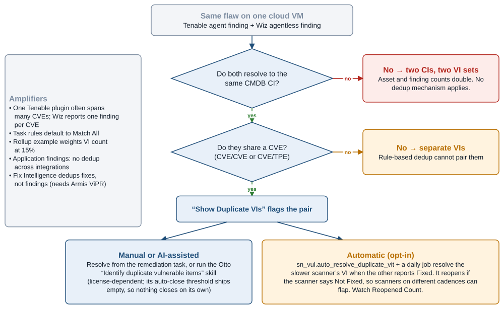

*Figure 12. Decision path for a Tenable-plus-Wiz duplicate on the same cloud VM. Source: Official docs: correlate-vis-from-diff-scanners, automate-workflows-for-duplicate-vulnerabilities, dedupe-host-vi-now-assist. The worked case is inference.*

## Known issues cluster around staleness, identity, upgrades and documentation drift

**Stale data is the clearest Wiz problem.** `last_found` is purely Wiz's `lastDetectedAt` on a delta ("Import since") pull. A Community thread reports that unchanged active detections never refresh it, so a 14-day stale auto-close rule closed live findings, which then reopened and closed in a cycle through April and May 2026. Responders called the behavior by design. They suggested closing on Asset Last Scanned or Wiz status = Resolved, raising thresholds, or running periodic full resyncs. They also noted that the ServiceNow-built app has no On Demand job, and that clearing "Import since" is "much slower" ([Community](https://www.servicenow.com/community/secops-forum/wiz-integration-clarification-on-last-found-not-updating-for/m-p/3562033)). A July 2026 request for a supported reconciliation job is unanswered ([Community](https://www.servicenow.com/community/secops-forum/unable-to-find-quot-wiz-fetch-vulnerabilities-quot-integration/m-p/3579204)). The official docs neither confirm the refresh behavior nor offer a periodic full-reconcile job. They mention "full import" only for detection-key changes, without naming a mechanism.

**Upgrades produce closure waves.** ServiceNow's Store release notes record three:

- In 32.0.3, container-finding uniqueness began to include the file path, and "irrelevant findings close as invalid."
- In 1.1.1, the backfill integrations and the missing-assets table were removed, and upgraders had to backdate three days and rerun ([ServiceNow release notes](https://www.servicenow.com/docs/r/store-release-notes/store-secops-rn-vr-int-wiz.html)).
- Before the 32.8.4 deployment-context chain, CVIT creation stopped at 16 clusters per image ([Community](https://www.servicenow.com/community/secops-articles/enhanced-runtime-exposure-visibility-for-container-images-with/ta-p/3599152)).

On the Tenable side, Tenable's own 6.x upgrade scripts rewrite `source` strings. For example, "Tenable.ot" becomes "Tenable OT Security," and the CMDB `discovery_source` "SG-TenableForAssets" becomes "SG-Tenable" ([Tenable guide](https://docs.tenable.com/integrations/ServiceNow/Content/PDF/Tenable_and_ServiceNow_Integration_Guide.pdf)). Any rule or report keyed on those strings breaks silently. USEM's own deprecated-table list does the same to custom code.

**Identity collisions are structural.** For Tenable.sc they follow from a synthesized UUID. For Tenable.io they follow from unused agent and BIOS UUIDs. For Wiz they follow from the absence of default lookup rules and an unanswered Community question about whether lookup rules or IRE apply first.

**The official documentation drifts in at least seven places**, so instance verification beats reading:

1. The Tenable version table (3.13.1/4.1/5.0.1) conflicts with pages that cite 5.2.1 and 6.1.3.
2. The Tenable lookup-rule lists differ between two pages; one omits IP.
3. The Wiz Asset integration is called optional, yet the same page says other integrations depend on it.
4. The USEM integrations catalog lists the superseded Wiz-built apps.
5. The Wiz field-mapping page still mentions "Backfill Integrations," which were removed ([official docs](https://github.com/ServiceNow/ServiceNowDocs/blob/brazil/markdown/security-management/vulnerability-response/wiz-vul-resp-integration-view-findings.md)).
6. The detailed dedup pages contradict the "deduplicates and correlates" headline.
7. The repo's `llms.txt` points at the Australia branch.

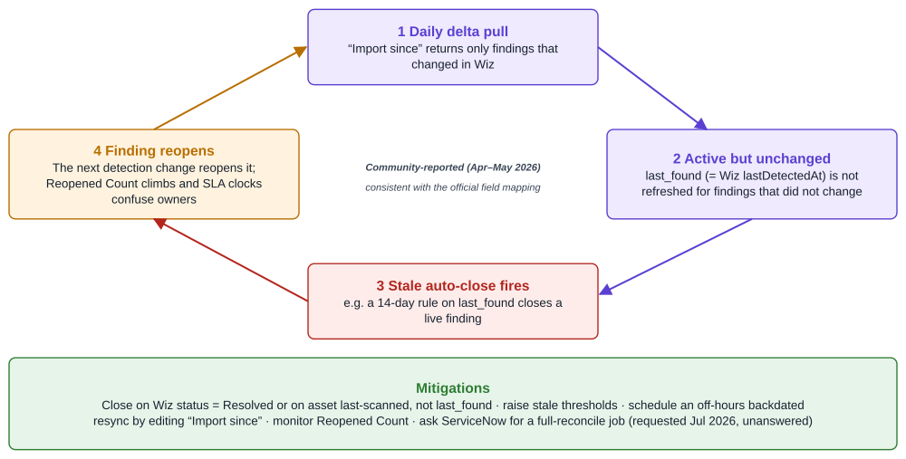

*Figure 13. The Wiz stale/reopen loop and how to break it. Source: ServiceNow Community threads (2026); official Wiz field-mapping page.*

## The critical verdict: strong mobilization layer, weak cross-scanner intelligence

Analysts split the stack along the same lines as its architecture. Forrester named ServiceNow a Leader in its Q3 2025 Unified Vulnerability Management Wave, crediting VR's deep CMDB and ITSM integration for change requests, SLAs, and patch windows. The excerpt was ServiceNow-sponsored and showed no weaknesses ([TechTarget-hosted Forrester](https://www.techtarget.com/hub/asset/1774492329_785)). Tenable was a Leader in the same Wave and in Gartner's first Magic Quadrant for Exposure Assessment Platforms (November 2025). ServiceNow was included in that MQ in a position I could not confirm, and Wiz was not listed ([Gartner](https://www.gartner.com/en/documents/7159430); [Tenable](https://www.tenable.com/press-releases/tenable-named-a-leader-in-the-2025-gartner-magic-quadrant-for-exposure-assessment)). Peer evidence is very thin: **4.2 stars from seven Gartner Peer Insights ratings** for ServiceNow VR ([Gartner Peer Insights](https://www.gartner.com/reviews/product/servicenow-vulnerability-response)). For a Tenable-plus-Wiz design, reference calls are the only real evidence.

The strengths are real. Scoring is transparent and rule-ordered rather than a black box. The exception machinery has two-level approval, audit trails, and Change Approval records. The chain from finding to CI to owner to change to patch is something neither Tenable nor Wiz delivers inside ITSM. The official docs also show more dedup and identity tooling than Community material credits: duplicate VIs across CVE/TPE, a deterministic-plus-LLM dedup skill, a Tenable UUID lookup, network partition identifiers, and Tenable.io rescans.

Every one of those capabilities is opt-in, conditional, or entitlement-gated. The defaults also work against a multi-scanner estate:

- KEV re-scores findings but carries no weight.
- The Tenable Risk Rule is off.
- Assignment re-runs are off.
- Task re-evaluation is off.
- Task rules default to Match All.
- The dedup threshold ships empty.

Context is flattened in both directions. Tenable's ACR and AES never arrive. Wiz's privilege, sensitive-data, and wide-exposure flags arrive only as JSON, toxic combinations arrive as separate test results, and Wiz's own score is dropped. **A USEM risk score can therefore be less informed than the score in the scanner console it came from**, unless the customer rebuilds that context in calculators. A competitor frames the v30 cut-over as a forced, complex migration ([ArmorCode](https://www.armorcode.com/compare/armorcode-vs-servicenow)). That framing is self-interested, and the official docs do not confirm the forced part. They do confirm that the migration is irreversible.

Strategy is the larger concern. Every vendor in this stack has moved to own the aggregation layer:

- Tenable closed Vulcan Cyber in February 2025 ([Tenable](https://www.tenable.com/press-releases/tenable-completes-acquisition-of-vulcan-cyber)).
- Wiz now markets Unified Vulnerability Management that ingests third-party findings onto its Security Graph ([Wiz](https://www.wiz.io/blog/introducing-wiz-for-exposure-management)).
- Google closed its **$32B acquisition of Wiz on March 11, 2026** ([Cleary Gottlieb](https://www.clearygottlieb.com/news-and-insights/news-listing/google-completes-32-billion-acquisition-of-wiz)).
- ServiceNow closed Veza on March 2 and **Armis for about $7.75B on April 20, 2026** ([SEC 10-Q](https://www.sec.gov/Archives/edgar/data/0001373715/000137371526000076/now-20260630.htm); [ServiceNow IR](https://investor.servicenow.com/news/news-details/2026/ServiceNow-completes-Armis-acquisition-closing-the-gap-between-asset-visibility-and-cyber-risk/default.aspx)).

The pattern inside USEM is telling. Armis already powers Early Warning (pre-KEV exploit intelligence) and Fix Intelligence, the one documented consolidation that spans Tenable.io and Wiz, and both are tied to Armis assets or entitlements. ServiceNow's ownership of the Wiz connector and its continued releases after the Google close protect that integration from Wiz's roadmap. Still, expect ServiceNow to keep moving cross-scanner intelligence onto its own assets, and plan for third-party connectors to trail the Armis-native experience.

## Recommendations and watch-outs for a large-enterprise VM program

**Control the upgrade before anyone else does.**

- Treat the Brazil forced upgrade and the Australia Patch 3m/4m warnings as real until your account team confirms otherwise in writing. The irreversibility is official even though the forcing is not.
- Gate patch governance on those patches if you are below VR v30.
- Rehearse the Migration assistant in sub-production against cloned data, following the official order: deactivate integrations and jobs, upgrade VR, then CC, then CVR, then each integration one at a time.
- Use the deprecated-table map as the checklist for every custom script, ACL, report, and Performance Analytics indicator.
- Upgrade `sn_vul`, the Wiz app (32.x for USEM, 4.x for legacy), and the Tenable app in one change window.
- Install the Tenable app's 30.x track on USEM and its 6.x track on classic VR, and confirm the certified build in KB0856498.

**Pick one owner per asset class and enforce it at import.**

- The cleanest split gives Wiz cloud workloads, containers, serverless, and cloud configuration. Tenable keeps on-premises servers, endpoints, network devices, and anything Wiz cannot see.
- Enforce the split with Wiz resource-type selection and Tenable `cidr_range` or tag JSON filters.
- Where both scanners must stay, for example Tenable agents mandated on cloud VMs, choose one feed to carry SLAs.
- Make identity converge. Run the Wiz SGC with "Server Bypass" alongside the native cloud SGCs, enable Tenable's network partition identifier, and check that Tenable's lookup rules can reach the same CIs that Wiz resolves to by resource ID.
- Watch the Discovered Items unmatched backlog weekly. It is the leading indicator of double-counting.
- Enable Show Duplicate VIs. Consider `sn_vul.auto_resolve_duplicate_vit` only after you test its flapping behavior.
- If you are entitled to the Otto dedup skill, run it in review mode before setting any confidence threshold.

**Make prioritization explicit, because the defaults won't.**

- Add a KEV criterion on `cisa_exists`, which both scanners populate.
- Decide whether the Tenable Risk Rule (VPR 70/15/15) replaces or supplements the Default Risk Rule for Tenable VIs, and load-test it first.
- Run FIRST.org EPSS before scanner imports so EPSS is scanner-neutral rather than living in Tenable's side table.
- Build scripted criteria for the Wiz `source_data` flags you care about, such as wide internet exposure and admin privileges.
- Correlate "Wiz Issues" toxic-combination results to VITs on the same CI if you want graph context on findings.
- Set your own SLA days. None ship.
- Choose the remediation-target recalculation method deliberately.
- Switch task rules to Match First if reports must not double-count.
- Activate the "Run assignment rules" job and `sn_sec_rem.rerun_task_rules` only after you measure their load.

**Redesign closure and exceptions around status.**

- For Wiz, do not use `last_found`-based stale rules. Close on Wiz Resolved status or on asset last-scanned, and schedule an off-hours backdated resync until ServiceNow ships a reconciliation job.
- For Tenable, keep Fixed chained ahead of Open, and test auto-close against known-fixed plugins.
- Pick one exception authority per scanner. Tenable accept/recast never reaches USEM. For Wiz, the AVR toggle and the test-result "Close rejected" settings decide whether Wiz or ServiceNow governs.
- Before the first load, keep Tenable at its Critical/High default until capacity is proven, disable unused calculators and notifications, and raise import templates as ServiceNow support advises.

| Watch-out | What triggers it | Mitigation |
|---|---|---|
| Irreversible USEM migration | Brazil upgrade or Australia Patch 3m/4m on VR < v30 (Community-reported); "Rollback is not possible" (official) | Patch gate; "Upgrade later"; rehearsal in sub-prod |
| Version mismatch | Wiz 32.x on legacy VR or 4.x on USEM; uncertified Tenable build | Upgrade `sn_vul`, Wiz, and Tenable apps together; confirm in KB0856498 |
| Tenable–Wiz double-counting | Same VM, different CI resolution (network IDs vs resource ID); multi-CVE plugins; Match All | Source-of-truth split; SGC identity; Match First; Show Duplicate VIs |
| Unweighted KEV, missing ACR/AES, flattened Wiz context | Default Risk Rule factors; unmapped fields | Explicit KEV, CMDB-criticality, and scripted Wiz criteria |
| Wiz stale/reopen loop | `last_found` on delta pulls plus stale auto-close | Status-based closure; periodic backdated resync |
| Auto-resolve flapping | Scanners on different cadences | Pilot before enabling; monitor Reopened Count |
| Upgrade-driven closure waves | Wiz detection-key and container-uniqueness changes; backfill removal | Test on cloned data; pre-announce to owners |
| Silent rule breakage | Deprecated `sn_vul_*`/`sn_vulc_*` rule tables; Tenable `source` renames | Re-key code and reports before cut-over |
| Hidden entitlements | Tenable app, CVR + CC for Wiz, ITSM Advanced, Armis ViPR, SAM, Otto skills | Confirm the bill of materials before design |
| Coverage gaps | No Tenable OT or Identity Exposure path; no AVIT dedup; Wiz Defend lands as test results, not SIR | Inventory needed feeds; route threat issues deliberately |

## What the official docs confirm, and what rests on Community word

| Claim | Official Brazil docs | Community / third-party | Status |
|---|---|---|---|
| Brazil force-upgrades VR < v30 to USEM | Not stated; CVR notes still say install < v30 if not upgrading | Community upgrade guidance | **Unverified officially** |
| Australia Patch 3m/4m auto-upgrade | Not in repo | Community FAQ | Community-only |
| Migration is irreversible | "Rollback is not possible" | — | Confirmed |
| Brazil dates | EA 2026-09-24; GA "scheduled" Nov 5 (accessibility page) | — | Confirmed as schedule |
| Unified exposure table | None; shared `sn_sec_*` rule/calculator/exception tables | "Unified exposure records" (Community) | Corrected |
| `sn_vul_vulnerability` | Host Remediation Tasks table | — | Confirmed |
| Default risk factors | Severity, exploit, criticality, external exposure, EPSS; KEV triggers recalculation only | — | Confirmed; weights unpublished |
| 80/5/15 rollup | Worked example only | Treated as default | Downgraded to example |
| Tenable Risk Rule 70/15/15 | Official, inactive by default | Community tutorial | Confirmed |
| Tenable app "v30.x" | Docs table lists v3.13.1/4.1/5.0.1 (stale); Store release notes list 30.x (USEM) and 6.x (classic) tracks | Community FAQ | Confirmed by release notes |
| Tenable default severities | Critical + High only | — | Confirmed |
| ACR/AES mapped | Not mapped | — | Confirmed absent |
| Tenable UUID used | `source_id` used for CI lookup | — | Confirmed |
| Tenable WAS | WAS → AVR integration documented | 2023–24 Community: none | Corrected |
| Tenable.io rescan | Documented (not on agents) | — | Confirmed |
| GenAI cross-scanner dedup | Otto skill page exists, threshold ships empty; not mentioned on any Tenable or Wiz page | Community FAQ: Now Assist entitlement | Exists; Tenable/Wiz behavior undocumented |
| Wiz Asset integration required | Optional, off since 32.1/4.1 (same page contradicts) | — | Confirmed with caveat |
| "Manage Exceptions in ServiceNow" scope | AVR tab only | Release notes described generally | Narrowed |
| Cloud Exposure View uses Wiz | Yes; requires CC + Wiz app | — | Confirmed |
| Wiz `last_found` stale loop | `last_found` = `lastDetectedAt`; no reconcile job documented | Community thread | Community-reported, consistent with docs |
| VCM in Advanced, VSM in Prime | Each a separate subscription; no tier matrix | Community packaging guide | Unverified |
| Vulnerability Resolution AI Specialist | Absent | Aug 2026 press release | Roadmap |

## Conclusion

The official Brazil docs change the shape of the argument more than its verdict. The Community-sourced picture is of a platform with no cross-scanner dedup, no Tenable WAS, no Tenable.io rescans, and a forced, imminent cut-over. The docs show more machinery than that, with less certainty about the deadline. What they also show is that almost every capability a Tenable-plus-Wiz program needs ships switched off or left to the customer to define: KEV weighting, the Tenable VPR rule, assignment re-runs, task re-evaluation, dedup thresholds, SLA days, and the identity bridge between Tenable's network view and Wiz's cloud view. USEM is therefore best understood as a configurable mobilization engine with a precise data model, not as an exposure brain. The vulnerability lead who writes down the scoring logic, the ownership split, and the identity strategy before migration will get a coherent program. The lead who accepts defaults will get two scanners' worth of tickets with one scanner's worth of context.

The other lesson is about evidence. Even ServiceNow's own repository contradicts itself on Tenable versions, lookup rules, the Wiz asset dependency, and whether USEM deduplicates. The GenAI dedup skill is documented on its own page but nowhere on the Tenable or Wiz pages, and the repo's `llms.txt` still points to the previous release. For anything that sets SLAs or closes findings automatically, the authoritative source is a cloned sub-production instance running your own Tenable and Wiz data. Docs, Community answers, and vendor marketing are hypotheses to test there before the November 5 GA reaches your production upgrade calendar.
