# ServiceNow VR, CC and CVR with Tenable and Wiz

> **Tools Research** · How ServiceNow Vulnerability Response, Configuration Compliance and Container Vulnerability Response work, and how Tenable and Wiz feed each one, from official documentation (Brazil release, September 2026). Companion study: [ServiceNow USEM with Tenable and Wiz](/tools-research/SERVICENOW_USEM_TENABLE_WIZ.md). Download: [PDF](https://github.com/TeamStarWolf/TeamStarWolf/raw/main/tools-research/pdf/ServiceNow_VR_CC_CVR_Tenable_Wiz.pdf).

## Summary: Tenable and Wiz feed three separate engines

ServiceNow Vulnerability Response (VR), Configuration Compliance (CC) and Container Vulnerability Response (CVR) are **three separate data models that share one remediation pipeline**. VR rolls scanner **detections** into vulnerable items (VIs) and remediation tasks. CC imports pass/fail **configuration test results** that it never evaluates itself. CVR attaches container image **findings** to the source Docker image, not to running containers. In all three the scanner, not the remediation owner, closes the work: the manual Close actions have been removed, and 90-day stale rules sweep up whatever the scanner stops reporting. Tenable feeds the three engines through one ServiceNow-built, separately subscribed Store app, and its coverage is uneven. **Tenable Vulnerability Management (TVM) feeds VR and CC. Tenable Security Center feeds VR only. Tenable Cloud Security (Tenable.cs) is the only Tenable source for CVR.** Wiz feeds all three, plus Application VR, from one service account. Since July 2025 that has run through a ServiceNow-built app that replaced three Wiz-built ones, and its installer requires VR, CC and CVR to be present even for a host-only rollout. USEM (VR v30 and later) moves the rules into shared `sn_sec_*` tables but keeps separate VR, CC and CVR finding tables. ServiceNow tells customers who are not moving to USEM to keep every one of these apps, scanner integrations included, below v30. Several decisions are hard to reverse and belong before the first import:

- the VI, detection, container vulnerable item (CVIT) and Tenable compliance-test keys;
- severity filters, which default to Critical and High only;
- which scanner owns which asset.

The Brazil documentation contradicts itself on more than twenty points that bear on those decisions. Validate every mapping below on a sub-production instance before it drives an SLA or a dashboard.

**How the sourcing works.** ServiceNow's official documentation repository, `brazil` branch, is the primary source; most pages cited carry `last_updated: 2026-09-10`. Citations take the form `https://github.com/ServiceNow/ServiceNowDocs/blob/brazil/<path>`. ServiceNow's Store release notes on servicenow.com are also official. They are more current (September 2026) but sit outside the repo, and they were read through a summarizing fetch, so check exact wording there before quoting it. Vendor-side facts come from Tenable's documentation (docs.tenable.com, developer.tenable.com) and Wiz's public website. Wiz's product documentation (docs.wiz.io) requires a login, so Wiz-side requirements rest mostly on ServiceNow's pages. Anything from the ServiceNow Community or another third party is labeled as such. A companion report, *ServiceNow USEM, Tenable and Wiz*, covers the USEM layer itself: the workspace, unified scoring defaults, cross-scanner deduplication and packaging tiers. This report repeats that material only where VR, CC or CVR cannot be explained without it.

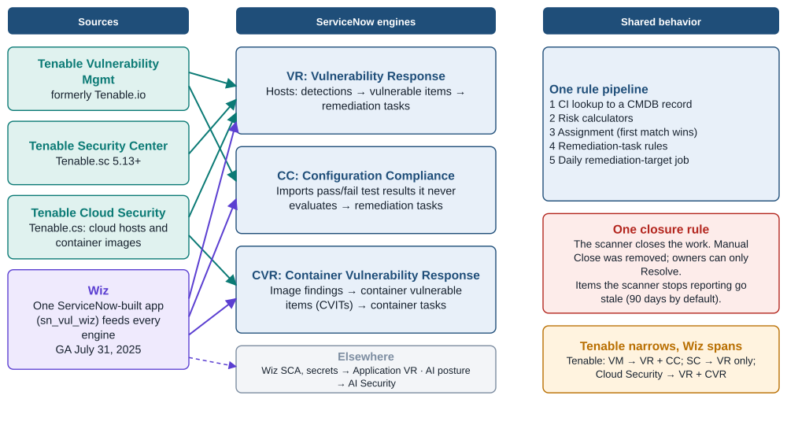

*Figure 1. Four Tenable and Wiz sources, three ServiceNow engines, one shared pipeline. Source: Official docs: tenable-io / sc / cs-integrations-list, Wiz integration pages, CC and VR assignment and task pages.*

## Three finding models share one rule pipeline and one closure rule

All three engines process a new or reopened finding the same way:

1. Scanner data lands on a discovered item (or, in CVR, a discovered container image), which CI lookup rules resolve to a CMDB record.
2. Risk calculators score the finding.
3. Assignment rules run by execution order, and the first match wins.
4. Remediation-task (RT) rules group findings into tasks.
5. A daily job sets remediation targets.

CC documents the order explicitly: CI matching, then risk, then assignment, then RT rules ([CC assignment rules](https://github.com/ServiceNow/ServiceNowDocs/blob/brazil/markdown/security-management/configuration-compliance/cc-assignment-rules.md); [CC remediation tasks](https://github.com/ServiceNow/ServiceNowDocs/blob/brazil/markdown/security-management/configuration-compliance/cc-groups.md)). VR uses the same first-match assignment logic ([VR assignment rules](https://github.com/ServiceNow/ServiceNowDocs/blob/brazil/markdown/security-management/vulnerability-response/create-vul-assign-rules.md)) and a daily 04:00 target job ([VR remediation targets](https://github.com/ServiceNow/ServiceNowDocs/blob/brazil/markdown/security-management/vulnerability-response/time-to-remediate-rules.md)). What differs is what counts as a finding, how findings are keyed, and what they attach to.

| Layer | VR (hosts) | CC (configuration) | CVR (containers) |
|---|---|---|---|
| Asset anchor | Discovered item `sn_sec_cmn_src_ci` → CI. With no match, IRE creates `cmdb_ci_incomplete_ip`, `cmdb_ci_unclassed_hardware` or `cmdb_ci_cmp_resource` | Discovered item → CI. With no match, falls back to an "Unmatched CI" placeholder | Discovered container image `sn_vul_container_image` → `cmdb_ci_docker_image` |
| Knowledge record | Third-party entry (TPE) `sn_vul_third_party_entry`, e.g. `TEN-` plugin IDs, linked to NVD CVEs | Test group `sn_vulc_policy`; test `sn_vulc_test`; authoritative source `sn_vulc_auth_src`; citation `sn_vulc_citation` | TPE / `sn_vul_entry`, plus image layer and package tables |
| Raw observation | Detection `sn_vul_detection` | Test result `sn_vulc_result`, with history in `sn_vulc_result_history` | Image finding `sn_vul_container_image_findings` |
| Work item | VI `sn_vul_vulnerable_item` | The test result itself | CVIT `sn_vul_container_image_vulnerable_item` |
| Grouping | RT `sn_vul_vulnerability` | RT `sn_vulc_result_group` | Container RT (CVUL) `sn_vul_container_vulnerability` |
| Default work-item key | CI + vulnerability + integration instance. Port is optional | CI + technology + test (history key). Tenable can add keys | Image repository + vulnerability + image. Registry, cluster, namespace and service are optional |
| Manual close | Removed in v23.0. Owners can only Resolve | Close button removed in v15.0 | CVITs never closable. CVUL Close removed in v2.10 |
| Stale default | 90 days, on assets last scanned and on detections last found | Daily job keyed to the item's last compliance scan date | 90 days, "Container Vulnerabilities last scanned" |
| SLA clock | Daily 04:00, from Last opened | Daily 4:30, from Last pass, 30-day default | From Last opened |
| Base risk | Severity, exploit, criticality, exposure and EPSS | Average of CMDB business criticality and scanner test criticality | Severity, plus business criticality from the image's services |

Sources for the table: [VR detections](https://github.com/ServiceNow/ServiceNowDocs/blob/brazil/markdown/security-management/vulnerability-response/vr_host_detections.md); [VI key](https://github.com/ServiceNow/ServiceNowDocs/blob/brazil/markdown/security-management/vulnerability-response/vr-configure-vi-key.md); [RT states](https://github.com/ServiceNow/ServiceNowDocs/blob/brazil/markdown/security-management/vulnerability-response/vr-rt-states.md); [VR auto-close rules](https://github.com/ServiceNow/ServiceNowDocs/blob/brazil/markdown/security-management/vulnerability-response/create-auto-close-rules.md); [IRE classes](https://github.com/ServiceNow/ServiceNowDocs/blob/brazil/markdown/security-management/sem-ci-creation-using-IRE.md); [CC tables](https://github.com/ServiceNow/ServiceNowDocs/blob/brazil/markdown/security-management/configuration-compliance/installed-with-config-compliance.md); [CC test results](https://github.com/ServiceNow/ServiceNowDocs/blob/brazil/markdown/security-management/configuration-compliance/view-vuln-config-compl-test-results.md); [CC states](https://github.com/ServiceNow/ServiceNowDocs/blob/brazil/markdown/security-management/configuration-compliance/vuln-config-compl-states.md); [CC auto-close](https://github.com/ServiceNow/ServiceNowDocs/blob/brazil/markdown/security-management/configuration-compliance/cc-autoclose-tr-overview.md); [CC targets](https://github.com/ServiceNow/ServiceNowDocs/blob/brazil/markdown/security-management/configuration-compliance/cc-remed-target-rules.md); [CC risk](https://github.com/ServiceNow/ServiceNowDocs/blob/brazil/markdown/security-management/configuration-compliance/vuln-config-compl-calc-groups.md); [CVR tables](https://github.com/ServiceNow/ServiceNowDocs/blob/brazil/markdown/security-management/container-vulnerability-response/installed-with-cvr-data.md); [CVIT key](https://github.com/ServiceNow/ServiceNowDocs/blob/brazil/markdown/security-management/container-vulnerability-response/cvr-configuring-findings-key-granularity.md); [CVR states](https://github.com/ServiceNow/ServiceNowDocs/blob/brazil/markdown/security-management/container-vulnerability-response/container-vulnerabillity-states.md); [CVR auto-close](https://github.com/ServiceNow/ServiceNowDocs/blob/brazil/markdown/security-management/container-vulnerability-response/cvr-create-auto-close-rules.md); [CVR dashboard](https://github.com/ServiceNow/ServiceNowDocs/blob/brazil/markdown/security-management/container-vulnerability-response/cvr-dashboard.md).

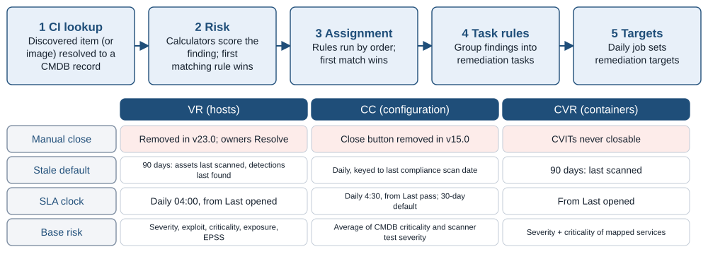

*Figure 2. The shared processing order, and how closure, staleness, SLA clocks and base risk differ per engine. Source: Official docs: cc-assignment-rules, cc-groups, create-vul-assign-rules, vr-rt-states, create-auto-close-rules, CC and CVR risk pages.*

### VR turns detections into vulnerable items, then into remediation tasks

A detection is "a single, distinct occurrence of a vulnerability as reported by a scanner." Each detection is keyed by a hashed, integration-specific **detection key**:

- **Tenable and Qualys:** vulnerability + port + protocol + asset ID, with no proof.
- **Rapid7:** adds proof and NIC.
- **Default** (when no key is specified): adds proof ([VR detections](https://github.com/ServiceNow/ServiceNowDocs/blob/brazil/markdown/security-management/vulnerability-response/vr_host_detections.md)).

Detections collapse into a **VI that is unique per CI + vulnerability + integration instance**. The "Include port" option creates one VI per port, but **once you enable it, you must delete all VR data before you can disable it again** ([VI key](https://github.com/ServiceNow/ServiceNowDocs/blob/brazil/markdown/security-management/vulnerability-response/vr-configure-vi-key.md)). Because the integration instance is part of the key, and ServiceNow states that VIs are not de-duplicated across integrations, **the same CVE on the same server reported by both Tenable and Wiz produces two VIs** ([VR integrations](https://github.com/ServiceNow/ServiceNowDocs/blob/brazil/markdown/security-management/vulnerability-response/vuln_integrations.md)). The [companion USEM study](/tools-research/SERVICENOW_USEM_TENABLE_WIZ.md) covers the narrow duplicate-VI tooling that exists. Plan cross-scanner reporting around CVE + CI, not VI counts.

Closure belongs to the scanner. RTs move through Open, Under Investigation, Deferred (shown as In Review during approval), Awaiting Implementation, Resolved and Closed. **The Close button was removed in v23.0, so "closure of a remediation task is driven by the scanner,"** and owners can only mark work Resolved ([RT states](https://github.com/ServiceNow/ServiceNowDocs/blob/brazil/markdown/security-management/vulnerability-response/vr-rt-states.md)).

State rolls up deterministically from detections to VIs:

- Any Open detection keeps the VI Open.
- A mix of Closed and Stale detections makes the VI **Closed – Fixed**.
- All-Stale detections make it **Closed – Stale**.

At the RT level:

- All-Stale VIs cancel the RT.
- Any false-positive VI blocks auto-close ([VR auto-close setup](https://github.com/ServiceNow/ServiceNowDocs/blob/brazil/markdown/security-management/vulnerability-response/vr-setup-autoclose-detections.md)).

When a VI belongs to several RTs, precedence runs Closed > Deferred > Resolved > In Review > Awaiting Implementation > Under Investigation > Open. An RT closed as Canceled or Fixed with Exception does not close its VIs ([RT/VI states](https://github.com/ServiceNow/ServiceNowDocs/blob/brazil/markdown/security-management/vulnerability-response/vr-rt-vi-states.md)). A VI closed as Fixed, Stale or CI Decommissioned **reopens when a new matching detection arrives**. A Resolved VI that the scanner never confirms as fixed also reopens ([detections and states](https://github.com/ServiceNow/ServiceNowDocs/blob/brazil/markdown/security-management/vulnerability-response/vr-detections-rt-vi-states.md)). A rollup job re-evaluates RT state, reason and Until date every 15 minutes ([RT states](https://github.com/ServiceNow/ServiceNowDocs/blob/brazil/markdown/security-management/vulnerability-response/vr-rt-states.md)).

Stale handling has been rule-based since v22.0. Three base auto-close rules ship with a **90-day** window: Assets last scanned, Detections last found, and Manual detections last found. A daily job moves matching detections to Stale ([auto-close rules](https://github.com/ServiceNow/ServiceNowDocs/blob/brazil/markdown/security-management/vulnerability-response/create-auto-close-rules.md)). Auto-close acts only on active integration instances and is switched on or off for the whole environment. Tenable needs no special full-run integration for the "Detections last found" rule, unlike Rapid7 and Microsoft TVM, which need a full run in the last seven days ([VR auto-close setup](https://github.com/ServiceNow/ServiceNowDocs/blob/brazil/markdown/security-management/vulnerability-response/vr-setup-autoclose-detections.md)). A separate property closes VIs on retired CIs with the substate CI Decommissioned ([retired CIs](https://github.com/ServiceNow/ServiceNowDocs/blob/brazil/markdown/security-management/vulnerability-response/auto-close-vis.md)). **Exclusion rules** stop matching detections from ever becoming VIs, starting with the next ingestion ([exclusion rules](https://github.com/ServiceNow/ServiceNowDocs/blob/brazil/markdown/security-management/vulnerability-response/create-exclusion-rule.md)).

Several reference feeds enrich findings before any scanner data arrives, and **NVD (CVE only) and CWE must run before any third-party scanner** ([NVD integration](https://github.com/ServiceNow/ServiceNowDocs/blob/brazil/markdown/security-management/vulnerability-response/nvd-vuln-integration.md)):

- **CISA KEV** runs daily. It sets CISA Exists, the due date and known-ransomware use, and "the earliest due date is considered for the roll-up to the vulnerable items" ([CISA KEV](https://github.com/ServiceNow/ServiceNowDocs/blob/brazil/markdown/security-management/vulnerability-response/cisa-vuln-integration.md)).
- **FIRST EPSS** runs daily. It writes score and percentile to CVE records and rolls them up to TPEs through a calculator ([EPSS](https://github.com/ServiceNow/ServiceNowDocs/blob/brazil/markdown/security-management/vulnerability-response/epss-vr-integration-overview.md)).
- **SSVC** values (Exploitation, Automatable, Technical Impact) are available "only in USEM" ([SSVC](https://github.com/ServiceNow/ServiceNowDocs/blob/brazil/markdown/security-management/vulnerability-response/nvd-ssvc-enrichment.md)).
- **Armis Early Warning** likewise requires VR v30.x ([Armis Early Warning](https://github.com/ServiceNow/ServiceNowDocs/blob/brazil/markdown/security-management/armis-early-warning-integration.md)).

Scoring runs through the **Default Risk Calculator**, whose Default Risk Rule weighs severity, exploit information, criticality, external exposure and EPSS. Only one calculator per target field can be active, and **the first matching rule wins**. Ratings band at 90–100 (1), 70–89 (2), 40–69 (3), 1–39 (4) and 0 (5) ([calculators](https://github.com/ServiceNow/ServiceNowDocs/blob/brazil/markdown/security-management/vulnerability-response/vuln-calculators-rules.md)).

Ownership and SLAs are rule-driven:

- **Assignment.** The base rule "Assign to CI support group" stops at the first match. Reapplying assignment rules skips manually assigned VIs ([assignment](https://github.com/ServiceNow/ServiceNowDocs/blob/brazil/markdown/security-management/vulnerability-response/create-vul-assign-rules.md)).
- **Grouping.** RT rules group on up to six fields. A VI joins an existing Open RT with the same assignment group, and **Reapply deletes and recreates Open RTs** ([RT rules](https://github.com/ServiceNow/ServiceNowDocs/blob/brazil/markdown/security-management/vulnerability-response/vulnerability-groups.md)).
- **Targets.** The target job applies the most restrictive matching rule, counting from Last opened. USEM 30.0.4 and VR 26.4.4 added four ways to recalculate targets when a risk rating changes ([targets](https://github.com/ServiceNow/ServiceNowDocs/blob/brazil/markdown/security-management/vulnerability-response/time-to-remediate-rules.md)).
- **Exceptions** defer a VI or RT through one- or two-level Flow Designer approval. A first-level approver must exist or nothing can be requested, and an expired exception reverts the item to Open ([exceptions](https://github.com/ServiceNow/ServiceNowDocs/blob/brazil/markdown/security-management/vulnerability-response/vr-exception-management.md)).
- **False positives** close as Closed – False Positive. They are permanent unless the approver sets an Until date ([false positives](https://github.com/ServiceNow/ServiceNowDocs/blob/brazil/markdown/security-management/vulnerability-response/vr-false-positive.md)).
- **Change requests** created from RTs drive the RT state ([change management](https://github.com/ServiceNow/ServiceNowDocs/blob/brazil/markdown/security-management/vulnerability-response/vuln-change_mgmnt_ovrvw.md)).
- **Vulnerability Solution Management**, a separate subscription, picks a Preferred solution. Since v24.0.6 it also ingests scanner solutions from the Tenable.io and Tenable.sc plugin integrations ([solution management](https://github.com/ServiceNow/ServiceNowDocs/blob/brazil/markdown/security-management/vulnerability-response/vuln-solution-mgmt.md)).

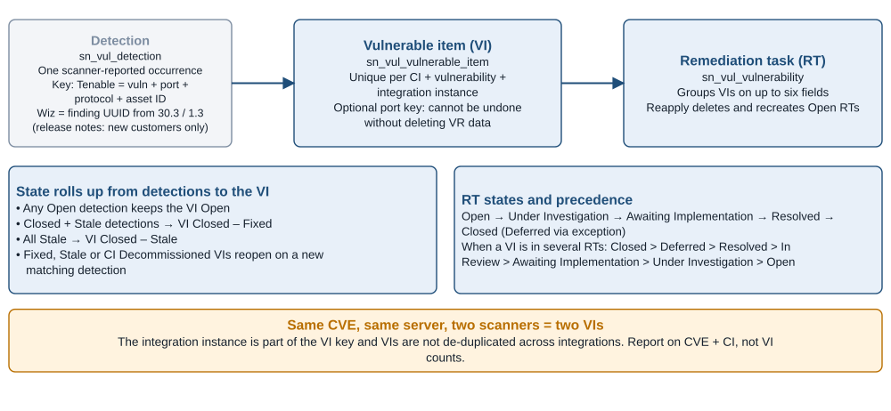

*Figure 3. VR object model: detection, vulnerable item and remediation task, with state roll-up rules. Source: Official docs: vr_host_detections, vr-configure-vi-key, vr-rt-states, VI state pages.*

### CC imports verdicts it never computes

CC "does not calculate the test results, but imports them as part of a third-party integration." It turns scanner-supplied test groups, tests, authoritative sources, citations and pass/fail results into remediation work ([CC test groups](https://github.com/ServiceNow/ServiceNowDocs/blob/brazil/markdown/security-management/configuration-compliance/vuln-config-compl-policies.md)). Version 14.9 renamed "Test Result Group" to Remediation Task and "Policy" to Test group, but the tables kept the old names (`sn_vulc_policy`, `sn_vulc_result_group`) ([CC overview](https://github.com/ServiceNow/ServiceNowDocs/blob/brazil/markdown/security-management/configuration-compliance/vuln-config-compl-overview.md)). Each test carries:

- a scanner Criticality (Critical through Minor);
- a remediation text;
- citations to authoritative sources such as an NIST 800-53 control;
- a **GRC Policy Statements** tab, if GRC Policy and Compliance Management is installed. This tab is the only concrete CC-to-GRC link the docs describe ([CC tests](https://github.com/ServiceNow/ServiceNowDocs/blob/brazil/markdown/security-management/configuration-compliance/view-vuln-config-compl-tests.md)).

Results are Passed, Failed, Error or Unknown. They carry Expected and Actual values, and since v15.0 a passed result keeps its risk score so that mitigated risk can be measured ([CC test results](https://github.com/ServiceNow/ServiceNowDocs/blob/brazil/markdown/security-management/configuration-compliance/view-vuln-config-compl-test-results.md)). "Passed items are always in the Closed-Fixed state." After every import an end-of-import event runs three steps:

1. It moves Resolved RTs that still contain failures back to Awaiting Implementation.
2. It closes RTs whose results all passed.
3. It refreshes the "Ungrouped Test Results" list ([CC correlation](https://github.com/ServiceNow/ServiceNowDocs/blob/brazil/markdown/security-management/configuration-compliance/vuln-config-compl-correlation.md)).

CC's out-of-box automation is thinner than VR's. **The base RT rule ("Assignment group, Test") is disabled by default** ([CC remediation tasks](https://github.com/ServiceNow/ServiceNowDocs/blob/brazil/markdown/security-management/configuration-compliance/cc-groups.md)). So are **the base assignment rule** and the "Reapply all assignment rules" job ([CC assignment rules](https://github.com/ServiceNow/ServiceNowDocs/blob/brazil/markdown/security-management/configuration-compliance/cc-assignment-rules.md)). A fresh CC deployment therefore leaves results ungrouped and unassigned until someone designs the rules. Zurich added a Match First execution mode so that each result lands in exactly one RT ([CC release notes](https://github.com/ServiceNow/ServiceNowDocs/blob/brazil/markdown/delta-zurich-brazil/brazil-zurich-configurationcompliance-release-notes.md)).

The RT carries the state model. From Resolved, the next scan decides the outcome: all results pass and the RT closes, or it returns to Under Investigation. A resolved result whose Last Seen date is later than its resolution date reopens. When a result sits in several RTs, it takes the highest-precedence state ([CC states](https://github.com/ServiceNow/ServiceNowDocs/blob/brazil/markdown/security-management/configuration-compliance/vuln-config-compl-states.md)). Change-request sync is on by default ([CC change sync](https://github.com/ServiceNow/ServiceNowDocs/blob/brazil/markdown/security-management/configuration-compliance/cc-cr-state-synch.md)):

- Creating or linking a change moves the RT to Awaiting Implementation.
- A change in Review moves it to Resolved.
- A cancelled or unsuccessful change sends it back to Under Investigation.

Scoring, SLAs and exceptions differ from VR in ways that matter for audits:

- **Risk** is "the average of the business criticality of the affected asset as defined in the CMDB, and the severity of the test as communicated by the scanner." The documented script **needs the separately licensed Service Mapping plugin** ([CC risk](https://github.com/ServiceNow/ServiceNowDocs/blob/brazil/markdown/security-management/configuration-compliance/vuln-config-compl-calc-groups.md)). "Unknown severity is automatically assigned a risk score of 100" ([CC calculators](https://github.com/ServiceNow/ServiceNowDocs/blob/brazil/markdown/security-management/configuration-compliance/config-compliance-calculator-rules.md)).
- **Remediation targets** run daily at 4:30. Since v14.12 they count from **Last pass**, falling back to Created, with a **30-day default** ([CC targets](https://github.com/ServiceNow/ServiceNowDocs/blob/brazil/markdown/security-management/configuration-compliance/cc-remed-target-rules.md)).
- **Exceptions** are requested on the RT, not on individual results. The RT sits In review, becomes Deferred on approval and returns to Open on expiry ([CC exceptions](https://github.com/ServiceNow/ServiceNowDocs/blob/brazil/markdown/security-management/configuration-compliance/cc-ex-mgmt.md)). Requests are capped at 365 days by default ([CC exception properties](https://github.com/ServiceNow/ServiceNowDocs/blob/brazil/markdown/security-management/configuration-compliance/cc-ex-mgmt-sys-prop.md)).
- **GRC exceptions.** GRC: Policy and Compliance Management can replace VR as the exception backend, raising a policy exception against a chosen control objective ([GRC exception backend](https://github.com/ServiceNow/ServiceNowDocs/blob/brazil/markdown/security-management/configuration-compliance/configure-exception-management-configuration-compliance.md)).
- **Staleness** keys on the discovered item's **last configuration-compliance scan date**, not the vulnerability scan date. A server scanned weekly for CVEs but monthly for CIS benchmarks therefore ages differently in CC than in VR ([CC auto-close](https://github.com/ServiceNow/ServiceNowDocs/blob/brazil/markdown/security-management/configuration-compliance/cc-autoclose-tr-overview.md)).

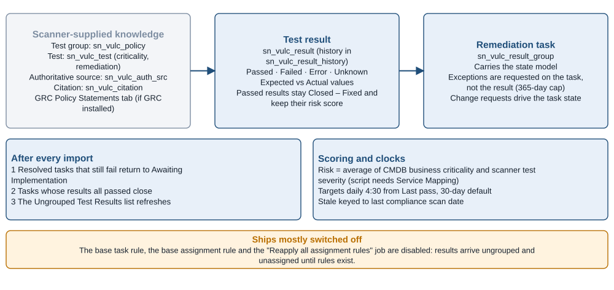

*Figure 4. CC object model: scanner-supplied tests, imported results, and remediation tasks. Source: Official docs: Configuration Compliance overview, test, result, remediation-task, risk and target pages.*

### CVR anchors findings on images, not running containers

CVR's design principle is to "point to source Docker Image from CVITs instead of running containers." It enriches findings with runtime context (hosts, clusters, namespaces, services) and automatically resolves vulnerabilities "reported in older versions … when new image versions are deployed at runtime" ([CVR landing](https://github.com/ServiceNow/ServiceNowDocs/blob/brazil/markdown/security-management/container-vulnerability-response/cvr-landing.md)). The model has five layers ([CVR tables](https://github.com/ServiceNow/ServiceNowDocs/blob/brazil/markdown/security-management/container-vulnerability-response/installed-with-cvr-data.md)):

- the discovered container image, holding image ID, digest, registry and last scan date;
- image layers and packages, with a package URL since v2.11.3;
- image findings, one observation per image, package, layer and path;
- CVITs;
- container remediation tasks.

The CVIT key is configured per scanner in `sn_vul_container_image_vulnerability_keys`. Its default is **image repository + vulnerability + image**. ECS adds optional cluster and service components, and EKS adds namespace, registry and service. For example, keying on cluster + service across two clusters and four services yields four CVITs per vulnerability ([CVIT key](https://github.com/ServiceNow/ServiceNowDocs/blob/brazil/markdown/security-management/container-vulnerability-response/cvr-configuring-findings-key-granularity.md)). Each key record draws cluster and service data from one of two sources:

- **Scanner Information**, taken from the scanner payload.
- **Discovery Information**, taken from ServiceNow Discovery. This needs a daily "Populate image relationships" job, and scanner imports must start **at least four hours** after it completes.

The repo still calls Discovery the default ([key data source](https://github.com/ServiceNow/ServiceNowDocs/blob/brazil/markdown/security-management/container-vulnerability-response/cvr-configure-key-granularity.md)). The September 2026 Store release (30.8.5 USEM / 2.20.3) "removed discovery as a data source for determining finding granularity for new customers" ([Store release notes: CVR](https://www.servicenow.com/docs/r/store-release-notes/store-secops-rn-vr-cc-containers.html)).

**CVITs cannot be closed manually** ([CVR states](https://github.com/ServiceNow/ServiceNowDocs/blob/brazil/markdown/security-management/container-vulnerability-response/container-vulnerabillity-states.md)). Closure comes from five sources:

- scanner fixed data;
- the base auto-close rule, which moves items unreported for 90 days to Stale and closes CVITs with mixed Closed and Stale findings as Fixed ([CVR auto-close](https://github.com/ServiceNow/ServiceNowDocs/blob/brazil/markdown/security-management/container-vulnerability-response/cvr-create-auto-close-rules.md));
- image-version supersession;
- a job that cancels CVITs that have no Docker image ([CVR tables](https://github.com/ServiceNow/ServiceNowDocs/blob/brazil/markdown/security-management/container-vulnerability-response/installed-with-cvr-data.md));
- risk-acceptance paths: multi-level exception and false-positive approvals, plus auto-exception rules that defer matching CVITs ([CVR landing](https://github.com/ServiceNow/ServiceNowDocs/blob/brazil/markdown/security-management/container-vulnerability-response/cvr-landing.md)).

Ownership comes from image metadata: repository, labels, cloud account, namespace and cluster ([exploring CVR](https://github.com/ServiceNow/ServiceNowDocs/blob/brazil/markdown/security-management/container-vulnerability-response/exploring-cvr.md)). RT rules group CVITs on up to six fields drawn from the CVIT, its Docker image or its container vulnerability. **New rules do not touch existing data until Reapply, and deleting a rule can delete its Open tasks** ([CVR RT rules](https://github.com/ServiceNow/ServiceNowDocs/blob/brazil/markdown/security-management/container-vulnerability-response/cvr-create-remediation-task-rules.md)). Risk uses the same bands as VR. Business criticality is computed from the services mapped to the CVIT's Docker image, so it works only where ITOM service mapping links images to services ([CVR calculators](https://github.com/ServiceNow/ServiceNowDocs/blob/brazil/markdown/security-management/container-vulnerability-response/cvr-calculator-rules.md); [ITOM pattern discovery](https://github.com/ServiceNow/ServiceNowDocs/blob/brazil/markdown/security-management/container-vulnerability-response/itom-pattern-discovery.md)). Targets count from Last Opened ([CVR dashboard](https://github.com/ServiceNow/ServiceNowDocs/blob/brazil/markdown/security-management/container-vulnerability-response/cvr-dashboard.md)). The Brazil pages document neither a container assignment-rule form nor default container SLA days, so both must be designed from scratch.

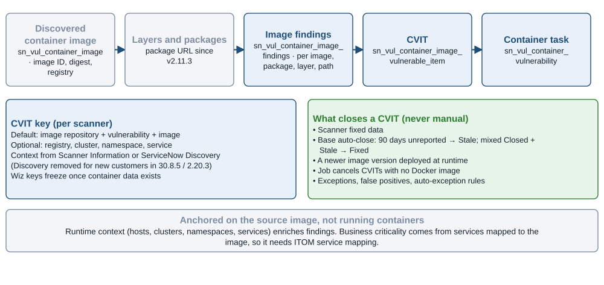

*Figure 5. CVR object model, the CVIT key, and every way a CVIT closes. Source: Official docs: CVR overview, CVIT key, auto-close and exception pages; Store release notes for 30.8.5 / 2.20.3.*

## Separate subscriptions and the v30 fork decide what you can run

The licensing picture is assembled from "separate subscription" statements scattered across product pages. VR is the base entitlement. Each of the following is a separate subscription:

- **CC**, a Store subscription app ([CC](https://github.com/ServiceNow/ServiceNowDocs/blob/brazil/markdown/security-management/configuration-compliance/vuln-config-compl.md)).
- **CVR**, "Vulnerability Response and Configuration Compliance for Containers," which requires an entitlement on production instances ([CVR install](https://github.com/ServiceNow/ServiceNowDocs/blob/brazil/markdown/security-management/container-vulnerability-response/install-and-configure-cvr.md)).
- **The Tenable integration** ([Tenable integration](https://github.com/ServiceNow/ServiceNowDocs/blob/brazil/markdown/security-management/vulnerability-response/tenableIntegration.md)).
- **Vulnerability Solution Management** ([Solution Management](https://github.com/ServiceNow/ServiceNowDocs/blob/brazil/markdown/security-management/vulnerability-response/vuln-solution-mgmt.md)) and **Vulnerability Crisis Management** ([Crisis Management](https://github.com/ServiceNow/ServiceNowDocs/blob/brazil/markdown/security-management/vulnerability-response/vulnerability-crisis-management.md)).

**The Wiz app lists VR, CVR and CC as prerequisites even for host-only use**, noting that "these applications are available as separate subscriptions" ([Wiz install](https://github.com/ServiceNow/ServiceNowDocs/blob/brazil/markdown/security-management/vulnerability-response/vr-wiz-host-vuln-install.md)).

Other features carry hidden dependencies:

- CC's business-criticality risk needs Service Mapping.
- CC dashboards need Performance Analytics for CC ([CC overview](https://github.com/ServiceNow/ServiceNowDocs/blob/brazil/markdown/security-management/configuration-compliance/vuln-config-compl-overview.md)).
- The Service Graph Connector for Wiz needs an ITOM Visibility or ITOM Discovery subscription unit, plus a Wiz advanced or standard license ([SGC for Wiz](https://github.com/ServiceNow/ServiceNowDocs/blob/brazil/markdown/servicenow-platform/service-graph-connectors/sgc-config-wiz-integration.md)).

The docs publish no pricing or unit definitions. The [companion USEM study](/tools-research/SERVICENOW_USEM_TENABLE_WIZ.md) discusses the Foundation/Advanced/Prime packaging claims, which product documentation does not corroborate.

The **v30 line is the architectural fork**. VR, CC and CVR pages all carry the same instruction: if you do not intend to move to USEM, "install a version below v30.x … and for upgrades to supported third-party integration applications" ([VR release notes](https://github.com/ServiceNow/ServiceNowDocs/blob/brazil/markdown/delta-zurich-brazil/brazil-zurich-vulnerabilityresponse-release-notes.md); [CC install](https://github.com/ServiceNow/ServiceNowDocs/blob/brazil/markdown/security-management/configuration-compliance/install-and-configure-cc.md); [CVR install](https://github.com/ServiceNow/ServiceNowDocs/blob/brazil/markdown/security-management/container-vulnerability-response/install-and-configure-cvr.md)). Scanner apps therefore run on paired version tracks. By September 2026 those tracks stood at:

- Tenable 30.5.3 (USEM) and 6.2.3 (classic);
- Wiz 32.8.4 and 4.2.4;
- CVR 30.8.5 and 2.20.3.

([Store release notes: Tenable](https://www.servicenow.com/docs/r/store-release-notes/store-secops-rn-vr-integration-with-tenable.html); [Wiz](https://www.servicenow.com/docs/r/store-release-notes/store-secops-rn-vr-int-wiz.html); [CVR](https://www.servicenow.com/docs/r/store-release-notes/store-secops-rn-vr-cc-containers.html))

The repo's own version lists lag far behind: the CVR page still lists v30.1/30.2 and v2.1 ([exploring CVR](https://github.com/ServiceNow/ServiceNowDocs/blob/brazil/markdown/security-management/container-vulnerability-response/exploring-cvr.md)). Compatibility questions all point to the login-gated KB0856498.

Moving to USEM uses the Migration assistant. Install `sn_vul_usem_common` before any v30.x app, rehearse in non-production, upgrade apps in the displayed order, then use **Enable all** to restore integrations and jobs. Only the assistant upgrades the other VR Store apps to v30 and temporarily disables integrations during the cutover ([migrate to USEM](https://github.com/ServiceNow/ServiceNowDocs/blob/brazil/markdown/security-management/vulnerability-response/migrate-to-usem.md); [migration planning](https://github.com/ServiceNow/ServiceNowDocs/blob/brazil/markdown/security-management/vulnerability-response/usem-migration-planning.md)).

USEM replaces the per-module rule tables with shared ones: `sn_sec_wf_assign_rule`, `sn_sec_wf_ttr_rule`, `sn_sec_rem_task_rule`, `sn_sec_calculator_group`, `sn_vul_cmn_auto_close_rule` and `sn_sec_exception_rule`. It also deprecates CC's `sn_vulc_auto_exception_rule` and `sn_vulc_state_change_approval` ([USEM components](https://github.com/ServiceNow/ServiceNowDocs/blob/brazil/markdown/security-management/sem-components-installed.md); [migration prerequisites](https://github.com/ServiceNow/ServiceNowDocs/blob/brazil/markdown/security-management/sem-migration-prereq-reference-data.md)). One assignment rule can then target VITs, AVITs, CVITs and CC test results through its "Applies to" field ([SEM assignment rules](https://github.com/ServiceNow/ServiceNowDocs/blob/brazil/markdown/security-management/sem-configure-assignment-rules.md)). **The finding tables keep their classic names throughout the Brazil pages**, so reports built on `sn_vul_vulnerable_item`, `sn_vulc_result` or `sn_vul_container_image_vulnerable_item` survive the migration. Rule configuration does not.

Several features exist only on the USEM side: SSVC enrichment, Armis Early Warning, and integration-health dashboards that show queue wait, CI-lookup and rule-processing times ([USEM integration review](https://github.com/ServiceNow/ServiceNowDocs/blob/brazil/markdown/security-management/review-usem-integrations.md)). Staying classic is therefore a feature freeze, not a neutral choice.

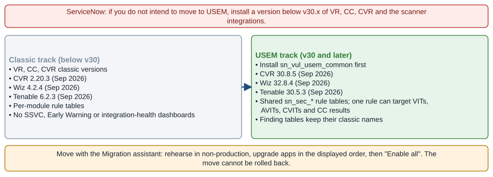

*Figure 6. The v30 fork: classic and USEM tracks must match across every app. Source: Official docs: VR, CC and CVR install notes, migrate-to-usem; ServiceNow Store release notes (September 2026).*

## The integration matrix shows Tenable narrowing and Wiz spanning

| Source | VR (hosts) | CC (configuration) | CVR (containers) | Elsewhere |
|---|---|---|---|---|
| **Tenable Vulnerability Management** (formerly Tenable.io) | Assets; Plugin; Fixed → Open Vulnerabilities; Scan Credential; Template; Scan Metadata; rescan | Fixed Compliance Results → Open Compliance Results; Compliance Results Backfill (v6.1.3 and later) | — | Tenable WAS → Application VR |
| **Tenable Security Center** (Tenable.sc) | Open/Fixed Assets; Plugin; Fixed → Open Vulnerabilities; Scan Credential; Backfill; rescan; MID Server | Not documented | — | — |
| **Tenable Cloud Security** (Tenable.cs) | Open → Fixed Cloud Host Vulnerabilities | Not documented | Cloud Container Assets → Open → Fixed Cloud Container Vulnerabilities | — |
| **Wiz** | Host Vulnerability (VMs, serverless); Asset (optional) | Test Results; Host Test Results; Issues | Grouped Vulnerability → Deployment Context → Container Vulnerability | SCA, Secrets, Application List → AVR; AI posture → AI Security |

Sources: [TVM integrations](https://github.com/ServiceNow/ServiceNowDocs/blob/brazil/markdown/security-management/vulnerability-response/tenable-io-integrations-list.md); [Tenable.sc integrations](https://github.com/ServiceNow/ServiceNowDocs/blob/brazil/markdown/security-management/vulnerability-response/tenable-sc-integrations-list.md); [Tenable.cs integrations](https://github.com/ServiceNow/ServiceNowDocs/blob/brazil/markdown/security-management/vulnerability-response/tenable-cs-integrations-list.md); [Tenable WAS](https://github.com/ServiceNow/ServiceNowDocs/blob/brazil/markdown/security-management/application-vulnerability-response/tenable-was-integration.md); [Wiz integrations by target app](https://github.com/ServiceNow/ServiceNowDocs/blob/brazil/markdown/security-management/vulnerability-response/vr-wiz-exploring-host-cf.md); [Wiz container chain](https://github.com/ServiceNow/ServiceNowDocs/blob/brazil/markdown/security-management/vulnerability-response/wiz-container-runtime-exposure-cvr.md); [Wiz AI posture](https://github.com/ServiceNow/ServiceNowDocs/blob/brazil/markdown/security-management/configuration-compliance/wiz-ai-sem-integration.md).

Ownership is now clear on both sides. The "Vulnerability Response Integration with Tenable" (scope `sn_vul_tenable`) is built by ServiceNow ([USEM integration catalog](https://github.com/ServiceNow/ServiceNowDocs/blob/brazil/markdown/security-management/integrating-usem.md)). Tenable's own *Tenable and ServiceNow Integration Guide* (revised August 26, 2026) covers only Tenable-built apps:

- the Service Graph Connector for Tenable;
- Tenable for ITSM;
- an OT Exposure app for VR that is "End-of-Life as of September 15, 2025."

The guide lists compatibility through Zurich but not Brazil ([Tenable integration guide](https://docs.tenable.com/integrations/ServiceNow/Content/PDF/Tenable_and_ServiceNow_Integration_Guide.pdf)). On the Wiz side, a ServiceNow staff announcement on the Community **[Community]** says the ServiceNow-built "Vulnerability Response Integration with Wiz" reached general availability on July 31, 2025. It replaced three Wiz-built apps (Security Operations, Configuration Compliance, Container Vulnerability Response), and new access requests to those apps were no longer granted ([ServiceNow Community announcement](https://www.servicenow.com/community/secops-articles/announcement-wiz-integration-with-servicenow-secops/ta-p/3325055)). Wiz's public integration page still describes a "Built by Wiz" app and looks stale ([Wiz: ServiceNow VR integration](https://www.wiz.io/integrations/servicenow-vulnerability-response)).

## Host findings reach VR through a Fixed-then-Open Tenable chain and a UUID-keyed Wiz feed

### Tenable VM and Security Center populate VR in a deliberate order

The Tenable app ingests TVM (cloud), Tenable.sc (on-premises, version 5.13 or later) and Tenable.cs (version 5.0.1 or later) ([Tenable integration](https://github.com/ServiceNow/ServiceNowDocs/blob/brazil/markdown/security-management/vulnerability-response/tenableIntegration.md)). It requires VR 12.1 or later and IntegrationHub. ServiceNow also advises two preparation steps before the first load: **size the instance against the expected VI volume, and disable unused calculators and notification business rules** ([Tenable setup checklist](https://github.com/ServiceNow/ServiceNowDocs/blob/brazil/markdown/security-management/vulnerability-response/tenable-setup-checklist.md)).

For TVM, the integrations run in this order ([TVM integrations](https://github.com/ServiceNow/ServiceNowDocs/blob/brazil/markdown/security-management/vulnerability-response/tenable-io-integrations-list.md)):

1. **Assets** creates discovered items and tags. Its export always requests `"is_deleted": false, "is_licensed": true` ([Tenable REST messages](https://github.com/ServiceNow/ServiceNowDocs/blob/brazil/markdown/security-management/vulnerability-response/tenable-rest-msgs.md)).
2. **Plugin** creates TPEs with a `TEN-` prefix.
3. **Fixed Vulnerabilities** runs on its schedule and then **chains to Open Vulnerabilities**.

Fixed detections update existing VIs but create none, "because Tenable considers Fixed vulnerabilities Mitigated," unless "Create vulnerable items for Fixed Vulnerability detections" is enabled. That option costs performance. Entering TVM credentials activates every TVM vulnerability integration but leaves the compliance integrations off ([Tenable Setup Assistant](https://github.com/ServiceNow/ServiceNowDocs/blob/brazil/markdown/security-management/vulnerability-response/vr-tenable-config-in-SA.md)).

Two defaults shape what arrives:

- **Severity filters import only Critical and High.** Medium, low and info are off ([Tenable retrieval parameters](https://github.com/ServiceNow/ServiceNowDocs/blob/brazil/markdown/security-management/vulnerability-response/tenable-data-rerieve.md)). Medium findings therefore never become VIs and never age into stale closure.
- **The first-run start time** pre-fills three months back, but ServiceNow advises at most one month to avoid Tenable API rate limits and timeouts ([optional modifications](https://github.com/ServiceNow/ServiceNowDocs/blob/brazil/markdown/security-management/vulnerability-response/tenable-optional-vul-modify.md)).

Advanced JSON filters on the REST methods support `cidr_range`, `plugin_family` and, from app 5.2.1, `epss_score`, `cvss4_base_score` and `vpr_v2_score`. The docs illustrate a split schedule that pulls criticals every four hours and everything else daily ([Tenable filters](https://github.com/ServiceNow/ServiceNowDocs/blob/brazil/markdown/security-management/vulnerability-response/tenable-add-filters.md)).

Tenable's API reference adds context the ServiceNow pages leave out ([Tenable: export vulnerabilities](https://developer.tenable.com/reference/exports-vulns-request-export)):

- The export's `state` filter defaults to OPEN and REOPENED.
- With no time filter, the export covers only items found or fixed in the last 30 days.
- `num_assets` means assets per chunk, ranging from 50 to 5,000.
- `vpr_v2_score` was "scheduled for deprecation on July 1, 2026." A ServiceNow filter built on it should be rechecked.

Tenable.sc uses a different set of integrations ([Tenable.sc integrations](https://github.com/ServiceNow/ServiceNowDocs/blob/brazil/markdown/security-management/vulnerability-response/tenable-sc-integrations-list.md)):

- Open Assets (cumulative) and Fixed Assets (mitigated).
- Plugin.
- Fixed → Open Vulnerabilities, with plugin families 0 and 39 excluded by default.
- A weekly Scan Credential integration.
- A seven-day Backfill, inactive by default.

Tenable.sc authenticates with API keys from version 5.13. The "Token validation is failed" log line is benign because tokens refresh automatically. A MID Server is mandatory when Tenable.sc and the instance sit in different environments ([Tenable setup checklist](https://github.com/ServiceNow/ServiceNowDocs/blob/brazil/markdown/security-management/vulnerability-response/tenable-setup-checklist.md)). Integrations time out after five minutes whether or not a MID Server is used ([Tenable Setup Assistant](https://github.com/ServiceNow/ServiceNowDocs/blob/brazil/markdown/security-management/vulnerability-response/vr-tenable-config-in-SA.md)). Tenable.cs cloud hosts run in the reverse order, **Open then Fixed**, with `compute_severity_*` filters ([Tenable.cs integrations](https://github.com/ServiceNow/ServiceNowDocs/blob/brazil/markdown/security-management/vulnerability-response/tenable-cs-integrations-list.md)).

Identity is where Tenable deployments succeed or fail. The base lookup rules differ by product ([Tenable integration](https://github.com/ServiceNow/ServiceNowDocs/blob/brazil/markdown/security-management/vulnerability-response/tenableIntegration.md)):

- **TVM:** MAC address, FQDN, NetBIOS, hostname, DNS, then IP.
- **Tenable.sc:** MAC, FQDN, NetBIOS, then IP.
- **Tenable.cs:** Cloud Resource ID.

"Enable Lookup By Network Partition" adds the TVM `network_id` or the Tenable.sc `repository_id` to the IP lookup rules. IRE then creates distinct CIs for overlapping private address space. A back-fill job, inactive by default, re-stamps existing records ([network partition](https://github.com/ServiceNow/ServiceNowDocs/blob/brazil/markdown/security-management/vulnerability-response/tenable-updateCI-NPI.md)).

Detections can be split by proof in three steps ([split detections](https://github.com/ServiceNow/ServiceNowDocs/blob/brazil/markdown/security-management/vulnerability-response/tenable-split-detections.md)):

1. Set "Include proof in VI key."
2. Enable port granularity.
3. Register plugins with a regex over the plugin output.

The published regex text appears garbled. Asset tags arrive only through the TVM Assets integration, case-insensitively, and the first tag wins. They work in rule conditions but not as an RT group-by key ([Tenable integration](https://github.com/ServiceNow/ServiceNowDocs/blob/brazil/markdown/security-management/vulnerability-response/tenableIntegration.md)).

**Rescan** is available from VI, RT, TPE or discovered-item records for TVM and Tenable.sc. It is not supported on agent-based assets. Child scans are capped at 1,000 IPs, and results arrive with the next Fixed Vulnerabilities import ([TVM rescan](https://github.com/ServiceNow/ServiceNowDocs/blob/brazil/markdown/security-management/vulnerability-response/vr-tenable-rescan-tenable-io.md); [Tenable.sc rescan](https://github.com/ServiceNow/ServiceNowDocs/blob/brazil/markdown/security-management/vulnerability-response/vr-tenable-rescan.md)). The optional **Tenable Risk Rule** weights VPR 70%, asset 15% and business criticality 15%. It is off by default and "may impact your data ingestion performance" ([Tenable Setup Assistant](https://github.com/ServiceNow/ServiceNowDocs/blob/brazil/markdown/security-management/vulnerability-response/vr-tenable-config-in-SA.md)).

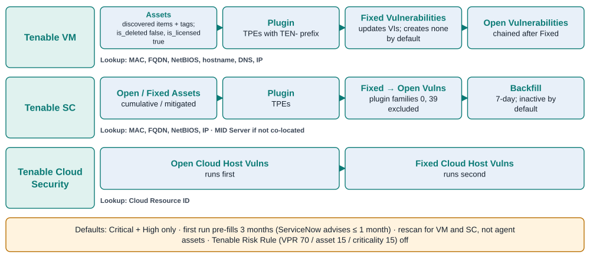

*Figure 7. Tenable host paths into VR: job order, defaults and CI lookup rules per Tenable product. Source: Official docs: tenable-io / sc / cs-integrations-list, tenable-data-rerieve, tenableIntegration; Tenable developer docs.*

### Wiz host findings key on the finding UUID and stamp their own assets

The Wiz app (scope `sn_vul_wiz`) authenticates with a Wiz service account: Auth URL, API URL, Client ID and Client Secret, then "Save and test." The Host Vulnerability integration needs the Wiz scopes `read:host_configuration` and `read:vulnerabilities`. All integrations run **daily** by default except Host Test Results, which runs on demand, and "Import since" backdates a run ([Wiz configuration](https://github.com/ServiceNow/ServiceNowDocs/blob/brazil/markdown/security-management/vulnerability-response/vr-config-wiz-host-vuln.md)).

From 30.3 (USEM) and 1.3 (classic), **the detection key is the Wiz finding UUID**, replacing vulnerability + asset_id + proof, and any key change needs a full import ([Wiz configuration](https://github.com/ServiceNow/ServiceNowDocs/blob/brazil/markdown/security-management/vulnerability-response/vr-config-wiz-host-vuln.md)). The release notes restrict the UUID key to new customers ([VR release notes](https://github.com/ServiceNow/ServiceNowDocs/blob/brazil/markdown/delta-zurich-brazil/brazil-zurich-vulnerabilityresponse-release-notes.md)).

From 32.1 (USEM) and 4.1 (classic), the separate Asset integration is **off by default and optional**, because the host integration stamps discovered items directly from `vulnerableAsset`. If it is turned on with no resource types selected, it pulls every type. The Host Vulnerability integration needs at least `VIRTUAL_MACHINE` or `SERVERLESS` ([Wiz resource types](https://github.com/ServiceNow/ServiceNowDocs/blob/brazil/markdown/security-management/vulnerability-response/wiz-assets-resources-tab.md)).

The Wiz filters carry real prioritization signal:

- Has Public Exploit
- Has CISA KEV Exploit
- Has Fix
- Resource Has Wide or Limited Internet Exposure
- admin or high privileges
- detection method
- status (OPEN, REJECTED, RESOLVED)
- **Validated In Runtime**, a Wiz status that "typically persists for a 48-hour period" after the package was last seen in memory

A filter left at `--None--` means "no data is imported for this field" ([Wiz host filters](https://github.com/ServiceNow/ServiceNowDocs/blob/brazil/markdown/security-management/vulnerability-response/wiz-host-tab-filters.md)).

Because Wiz feeds both VR and Application VR, lookup rules should set **Applies to** (Discovered Item or Discovered Application). Leaving it blank lets the two reapply jobs fight over the same flag ([lookup rules](https://github.com/ServiceNow/ServiceNowDocs/blob/brazil/markdown/security-management/sem-configure-lookup-rules.md)).

Two gaps matter. **The docs never map Wiz host status to VI state.** REJECTED lands only on detection status and `is_ignored`. By contrast, Application VR documents that rejected findings become Deferred/Risk Accepted unless ServiceNow exception management is selected ([Wiz AVR configuration](https://github.com/ServiceNow/ServiceNowDocs/blob/brazil/markdown/security-management/vulnerability-response/avr-wiz-config.md)). And **no rescan exists for Wiz**: the USEM catalog lists rescan only for Tenable and Qualys ([USEM integration catalog](https://github.com/ServiceNow/ServiceNowDocs/blob/brazil/markdown/security-management/integrating-usem.md)).

| VR target | Tenable source (TVM unless noted) | Wiz source (Host Vulnerability / Asset) |
|---|---|---|
| Discovered item `source_id` | Asset `id` (UUID) | `vulnerableAsset.id` (asset integration: `id`) |
| Host identifiers | First `ipv4s`, `fqdns`, `netbios_names`, `mac_addresses` | `vulnerableAsset.name` → `dns`; `ipAddresses[0]` → `ip_address` |
| Cloud context | Cloud metadata fields (v18+) | `region`, `providerUniqueId`, `cloudPlatform`, `subscriptionExternalId`, `nativeType` |
| Internet exposure | — | `isAccessibleFromInternet` → `cmdb_ci_internet_facing` (Asset) |
| TPE ID | Plugin `id` → `TEN-<id>` | `name` → `sn_vul_entry.id` |
| Severity | `risk_factor` → `source_severity`; `severity_id` → VI `priority` | `vendorSeverity` → `source_severity` |
| Vendor risk | `vpr.score` (v2 preferred) → `source_risk_score` + rating | `score` → `v3_base_score` (no Wiz risk score) |
| KEV / exploit | `on_cisa_kev` → `cisa_exists`; `exploit_available` → `exploit` | `hasCisaKevExploit` → `cisa_exists`; `hasExploit` → `exploit` |
| EPSS | `epss_score` → Tenable TPE Additional Attributes | From the CVE-level EPSS feed only |
| Proof / fix | sc `plugintext` → `proof`; `solution` → TPE | `description` → `proof`; `remediation` → `solution_summary`; `fixedVersion` → `fixed_version` |
| State | `state` → VI state (sc `hasBeenMitigated`) | `status` → detection `status`, `source_status`, `is_ignored` |

Sources: [Tenable transform reference](https://github.com/ServiceNow/ServiceNowDocs/blob/brazil/markdown/security-management/vulnerability-response/tenable-data-transformref.md); [Wiz field mappings](https://github.com/ServiceNow/ServiceNowDocs/blob/brazil/markdown/security-management/vulnerability-response/wiz-vul-resp-integration-view-findings.md). Tenable and Wiz both write KEV to the same `cisa_exists` field that the CVE-level CISA feed rolls up to TPEs. **Risk rules should reference one canonical KEV and EPSS signal to avoid counting the same fact twice.**

## Configuration verdicts reach CC only from Tenable VM and Wiz

### Tenable VM compliance arrives as Fixed and Open buckets plus a backfill

**Only TVM feeds CC.** The CC integrations page names only "the Tenable.io product of the Tenable Vulnerability Integration" ([CC integrations](https://github.com/ServiceNow/ServiceNowDocs/blob/brazil/markdown/security-management/configuration-compliance/vuln-config-compl-integrations.md)), and every Tenable.sc integration is vulnerability-only ([Tenable.sc integrations](https://github.com/ServiceNow/ServiceNowDocs/blob/brazil/markdown/security-management/vulnerability-response/tenable-sc-integrations-list.md)). Security Center estates therefore have no documented CC path. The Setup Assistant page requires CC v12.2 or later ([Tenable Setup Assistant](https://github.com/ServiceNow/ServiceNowDocs/blob/brazil/markdown/security-management/vulnerability-response/vr-tenable-config-in-SA.md)).

App v6.1.3 removed the single Compliance Results integration and split it in two ([TVM integrations](https://github.com/ServiceNow/ServiceNowDocs/blob/brazil/markdown/security-management/vulnerability-response/tenable-io-integrations-list.md)):

- **Fixed Compliance Results** imports PASSED and SKIPPED results. It is scheduled and chains to the next integration.
- **Open Compliance Results** imports FAILED, WARNING, ERROR and UNKNOWN results. It does not run if Fixed is inactive or fails.

A result whose asset cannot be matched is **ignored**. Its asset ID is parked in `sn_vul_tenable_missing_asset`, and **Compliance Results Backfill** reconciles up to 200 of those IDs per run after the Assets integration. In ServiceNow's worked example, 20 of 100 assets are ignored, and reconciliation "may take multiple runs" ([CC Tenable overview](https://github.com/ServiceNow/ServiceNowDocs/blob/brazil/markdown/security-management/configuration-compliance/cc-tenable-integration-overview.md)). The 200 figure matches Tenable's own cap of 200 asset UUIDs per compliance-export request ([Tenable: export compliance data](https://developer.tenable.com/reference/io-exports-compliance-create)).

On the vendor side, compliance data exists only if TVM scans run audit files: Tenable-supplied CIS or DISA STIG audits, or custom `.audit` files, each needing appropriate credentials ([Tenable VM: compliance in scans](https://docs.tenable.com/vulnerability-management/Content/Scans/Compliance.htm)). Tenable's compliance export aggregates results across scans rather than reporting them per scan ([Tenable: export compliance data](https://developer.tenable.com/reference/io-exports-compliance-create)). It now works with Basic [16] permissions plus Can View on the assets ([Tenable changelog](https://developer.tenable.com/changelog/vm-compliance-export-enhancements)).

**Test identity is the decision that matters most.** Tenable compliance tests used to be keyed on `check_id`. When several tests shared it, "later ingestion runs overwrite earlier records, causing data loss." Three keys are now available ([test uniqueness key](https://github.com/ServiceNow/ServiceNowDocs/blob/brazil/markdown/security-management/vulnerability-response/cc-tenable-compliance-test-uniqueness-key.md)):

- **`compliance_control_id`**, the default for new installs;
- **`check_id`**, kept as the default on upgraded instances;
- **`compliance_functional_id`**.

Only one key can be active, and changing it changes how later runs match records. It is set under "Configure Tenable Test Granularity" ([set the key](https://github.com/ServiceNow/ServiceNowDocs/blob/brazil/markdown/security-management/vulnerability-response/cc-tenable-config-test-uniqueness-key.md)).

Tenable defines `compliance_control_id` as a computed hash that groups results under one CIS or DISA recommendation. It defines `compliance_functional_id` as a hash of the audit code that **changes whenever the check's evaluation logic changes** ([Tenable changelog](https://developer.tenable.com/changelog/vm-compliance-export-enhancements)). The control ID is therefore the audit-stable choice. The functional ID would create a new CC test every time Tenable edits an audit.

Since v15.6.1, result granularity can add keys such as `instance`, so a database with five instances yields five results. ServiceNow advises no more than three extra keys because each adds run time ([result granularity](https://github.com/ServiceNow/ServiceNowDocs/blob/brazil/markdown/security-management/vulnerability-response/cc-tenable-tr-granularity.md)). Tenable supplies **no risk score** for compliance results. The transform reference says ServiceNow applies "the default Medium risk value of 20" in that case ([Tenable transform reference](https://github.com/ServiceNow/ServiceNowDocs/blob/brazil/markdown/security-management/vulnerability-response/tenable-data-transformref.md)), but two other pages disagree (see the contradictions table).

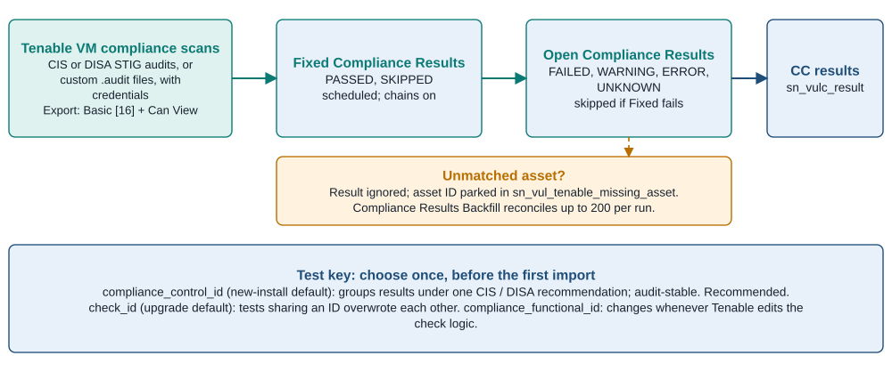

*Figure 8. Tenable compliance path into CC, the backfill, and the test-key decision. Source: Official docs: tenable-io-integrations-list, Tenable test granularity page, CC Tenable pages; Tenable compliance export docs.*

### Wiz writes three kinds of CC results and can divert AI posture for good

Three Wiz integrations write CC results ([Wiz integrations by target app](https://github.com/ServiceNow/ServiceNowDocs/blob/brazil/markdown/security-management/vulnerability-response/vr-wiz-exploring-host-cf.md)):

- **Test Results**: non-compliant cloud configurations.
- **Host Test Results**: VIRTUAL_MACHINE host configuration. These arrive from integration v1.1 with result type `host_misconfiguration`.
- **Issues**: CLOUD_CONFIGURATION, THREAT_DETECTION and TOXIC_COMBINATION, labeled "Wiz Issues."

These integrations need the `read:issues` and `read:threat_issues` scopes ([Wiz configuration](https://github.com/ServiceNow/ServiceNowDocs/blob/brazil/markdown/security-management/vulnerability-response/vr-config-wiz-host-vuln.md)). Version 1.1 made four changes ([CC release notes](https://github.com/ServiceNow/ServiceNowDocs/blob/brazil/markdown/delta-zurich-brazil/brazil-zurich-configurationcompliance-release-notes.md)):

- It deprecated the missing-asset backfill; primary integrations must be **backdated three days and re-run**.
- It replaced `is_ignored` with `is_result_ignored`.
- It mapped Wiz source severity to Priority on `sn_vulc_result`.
- It populated `validated_at_runtime`.

The Test Results tab filters on severity, project, cloud platform (including GitHub, Terraform and OpenAI), subscription, Framework Category, resource and native type, Has remediation, and status. Two options govern rejected findings: **Fetch rejected** imports Wiz-rejected results that "remain in a failed state but are not rolled up," and **Close rejected** imports them and closes them ([Wiz Test Results filters](https://github.com/ServiceNow/ServiceNowDocs/blob/brazil/markdown/security-management/vulnerability-response/wiz-test-result-tab-filters.md)). The Issues tab adds an Issue type filter ([Wiz Issues filters](https://github.com/ServiceNow/ServiceNowDocs/blob/brazil/markdown/security-management/vulnerability-response/wiz-issues-tab-filters.md)). That filter deserves a deliberate setting: by default, runtime THREAT_DETECTION issues would land in CC as configuration results, which is a modeling compromise. Many teams would rather route them to incident response.

**AI posture routing is a one-way switch.** With the `sn_sec_ai` plugin active, a checkbox on the Test Results tab sends Wiz AI-resource posture findings to AI Security Exposure Management. Wiz defines 14 AI resource types, but **only five map to an AI Security asset type**: agent, dataset, model, tool and MCP server. Evidence is not populated ([Wiz AI-SEM integration](https://github.com/ServiceNow/ServiceNowDocs/blob/brazil/markdown/security-management/configuration-compliance/wiz-ai-sem-integration.md); [mapping](https://github.com/ServiceNow/ServiceNowDocs/blob/brazil/markdown/security-management/configuration-compliance/wiz-ai-sem-mapping.md)). **Once saved, the setting cannot be turned off**, even through the API, and CC "stops creating test results" for routed findings ([Wiz AI-SEM configuration](https://github.com/ServiceNow/ServiceNowDocs/blob/brazil/markdown/security-management/configuration-compliance/wiz-ai-sem-configure.md)).

The **Cloud Exposure View** groups Wiz-sourced data into Host, Misconfiguration, Toxic combination and Container findings. Its lists cap at 1,000 records ([Cloud Exposure View](https://github.com/ServiceNow/ServiceNowDocs/blob/brazil/markdown/security-management/vr-cloud-exposure-view-db.md)). Matching Wiz CC results to CMDB cloud CIs works only if the lookup rules reproduce Discovery's `object_id` formats, for example `arn:aws:s3:::<bucket>` for S3. A mismatched format silently misses ([cloud CI lookup](https://github.com/ServiceNow/ServiceNowDocs/blob/brazil/markdown/security-management/configuration-compliance/cloud-ci-look-up-for-ms-paloalto.md)).

| CC target | Tenable VM compliance source | Wiz Test Results source (Issues variant) |
|---|---|---|
| Test group `sn_vulc_policy` | `audit_file` → short description | None documented |
| Test `sn_vulc_test.source_id` | `check_id`, or the configured key | `rule.id` (`sourceRule.id`) |
| Test name / remediation | `check_name`; `check_info`; `solution` | `rule.name`; `rule.remediationInstructions` (`resolutionRecommendation`) |
| Test criticality | None. Tenable sends no risk score | `severity` → `source_criticality`; source severity → result Priority (v1.1) |
| Result value | `status` → `result` | `status` → `result`; Rejected → ignored flag |
| Expected / actual | `expected_value` / `actual_value` | Not mapped |
| Authoritative source | `reference.framework` | `securitySubCategories.category.framework.name` |
| Citation | `reference.control` → section; `profile_name` → section name | `securitySubCategories.id` / `.title` |
| Dates | `first_seen` / `last_seen` | `firstSeenAt` / `analyzedAt` (`createdAt` / `updatedAt`) |
| Technology | `db_type` | Not mapped |
| Asset | `asset_uuid` → discovered item | `resource.*` (`entitySnapshot.*`) → discovered item `source_data` |

Sources: [Tenable transform reference](https://github.com/ServiceNow/ServiceNowDocs/blob/brazil/markdown/security-management/vulnerability-response/tenable-data-transformref.md); [Wiz field mappings](https://github.com/ServiceNow/ServiceNowDocs/blob/brazil/markdown/security-management/vulnerability-response/wiz-vul-resp-integration-view-findings.md). No Wiz field is documented as populating a test group. Wiz results will likely have no test group unless one is created locally, and **CC reporting by benchmark should pivot on authoritative source and citation, not test group**.

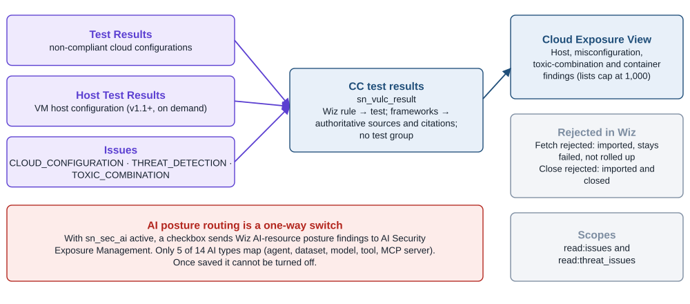

*Figure 9. Wiz paths into CC, rejected-finding options, and the one-way AI posture switch. Source: Official docs: wiz-test-result-tab-filters, wiz-issues-tab-filters, wiz-ai-sem-integration, vr-cloud-exposure-view-db.*

## Container data reaches CVR through Tenable.cs or a three-step Wiz chain

### Tenable.cs sends an explicit fixed signal

Tenable container data comes **only from Tenable Cloud Security**, through three chained integrations ([Tenable.cs integrations](https://github.com/ServiceNow/ServiceNowDocs/blob/brazil/markdown/security-management/vulnerability-response/tenable-cs-integrations-list.md)):

1. **Cloud Container Assets** creates discovered container images, Docker images and repositories.
2. **Open Cloud Container Vulnerabilities** creates new or reopened CVITs, findings, TPEs and CVEs.
3. **Fixed Cloud Container Vulnerabilities** creates findings "in closed state."

Authentication is a Tenable.cs API token, and the container forms in Setup Assistant appear "only if Container Vulnerability Response is installed" ([Tenable Setup Assistant](https://github.com/ServiceNow/ServiceNowDocs/blob/brazil/markdown/security-management/vulnerability-response/vr-tenable-config-in-SA.md)). Transport is a GraphQL REST message ([Tenable REST messages](https://github.com/ServiceNow/ServiceNowDocs/blob/brazil/markdown/security-management/vulnerability-response/tenable-rest-msgs.md)). Container severity filters again default to Critical and High only ([Tenable retrieval parameters](https://github.com/ServiceNow/ServiceNowDocs/blob/brazil/markdown/security-management/vulnerability-response/tenable-data-rerieve.md)).

The image digest (`u_digest`) becomes both `image_id` and `image_digest` and "is used for CI lookup." `u_resolved` drives the finding status and the CVIT state, and VPR lands in `source_risk_score` ([Tenable transform reference](https://github.com/ServiceNow/ServiceNowDocs/blob/brazil/markdown/security-management/vulnerability-response/tenable-data-transformref.md)). Because a fixed signal arrives explicitly, Tenable.cs closure is more deterministic than reliance on the 90-day stale rule.

Two cautions apply. The Store notes put real Tenable.cs ingestion at app 5.0.3 (May 2025) and record a fix in 30.3.3/6.1.3 for "a backward-incompatible API change" on Tenable's side ([Store release notes: Tenable](https://www.servicenow.com/docs/r/store-release-notes/store-secops-rn-vr-integration-with-tenable.html)). And Tenable's legacy token page now carries an end-of-support notice, which leaves the token's permission model undocumented ([Tenable Cloud Security: API tokens](https://docs.tenable.com/tenablecs/Content/Administration/Integrations/GenerateAPITokens.htm)). The 70/15/15 Tenable Risk Rule is documented only for host VIs; CVR has no equivalent.

### Wiz now maps every deployment before it creates CVITs

From Store release 32.8.4 (USEM) and 4.2.4 (September 2026), Wiz container data runs as a chain that is active by default ([Wiz container chain](https://github.com/ServiceNow/ServiceNowDocs/blob/brazil/markdown/security-management/vulnerability-response/wiz-container-runtime-exposure-cvr.md)):

1. **Container Grouped Vulnerability** gathers Source IDs for active images into `sn_vul_container_image`.
2. **Container Deployment Context** maps each image to cluster, namespace and service in `sn_vul_container_image_relationship_mapping`, and creates missing CVITs for new deployments.
3. **Container Vulnerability** creates CVITs for every cluster, namespace or service the image is deployed on.

Run alone, the Container Vulnerability integration created CVITs on **at most 16 clusters** per image. The Store notes describe this as a "16-controller-per-image cap" that also made auto-closing unreliable when a deployment was removed ([Store release notes: Wiz](https://www.servicenow.com/docs/r/store-release-notes/store-secops-rn-vr-int-wiz.html)). Setting `sn_vul_wiz.deployment_context_gate_writes` to false turns the chain off and restores the old behavior. That makes sense only if clusters are not part of the CVIT key.

Several earlier changes reshaped Wiz container identity. In 32.0.3, finding uniqueness gained the **path** attribute. Existing findings were migrated, and irrelevant ones were **bulk-closed as invalid**, which a metrics team must not read as remediation. The same release rolls Validated in Runtime up from findings to CVITs ([Store release notes: Wiz](https://www.servicenow.com/docs/r/store-release-notes/store-secops-rn-vr-int-wiz.html)). Zurich-era releases ([CVR release notes](https://github.com/ServiceNow/ServiceNowDocs/blob/brazil/markdown/delta-zurich-brazil/brazil-zurich-containervulnerabilityresponse-release-notes.md)):

- changed the repository name to the form registry/repository, with a separate finding per registry;
- rolled fix status up to CVITs as Fix available, Partial fix available or No fix available;
- evaluated cluster and namespace for DEPLOYMENT, DAEMON_SET, STATEFUL_SET and POD controllers.

Wiz CVIT keys "aren't editable unless there is no container vulnerability data in the instance, or unless you're a new customer" ([Wiz container chain](https://github.com/ServiceNow/ServiceNowDocs/blob/brazil/markdown/security-management/vulnerability-response/wiz-container-runtime-exposure-cvr.md)). The container import filters include Has Fix, Has CISA KEV Exploit, Limited Internet Exposure, Detection Method and Validated In Runtime ([Wiz container filters](https://github.com/ServiceNow/ServiceNowDocs/blob/brazil/markdown/security-management/vulnerability-response/wiz-container-tab-filters.md)). CVR 30.8.5/2.20.3 adds ingestion of Wiz Running Container Vulnerability findings ([Store release notes: CVR](https://www.servicenow.com/docs/r/store-release-notes/store-secops-rn-vr-cc-containers.html)).

CMDB alignment runs through `cmdb_ci_docker_image`. The AWS Service Graph Connector models the image as instantiating Docker containers, with Kubernetes clusters containing namespaces, pods and services ([AWS CMDB classes](https://github.com/ServiceNow/ServiceNowDocs/blob/brazil/markdown/servicenow-platform/service-graph-connectors/cmdb-aws-classes.md)). If those classes are not populated with matching image IDs, choose Scanner Information as the key data source.

| CVR target | Tenable.cs source | Wiz source |
|---|---|---|
| Image ID / digest | `u_digest` → `image_id`, `image_digest` (CI lookup) | `imageId` → `image_id` |
| Image name | `u_name` | `vulnerableAsset.name` |
| Repository / registry | `u_repositoryuri` | `repository.externalId`: before `##` → repo, after → registry |
| Labels / tags | `u_labels`; `u_imagetags` | `tags` → `image_labels` |
| Cluster / namespace | `u_clusters` → `image_cluster` | `executionControllers.ancestors.name` → `image_namespace`, `image_clusters` |
| Cloud context | `u_cloudprovider`, `u_accountid`, `u_region` | `cloudPlatform`, `subscriptionExternalId`, `region` |
| Package | Software name, version, type, paths | `detailedName`, `version`, `locationPath` |
| Vendor risk / severity | `VprScore` → `source_risk_score`; `VprSeverity` → `source_severity` | Vendor severity → finding source severity |
| Status | `u_resolved` → finding status and CVIT state | `status` → finding `is_ignored` |
| Runtime / base layer | — | `validate_at_runtime`; `layerMetadata.isBaseLayer` → finding `is_base_image` |
| Fix | — | `fixed_version` → finding `fix_status` |

Sources: [Tenable transform reference](https://github.com/ServiceNow/ServiceNowDocs/blob/brazil/markdown/security-management/vulnerability-response/tenable-data-transformref.md); [Wiz field mappings](https://github.com/ServiceNow/ServiceNowDocs/blob/brazil/markdown/security-management/vulnerability-response/wiz-vul-resp-integration-view-findings.md). Because CVR 30.3.2 deprecated the CVIT-level IsBaseImage flag as "image-specific data" ([Store release notes: CVR](https://www.servicenow.com/docs/r/store-release-notes/store-secops-rn-vr-cc-containers.html)), triage of base-image versus application-layer findings should filter on findings or layers, not CVITs.

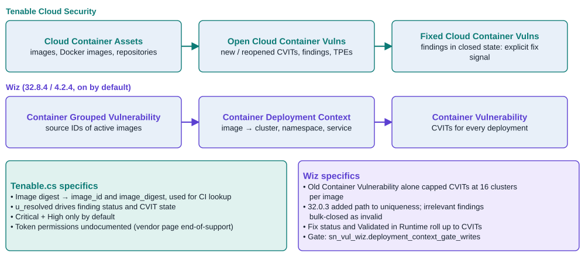

*Figure 10. Container paths into CVR: the Tenable Cloud Security chain and the Wiz deployment-context chain. Source: Official docs: tenable-cs-integrations-list, wiz-container-runtime-exposure-cvr, wiz-container-tab-filters; Store release notes.*

## Least-privilege setup starts on the vendor side

| Requirement | Tenable VM | Tenable Security Center | Tenable Cloud Security | Wiz |
|---|---|---|---|---|
| ServiceNow apps | VR 12.1+ with NVD and CWE loaded; IntegrationHub; Tenable app; CC 12.2+ for compliance | Same, plus a MID Server unless co-located | Same, plus the CVR app for containers | VR with NVD, CISA and CWE; CVR app; CC app; Wiz app |
| ServiceNow roles | `admin` (install); `sn_vul.vulnerability_admin`; `sn_vul_tenable.configure_integration` | Same | Same | `sn_vul.vulnerability_admin`; `sn_vulc.admin`; `sn_vul_wiz.configure_integration`; `sn_vul_wiz.read_integration` |
| Vendor credential | API access and secret keys | API keys (5.13+, after an admin enables "Allow API Keys") | API token | Service account: Client ID, Client Secret, Auth URL, API URL |
| Vendor permission | Basic [16] from app v3.8 (Administrator [64] before); Can View on assets for exports | Security Analyst or Security Manager | Not documented (vendor page is end-of-support) | Host: `read:vulnerabilities`, `read:host_configuration`. Asset: `read:resources`. Container: `read:cloud_configuration`. CC and Issues: `read:issues`, `read:threat_issues` |
| Throughput limits | 10 concurrent exports per container; 429 with retry-after; `num_assets` 50–5,000 | 30-second sync calls; 5-minute integration timeout | Asset page ≤1,000; vulnerability page ≤10,000 | `First` page size (asset default 500; 500–1,000 suggested for findings); Wiz-side limits not public |

Sources: [Tenable setup checklist](https://github.com/ServiceNow/ServiceNowDocs/blob/brazil/markdown/security-management/vulnerability-response/tenable-setup-checklist.md); [Tenable Setup Assistant](https://github.com/ServiceNow/ServiceNowDocs/blob/brazil/markdown/security-management/vulnerability-response/vr-tenable-config-in-SA.md); [Tenable retrieval parameters](https://github.com/ServiceNow/ServiceNowDocs/blob/brazil/markdown/security-management/vulnerability-response/tenable-data-rerieve.md); [Tenable: concurrency limiting](https://developer.tenable.com/docs/concurrency-limiting); [Tenable: roles](https://developer.tenable.com/docs/roles); [Tenable SC: API key authentication](https://docs.tenable.com/security-center/Content/EnableAPIKeys.htm); [Wiz install](https://github.com/ServiceNow/ServiceNowDocs/blob/brazil/markdown/security-management/vulnerability-response/vr-wiz-host-vuln-install.md); [Wiz configuration](https://github.com/ServiceNow/ServiceNowDocs/blob/brazil/markdown/security-management/vulnerability-response/vr-config-wiz-host-vuln.md); [Wiz container filters](https://github.com/ServiceNow/ServiceNowDocs/blob/brazil/markdown/security-management/vulnerability-response/wiz-container-tab-filters.md).

**On the Tenable side**, the numeric TVM roles are Read-Only 0, Basic 16, Scan Operator 24, Standard 32, Scan Manager 40 and Administrator 64. Custom roles can carry granular export privileges ([Tenable: roles](https://developer.tenable.com/docs/roles)). A Basic service user with Can View on the relevant asset objects is therefore the least-privilege TVM identity for ServiceNow from app v3.8. Rescan is the exception: it relies on the Scan Credential and Template integrations, and the docs do not state what scan permissions it needs.

Tenable.sc API keys require an administrator to enable "Allow API Keys" first. The secret cannot be viewed again after generation, and regenerating keys de-authorizes the old ones ([Tenable SC: manage API keys](https://docs.tenable.com/security-center/Content/GenerateAPIKey.htm)).

Tenable caps export endpoints at **10 concurrent exports per container**, rejects duplicate exports with the same filters, and returns HTTP 429 with a `retry-after` header ([Tenable: concurrency limiting](https://developer.tenable.com/docs/concurrency-limiting)). That cap is shared by every tool pulling from the same TVM container: ServiceNow's asset, fixed, open and compliance chains, plus any data lake or SIEM exporter.

Do not confuse the Tenable-built apps with the ServiceNow-built one. They use their own `x_tsirm_*` roles, cross-scope privileges and chunk defaults ([Tenable integration guide](https://docs.tenable.com/integrations/ServiceNow/Content/PDF/Tenable_and_ServiceNow_Integration_Guide.pdf)). Tenable's "Create ServiceNow Ticket" action writes incidents directly, bypassing VR. It needs a Tenable One license and is limited to 200 findings per action ([Tenable VM: create a ticket](https://docs.tenable.com/vulnerability-management/Content/Explore/take-action.htm)).

**On the Wiz side**, creating a service account requires a Wiz user with Write permission on service accounts. Project-scoped roles can create accounts only within their own projects, and you can select projects to limit what the account sees ([SGC for Wiz setup](https://github.com/ServiceNow/ServiceNowDocs/blob/brazil/markdown/servicenow-platform/service-graph-connectors/sgc-cmdb-wiz-setup.md)). The token URL is `https://auth.app.wiz.io/oauth/token`, and API URLs take the form `https://api.<region>.app.wiz.io` ([SGC for Wiz configuration](https://github.com/ServiceNow/ServiceNowDocs/blob/brazil/markdown/servicenow-platform/service-graph-connectors/sgcc-configure-wiz.md)). The CMDB connector needs only `read:resources` and `read:projects`. That makes a separate CMDB service account, distinct from the security-findings account, the natural least-privilege split. Government-cloud endpoints, GraphQL rate limits and Wiz-side ticketing could not be verified because Wiz's documentation requires a login.

**On the ServiceNow side**, every scanner shares one import framework. By default it has **ten "Vulnerability Import Template" engine jobs**, one-hour import-queue entries kept alive by heartbeats, and a 60-minute run-timeout checker. Chained integrations trigger their successors ([VR components](https://github.com/ServiceNow/ServiceNowDocs/blob/brazil/markdown/security-management/vulnerability-response/installed-with-vr.md); [VR integrations](https://github.com/ServiceNow/ServiceNowDocs/blob/brazil/markdown/security-management/vulnerability-response/vuln_integrations.md)). Large Tenable and Wiz estates therefore compete for the same workers, so stagger the chains. Domain-separated Tenable imports need a run-as user per domain and a cloned data source processor ([optional modifications](https://github.com/ServiceNow/ServiceNowDocs/blob/brazil/markdown/security-management/vulnerability-response/tenable-optional-vul-modify.md)). CVITs ingest into the integration user's domain ([CVR domain separation](https://github.com/ServiceNow/ServiceNowDocs/blob/brazil/markdown/security-management/container-vulnerability-response/domain-separation-container-vulnerability-response.md)).

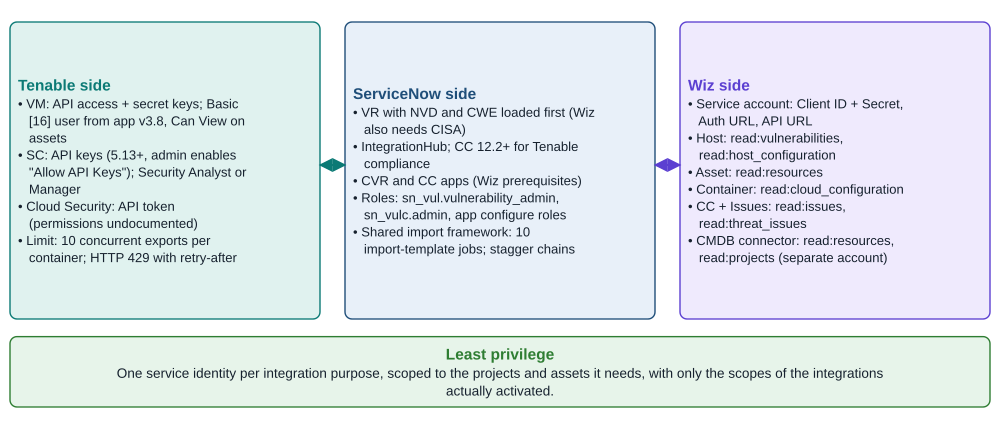

*Figure 11. Least-privilege setup across Tenable, ServiceNow and Wiz. Source: Official docs: tenable-setup-checklist, vr-wiz-host-vuln-install, vr-config-wiz-host-vuln, sgc-cmdb-wiz-setup; Tenable developer docs.*

## Two dozen documentation contradictions touch design decisions

The Brazil pages carry a September 2026 date, but many paragraphs predate the code they describe. These conflicts change how a team would configure the product:

| Topic | Conflict | Practical resolution |
|---|---|---|
| Tenable app ownership | [VR integrations](https://github.com/ServiceNow/ServiceNowDocs/blob/brazil/markdown/security-management/vulnerability-response/vuln_integrations.md) says the Tenable app is "created and maintained by Tenable"; [USEM catalog](https://github.com/ServiceNow/ServiceNowDocs/blob/brazil/markdown/security-management/integrating-usem.md) says "Built by ServiceNow" | Treat `sn_vul_tenable` as ServiceNow-built; migration from the Tenable-built app is KB0960667 |
| Tenable.sc auth | [Setup Assistant](https://github.com/ServiceNow/ServiceNowDocs/blob/brazil/markdown/security-management/vulnerability-response/vr-tenable-config-in-SA.md) lists user/password and API key, then says "only API key" is supported | Use API keys (Tenable.sc 5.13+) |
| Tenable severity mapping | [Severity mapping](https://github.com/ServiceNow/ServiceNowDocs/blob/brazil/markdown/security-management/vulnerability-response/vulnerability-response-severity-mapping.md) maps Priority to `source_severity` and VPR in the Plugin run; [transform reference](https://github.com/ServiceNow/ServiceNowDocs/blob/brazil/markdown/security-management/vulnerability-response/tenable-data-transformref.md) maps severity to `priority` and VPR in the vulnerability import | Inspect the transform maps on the instance |
| `num_assets` meaning | ServiceNow: "max vulnerabilities per exported chunk" ([retrieval parameters](https://github.com/ServiceNow/ServiceNowDocs/blob/brazil/markdown/security-management/vulnerability-response/tenable-data-rerieve.md)); Tenable: assets per chunk, 50–5,000 ([Tenable API](https://developer.tenable.com/reference/exports-vulns-request-export)) | Follow Tenable's definition when tuning |
| Tenable CC integration name | [CC Tenable overview](https://github.com/ServiceNow/ServiceNowDocs/blob/brazil/markdown/security-management/configuration-compliance/cc-tenable-integration-overview.md) still says run "Compliance Results Integration"; [TVM list](https://github.com/ServiceNow/ServiceNowDocs/blob/brazil/markdown/security-management/vulnerability-response/tenable-io-integrations-list.md) says it was removed in v6.1.3 | Activate both Fixed and Open Compliance Results |
| Tenable CC test key | Transform hard-codes `check_id → source_id`; [uniqueness key page](https://github.com/ServiceNow/ServiceNowDocs/blob/brazil/markdown/security-management/vulnerability-response/cc-tenable-compliance-test-uniqueness-key.md) makes it configurable | Choose `compliance_control_id` before first import |
| Tenable CC risk | "Default Medium risk value of 20" ([transform reference](https://github.com/ServiceNow/ServiceNowDocs/blob/brazil/markdown/security-management/vulnerability-response/tenable-data-transformref.md)) vs vendor scores in Criticality ([CC risk example](https://github.com/ServiceNow/ServiceNowDocs/blob/brazil/markdown/security-management/configuration-compliance/config-compliance-risk-calculator-example.md)) vs unknown = 100 ([CC calculators](https://github.com/ServiceNow/ServiceNowDocs/blob/brazil/markdown/security-management/configuration-compliance/config-compliance-calculator-rules.md)) | Test a known result's score; set an explicit calculator rule |
| CC auto-close roll-up | All Closed-Fixed → RT Closed-Canceled ([procedure](https://github.com/ServiceNow/ServiceNowDocs/blob/brazil/markdown/security-management/configuration-compliance/cc-autoclose-tr.md)) vs all Closed-Stale → Closed-Canceled ([overview](https://github.com/ServiceNow/ServiceNowDocs/blob/brazil/markdown/security-management/configuration-compliance/cc-autoclose-tr-overview.md)) | The overview matches VR's logic; verify on the instance |
| CC RT creation and Close | RTs "are created manually" ([correlation](https://github.com/ServiceNow/ServiceNowDocs/blob/brazil/markdown/security-management/configuration-compliance/vuln-config-compl-correlation.md)) vs RT rules ([RT rules](https://github.com/ServiceNow/ServiceNowDocs/blob/brazil/markdown/security-management/configuration-compliance/cc-groups.md)); the state page still cites the Close button removed in v15.0 | RT rules exist but ship disabled |
| CC CI lookup scope | "Only for the Qualys Integration," then lists Defender and Prisma rules ([CC CI rules](https://github.com/ServiceNow/ServiceNowDocs/blob/brazil/markdown/security-management/configuration-compliance/cc-ci-identifier-rules.md)) | Test lookup coverage per scanner |
| Wiz host configurations | "Host configurations from Wiz are not imported" ([Test Results filters](https://github.com/ServiceNow/ServiceNowDocs/blob/brazil/markdown/security-management/vulnerability-response/wiz-test-result-tab-filters.md)) vs the Host Test Results integration from v1.1 ([Wiz CC overview](https://github.com/ServiceNow/ServiceNowDocs/blob/brazil/markdown/security-management/configuration-compliance/exploring-wiz-ctest-results-int.md)) | Host configuration is imported from v1.1 |
| Wiz Asset prerequisite | Same page says "optional … deactivated by default" and "other integrations depend on" it ([resource types](https://github.com/ServiceNow/ServiceNowDocs/blob/brazil/markdown/security-management/vulnerability-response/wiz-assets-resources-tab.md)) | Optional from 32.1/4.1; enable it only for exposure flags |
| Wiz detection key | UUID from 30.3/1.3 ([configuration](https://github.com/ServiceNow/ServiceNowDocs/blob/brazil/markdown/security-management/vulnerability-response/vr-config-wiz-host-vuln.md)) vs "new customers only" ([VR release notes](https://github.com/ServiceNow/ServiceNowDocs/blob/brazil/markdown/delta-zurich-brazil/brazil-zurich-vulnerabilityresponse-release-notes.md)); the configure page contains unedited draft questions | Check the Detection Granularity record before upgrading |
| Wiz ignored flag | `is_ignored` in [field mappings](https://github.com/ServiceNow/ServiceNowDocs/blob/brazil/markdown/security-management/vulnerability-response/wiz-vul-resp-integration-view-findings.md) vs `is_result_ignored` in [CC release notes](https://github.com/ServiceNow/ServiceNowDocs/blob/brazil/markdown/delta-zurich-brazil/brazil-zurich-configurationcompliance-release-notes.md) | Build reports on `is_result_ignored` for CC |
| Wiz AI routing | "Instead of Configuration Compliance" ([configure](https://github.com/ServiceNow/ServiceNowDocs/blob/brazil/markdown/security-management/configuration-compliance/wiz-ai-sem-configure.md)) vs "into AI-SEM and Configuration Compliance" ([overview](https://github.com/ServiceNow/ServiceNowDocs/blob/brazil/markdown/security-management/configuration-compliance/wiz-ai-sem-integration.md)) | Assume CC stops; the setting is irreversible |
| Wiz in CC catalog | Missing from [CC integrations](https://github.com/ServiceNow/ServiceNowDocs/blob/brazil/markdown/security-management/configuration-compliance/vuln-config-compl-integrations.md); the [USEM catalog](https://github.com/ServiceNow/ServiceNowDocs/blob/brazil/markdown/security-management/integrating-usem.md) Wiz CC entry says "from Microsoft Defender for Cloud" | Copy errors; Wiz CC is supported |
| Default CVIT key | Repository + tag + vulnerability ([exploring CVR](https://github.com/ServiceNow/ServiceNowDocs/blob/brazil/markdown/security-management/container-vulnerability-response/exploring-cvr.md)) vs repository + vulnerability + image ([key granularity](https://github.com/ServiceNow/ServiceNowDocs/blob/brazil/markdown/security-management/container-vulnerability-response/cvr-configuring-findings-key-granularity.md)) | Read `sn_vul_container_image_vulnerability_keys` |
| CVR Discovery default | Discovery is the default ([key data source](https://github.com/ServiceNow/ServiceNowDocs/blob/brazil/markdown/security-management/container-vulnerability-response/cvr-configure-key-granularity.md)) vs removed for new customers in 30.8.5/2.20.3 ([Store notes](https://www.servicenow.com/docs/r/store-release-notes/store-secops-rn-vr-cc-containers.html)) | Use Scanner Information unless Kubernetes Discovery is mature |
| Base-image tracking | CVIT "Base Image" field ([CVIT fields](https://github.com/ServiceNow/ServiceNowDocs/blob/brazil/markdown/security-management/container-vulnerability-response/container-vul-items-fields.md)) vs CVIT IsBaseImage deprecated ([Store notes](https://www.servicenow.com/docs/r/store-release-notes/store-secops-rn-vr-cc-containers.html)) | Filter on finding `is_base_image` |
| Wiz 16-item cap; container path | "16 clusters" ([chain page](https://github.com/ServiceNow/ServiceNowDocs/blob/brazil/markdown/security-management/vulnerability-response/wiz-container-runtime-exposure-cvr.md)) vs "16-controller" ([Store notes](https://www.servicenow.com/docs/r/store-release-notes/store-secops-rn-vr-int-wiz.html)); path moved to findings ([Australia notes](https://github.com/ServiceNow/ServiceNowDocs/blob/brazil/markdown/delta-australia-brazil/brazil-australia-containervulnerabilityresponse-release-notes.md)) but mappings still target packages | Keep the chain on; read path from findings |
| Wiz container scopes | Container integration lists only `read:cloud_configuration` ([configuration](https://github.com/ServiceNow/ServiceNowDocs/blob/brazil/markdown/security-management/vulnerability-response/vr-config-wiz-host-vuln.md)) | Test the service account with a dry run; add `read:vulnerabilities` if calls fail |
| Tenable.cs Fixed output and version | Fixed integration output listed as "New/Reopened" CVITs ([Tenable.cs list](https://github.com/ServiceNow/ServiceNowDocs/blob/brazil/markdown/security-management/vulnerability-response/tenable-cs-integrations-list.md)); repo says Tenable.cs from 5.0.1, Store notes say ingestion from 5.0.3 | Fixed closes findings; run 5.0.3 or later |
| VR remediation-target defaults | Shipped rules (15/30/45 days, inactive) "applicable only for application vulnerable items" ([SEM targets](https://github.com/ServiceNow/ServiceNowDocs/blob/brazil/markdown/security-management/sem-configure-remediation-target-rules.md)) vs "at least one rule is shipped" ([Setup Assistant](https://github.com/ServiceNow/ServiceNowDocs/blob/brazil/markdown/security-management/vulnerability-response/cj-setup-assistant.md)) | Author host SLA rules explicitly |
| Enrichment order | NVD "runs daily" ([NVD](https://github.com/ServiceNow/ServiceNowDocs/blob/brazil/markdown/security-management/vulnerability-response/nvd-vuln-integration.md)) vs "weekly on Monday" ([CWE jobs](https://github.com/ServiceNow/ServiceNowDocs/blob/brazil/markdown/security-management/vulnerability-response/t_ConfigureScheduledJobsCWE.md)); EPSS before vs after scanner imports ([EPSS](https://github.com/ServiceNow/ServiceNowDocs/blob/brazil/markdown/security-management/vulnerability-response/epss-vr-integration-overview.md)) | Schedule NVD → CWE → KEV → EPSS ahead of scanner chains, daily |

Two more process-level conflicts belong on the risk register. The Setup Assistant still tells admins to assign the deprecated `sn_vul.admin` role ([Setup Assistant](https://github.com/ServiceNow/ServiceNowDocs/blob/brazil/markdown/security-management/vulnerability-response/cj-setup-assistant.md)). And Tenable's own ServiceNow guide omits Brazil from its compatibility list ([Tenable integration guide](https://docs.tenable.com/integrations/ServiceNow/Content/PDF/Tenable_and_ServiceNow_Integration_Guide.pdf)), which matters to anyone also running Tenable's CMDB connector.

## A large-enterprise program should decide keys, ownership and filters before data lands

**Pick the version track once, for every app.** USEM-only enrichment (SSVC, Early Warning), integration-health tooling, and the unified rule tables make the v30 track the forward path. ServiceNow's instruction to keep integration apps on the same side of the fork as VR, CC and CVR means the move is a coordinated program, not an app-by-app upgrade. Rehearse the Migration assistant in sub-production, and pin target versions to the KB0856498 matrix.

**Lock every key in a design review before the first production import.** Four choices are expensive or impossible to reverse:

- The VI port option cannot be turned off without deleting all VR data.
- The Wiz detection key needs a full import to change.
- Wiz CVIT keys freeze once container data exists.
- The Tenable CC test key changes how later runs match records.

For most enterprises the defensible defaults are these: VI per CI + vulnerability without port, so tasks stay readable; the Wiz UUID detection key for new deployments; a CVIT key that includes cluster or namespace only where those values map one-to-one to owning teams; and `compliance_control_id` for Tenable compliance.

**Assign scanner ownership by asset class, then enforce it.** ServiceNow keeps one VI per integration instance and has no general cross-scanner merge. A cloud VM scanned by both TVM and Wiz therefore doubles its VI count, its SLA clocks and its exception requests. A workable split is Tenable (agents and network scans) for on-premises and data-center hosts, and Wiz for cloud-native workloads, containers and cloud configuration. Use Wiz project or subscription filters, Tenable query filters and VR exclusion rules to keep each scanner inside its lane. Report remediation on CVE + CI rather than VI totals.

**Turn on the severities your policy actually governs.** Tenable TVM, Tenable.cs host and Tenable.cs container imports all default to Critical and High. If the vulnerability standard sets SLAs for Medium findings, those findings currently never exist in ServiceNow. Enable Medium in a second phase after sizing, and use the documented split-schedule pattern (criticals every four hours, the rest daily) to keep criticals current.

**Make scan cadence an SLA input, because the scanner closes the work.** A remediation owner can only Resolve. The clock stops when the next Fixed import or Wiz daily pull confirms the fix. The 90-day stale rules are too slow for ephemeral cloud assets, so add auto-close rules with shorter windows scoped to cloud discovered items. For CC, remember that staleness follows the compliance scan date.

**Choose one score and one source per signal.** KEV can arrive from the CISA feed, from Tenable's `on_cisa_kev` and from Wiz's `hasCisaKevExploit`, all landing in `cisa_exists`. EPSS can come from the CVE feed or Tenable's additional attributes. Pick the CVE-level feeds as canonical, use vendor flags as filters, and decide deliberately between the 70/15/15 Tenable Risk Rule and the composite Default Risk Rule, since the first matching rule wins. Wiz privilege and sensitive-data flags sit in `source_data` JSON and need a scripted rule to affect risk. CC risk without Service Mapping reduces to scanner criticality, and Tenable compliance contributes none.

**Fix identity before go-live.** For Tenable.sc and TVM, enable network-partition lookup wherever RFC 1918 space overlaps. For Wiz, deploy the Service Graph Connector for Wiz with its own `read:resources`/`read:projects` service account so that cloud CIs exist before findings arrive. Set Applies to on every lookup rule. For containers, use Scanner Information unless Kubernetes Discovery reliably populates `cmdb_ci_docker_image`.

**Route Wiz CC data deliberately.** Filter the Issues integration to CLOUD_CONFIGURATION and TOXIC_COMBINATION, and send runtime threats to incident response. Decide whether Wiz-rejected findings should be visible (Fetch rejected) or mirrored as closures (Close rejected). Leave AI posture routing off until AI Security governance is staffed, since the switch cannot be undone.

**Engineer throughput and least privilege together.** Give TVM a Basic [16] service user with Can View, Tenable.sc a Security Analyst API key, and Wiz separate project-scoped service accounts for findings and for the CMDB, each with only the scopes of the integrations actually activated. Budget Tenable's ten concurrent exports across ServiceNow and every other consumer. Keep first-run start times to a month, and disable calculators and notifications for the initial load.

**Treat the instance, not the docs, as the specification.** Given the contradictions above, export the live transform maps, key-configuration records and integration parameters after each Store upgrade and diff them. Expect step changes in metrics around upgrades that re-key data, such as the Wiz 32.0.3 path migration.

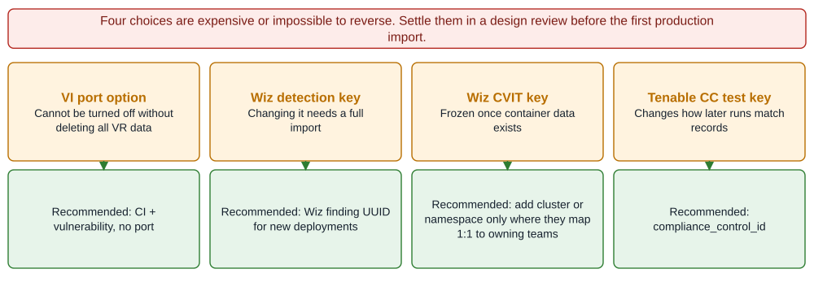

*Figure 12. Decide these before data lands. Source: Official docs: vr-configure-vi-key, vr-config-wiz-host-vuln, wiz-container-tab-filters, Tenable test granularity page.*

## Conclusion

The integration problem is less about connectors than about **keys and filters**. Both vendors' ServiceNow apps are now built and supported by ServiceNow. The results an enterprise sees are determined by four choices it makes once, before the first import: what makes a finding unique, which severities and resource types enter, which CMDB identity a finding resolves to, and which scanner owns an asset. Get those right and VR, CC and CVR give consistent scanner-confirmed closure. Get them wrong and the cost is duplicated work, invisible Medium risk, or keys that can no longer be changed.

The asymmetry between the vendors is also a strategic signal. Tenable's footprint narrows from three products in VR to one in CC and one in CVR: Security Center shops have no documented compliance path, and Tenable.cs container shops depend on a token model Tenable no longer documents. Wiz spans every engine from one service account, but it pulls in CC and CVR subscriptions even for host-only use. For a team running both, the effective architecture is Tenable for hosts on the network and Wiz for the cloud and containers, joined by CVE + CI reporting. ServiceNow's documentation lags its Store releases by months, so validate every assumption against a live instance.
